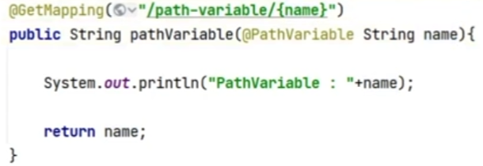
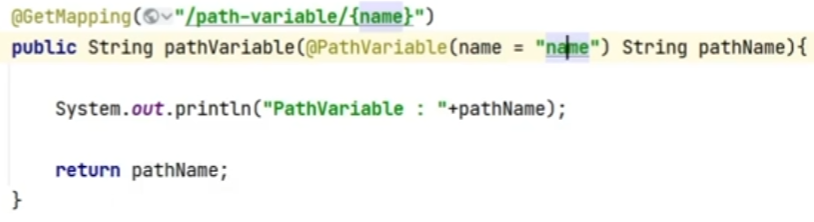
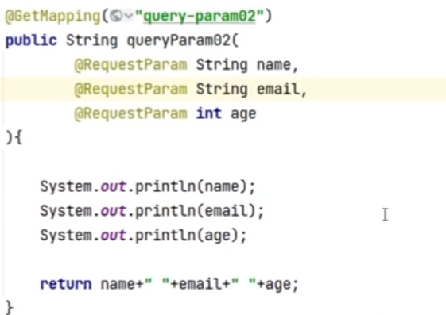
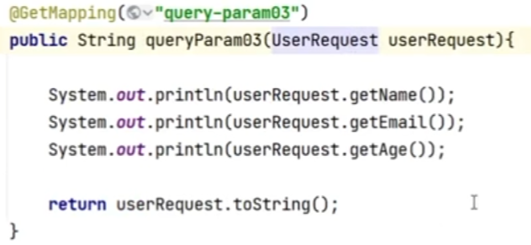

# Spring Boot란?

프로덕션 수준의 스프링 기반 어플리케이션을 쉽게 만들 수 있다.

Spring 구성이 거의 필요하지 않다.

java 어플리케이션 만들 수 있다.

목표

Spring 개발에 대해 빠르고 광범위하게 적용 가능

기본설정이 있지만 바꿀 수 있음

대규모 프로젝트에 공통적인 비기능 제공

XML 구성 요구사항 없음

Build Tool

Maven

Gradle v

Servlet Contatiners

Tomcat v

Jetty

undertow

Netty

IntellilJ로 실행하는 법

spring initializr로 프로젝트 다운받아서도 가능

IntelliJ에서 plugin 다운 받아서도 가능

장점

어플리케이션 개발에 필수 요소들만 모아두었다.

간단한 설정으로 개발 및 커스텀 가능(어노테이션)

간단하고 빠르게 어플리케이션 실행 및 배포가 가능(jar)

대규모프로젝트에 필요한 비 기능적 기능도 제공

오래되서 안정적인 운영 가능

Spring 불편한거 없앰(XML 설정)

# REST API Client 설치

## 용도

웹 어플리케이션 테스트 용도

## 방법

Chrome  웹 스토어 -> REST API Client 검색 -> Talent API Tester 추가

# 설정

## 포트 변경

src -> main -> resorces -> application properties -> server.port = 원하는포트 작성

# Controller

## 공통

1. 클래스 위 Annotation
   1. @RestController : 컨트롤러임을 명시
   2. @RequestMapping("주소") : 공통 주소 

## GET API

Resource Read, parameter header에 작성

1. 고정된 주소

   @GetMapping("주소")   =  @RequestMapping(path="주소", method = Request.GET)

2. PathVariable(변하는 주소)

   1. 함수 위에 GetMapping("/주소/{변수이름}")

   2. 함수 매개변수에 @PathVariable

      1. 매개변수이름 = 변수이름 인 경우 : @PathVariable 타입 변수이름

         

      2. 매개변수이름 != 변수이름 인 경우 : @PathVariable(name = "변수이름") 타입 매개변수이름 
      
         

3. QueryParam(?뒤, &) 

   1. 함수 매개변수에 @RequestParam

      1. Map : 뭐가 들어올지 모를 때
   
         
   
      2. 뭐가 들어오는지 알 때
   
         1. 일일히 @ReqeustParam : 수가 적을 때
   
            
   
         2. dto 객체 : 수가 많고 검증이 필요할 때
   
            1. dto 객체 구현(변수 선언, get 함수,set 함수)
            2. dto 객체 사용
   
            
   
      
   
      

## POST API

Resourse Create,  parameter DataBody에 데이터 작성

1. 변수 명칭법
   1. 스네이크 : var_name -> JSON에 사용
   2. 카넬 : varName -> Java에 사용

2. JSON

   1. 자료형

      * int
      * String
      * boolean
      * Object : {}
      * array : []

   2. 형태(key : value)

      

3. post 매핑

   @PostMapping("주소")

   

4. PathVariable 가능 : @PostMapping("/주소/{변수이름}")

   

5. QueryParameter 안씀 : DataBody 있어서

   

6. Request Body

   1. 매핑 : 함수 위 @PostMapping("주소")

   2. Request Body에서 가져오기 

      1. map : 뭐가 들어올지 모를 때

      2. 일일히 @ReqeustBody : 수가 적을 때

         함수 매개변수 : @RequestBody 타입 매개변수 이름

      2. dto 객체 : 수가 많고 검증이 필요할 때

         * 주의점 : 카넬(Java)이나 스네이크(Json) 이름 다를 때
         * 해결
           1.  JsonProperty("json에서 작성한 key이름")로 설정
              1. 카넬 vs 스네이크
              2. 둘다 아닐 때
           2. class 위에 JsonNaming(value = PropertyNamingsStrategy.SnakeCaseStrategy.class) : 반환도 JSON형태로 해줌, 변수이름을 스네이크식으로 이해함

 

## PUT API

Resource Read/Update, parameter DataBody에 작성

1. 고정된 주소

   @PutMapping("주소")

   

2. PathVariable 가능 : {}

   

3. QueryParameter 안씀 : DataBody 있어서

   

4. Data Body

   위 POST API와 동일

## DELETE API

Resource Delete, Query Parameter(데이터가 작아서)

1. 고정된 주소

   @DeleteMapping("주소")

2. PathVariable 가능 : {}

3. QueryParameter 가능

## Response 내려주기

### 1. ResponseEntity로 JSON으로 응답 -> 요걸 주로씀

1. JSON으로 응답

   return dto

2. JSON 커스터마이징

   1. 함수 자료형 ResponseEntity<class이름>로 하기
   2. 함수 매개변수는 dto
   3. 함수 return 은 ResponseEntity.status().body
      1. status(HttpStatus.선택) : 응답 상태메시지
      2. body() : body에 적을거

### 2.PageController로 응답하기

클래스 위에 @Controller

1.  html로 응답
   1. RequestMapping("/경로")
   2. 함수 return 이름.html
   3. resource -> static 에 이름.html작성
2. JSON Body로 응답 -> 보통 안함
   1. @ResponseBody
   2. 매핑 Annotation
   3. 함수안에서 인스턴스 생성 후 -> 값 set -> return instance

## 모범 사례

1. ObjectMapper 클래스

   1. 함수 

      1. writeValueAsString(dto 인스턴스 이름) : object -> text
      2. readValue(text이름, dto클래스이름.class) : text -> object

   2. 주의점

      1. object -> text

         get메소드 있어야 됨

      2. text -> object 

         디폴트 생성자 있어야 됨

2. dto 함수 만들 때 get들어가면 안 됨

3. 변수이름 matching(카넬, 스네이크)

   매칭 시킬 변수마다 JsonProperty("json에서 작성한 key이름")로 설정

   