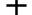
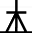
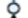

# ERD 사용법

draw.io 웹 어플리케이션 사용

1. 테이블(ER)
   * 테이블이름
   * 속성이름
   * PK, FK
2. 관계(화살표)
   * 1 :
   * N :
   * nullable : 


## Dto 작성

```java
@Entity
@NoArgsConstructor
@Data
@ToString(callSuper = true)
@EqualsAndHashCode(callSuper = true)
public class BookReviewInfo extends BaseEntity {
    @Id
    @GeneratedValue(strategy = GenerationType.IDENTITY)
    private Long id;

	// 관계
    
    // 변수
}
```


# 1:1 연관관계

## 사용법

1. dto

   ```java
   @OneToONe(기본속성)
   private dto타입 이름
   ```

   * OnetoOne 기본속성

     * null 비허용 : optional = false

     * 연관 관계는 있으나 table에는 FK 없음 : mappedBy = 'table 이름'  
       * 조회 쿼리는 가능

   * toString 순환참조 때문에 error 발생 -> @ToString.Exclude 추가로 해결


## 주의사항

1. primitive vs reference type

   primitive 타입 -> null이면 허용 -> 0

   ex) int

   reference 타입 -> null이면 허용안함 -> error

   ex) Integer

   

2. 자동증가

   @GeneratedValue(strategy =- GenerationType.IDENTITY)

   data.sql - hibernate 지우기


# 1:N 연관관계

1. dto

   ```java
   @OneToMany(fetch = FetchType.EAGER)	// 1 : N, LazyInitializationException 에러처리
   @JoinColumn(name = "FK이름", insertable = false, updatable = false)	// join 에러처리, 삽입, 업데이트 불가
   @ToString.Exclude		// toString에서 제외시키기
   private List<dto타입> 이름 = new ArrayList<>(); // null 에러처리
   ```

   * OneToMany 기본속성

     * null 비허용 : optional = false

     * 연관 관계는 있으나 table에는 FK 없음 : mappedBy = 'table 이름'  
       * 조회 쿼리는 가능

   * toString 순환참조 때문에 error 발생 -> @ToString.Exclude 추가로 해결

# N:1 연관관계

1. dto

   ```java
   @ManyToOne			// M : 1 관계
   @ToString.Exclude	// toString에서 제외시키기
   private Publisher publisher;
   ```

   * ManyToOne기본속성

     * null 비허용 : optional = false

     * 연관 관계는 있으나 table에는 FK 없음 : mappedBy = 'table 이름'  
       * 조회 쿼리는 가능

   * toString 순환참조 때문에 error 발생 -> @ToString.Exclude 추가로 해결


# N:M 연관관계

1. dto

   ```java
   
   ```

   