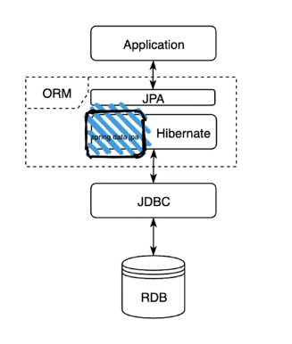

# 개념

* ORM(Object Relation Mapping) 

  객체와 DB 연결

* JPA(Java Persistence API) 

  * 현재 Java 진영의 ORM 표준으로 채택

  * persistence 영역 즉 데이터 접근하기 위한 API 규격을 인터페이스로 정의 ex) EntityManger

  * ORM이 전체적인 개념, JPA는 구체적으로 그 기능을 정의한 stack

* Hibernate 

  JPA 실제 구현체

* Spring Data Jpa 

  Spring에서 Hibernate를 편리하게 사용하기 위해서 HIbernate를 추상객체로 감쌈

# 세팅

1. Spring boot project 생성

   IntellilJ -> Spring Initializr -> Group, rtifact, Gradle, Java 8, jar -> Developer Tools - Lombok, Web - Spring Web, SQL - Spring Data JPA, H2 Database -> next -> finish

2. build.gradle dependencies, External libraries 확인

3. controller class 생성

   @RestConroller

   @GetMapping

4. junit5(cntrl + shift + t)으로 test하기

   @WebMvcTest

   @Auto wired - MockMvc

   @Test

   .perform()

   .andDo()

   .adnExpect()

# Lombok

@Getter : get 함수

@Setter : set 함수

@NonArgsConstructor : default 생성자

@AllArgsConstructor : 모든인자 생성자

@RequiredArgsConstructor : @NonNull인 변수인자 생성자 /  @NonNull 없으면 default 생성자

@EqualsAndHashCode : equals 함수 + Hashcode 함수 override

@Data : @Getter + @Setter + @RequiredArgsConstructor + @EqualsAndHashCode

@Builder : 빌더 형식으로 @AllArgsConstructor와 비슷하게 객체를 생성하고 필드값을 주입

​	ex) User user3 = User.builder().name("yg").emmail("nvaer.com").build()

# H2 DB 및 로그 설정

