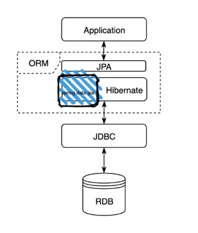

# 개념

## ORM(Object Relation Mapping) 

* 객체와 DB 연결

## JPA(Java Persistence API) 

* 현재 Java 진영의 ORM 표준으로 채택

* persistence 영역 즉 데이터 접근하기 위한 API 규격을 인터페이스로 정의 ex) EntityManger

* ORM이 전체적인 개념, JPA는 구체적으로 그 기능을 정의한 stack

## Hibernate 

* JPA 실제 구현체

## Spring Data Jpa 

* Spring에서 Hibernate를 편리하게 사용하기 위해서 HIbernate를 추상객체로 감쌈

## H2 DB

* Java 기반의 경량화된 DB 

* 파일로 저장해서 데이터 유지 가능(data.sql)

* 메모리 DB롤 사용해서 Instance가 동작할 때만 유지 가능
* 사용법

