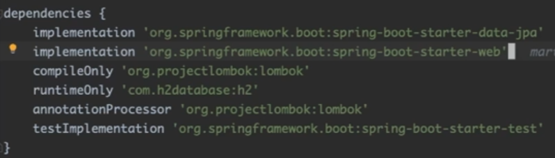

# 세팅

1. Spring boot project 생성(dependencies)

   IntellilJ -> Spring Initializr -> Group, rtifact, Gradle, Java 8, jar -> Developer Tools - Lombok, Web - Spring Web, SQL - Spring Data JPA, H2 Database -> next -> finish

2. build.gradle -> dependencies 확인

   

3. 사용 설정

   resources -> application.yml 생성(계층화 가능해서 application properties보다 많이 사용)

   1. h2 사용 설정 작성

      ```yml
      spring:
      	h2:
      		console:
      			enabled: true
      ```

   2. server 

      ```yml
      server:
      	port: 8080
      ```

   3. jpa 쿼리 보여주기 + 보기 좋은 형식에 맞게

      ```yml
      jpa:
      	show-sql: true
      	properties:
      		hibernate:
      			format_sql: true
      ```


# H2 DB 사용법

1. 브라우저

   웹 브라우저에 URL 입력 -> IntelliJ에서 h2-console에 있는 'jdbc~' 복사 -> 웹브라우저 JDBC URL에 붙여넣기 -> 웹브라우저에서 사용가능

2. IntelliJ

   IntelliJ 우측 Database 클릭 -> + 버튼 클릭 -> Data Source -> H2 클릭 -> Connection type : In-memory로 설정 -> 복사한 URL 붙여넣기 -> Test Connection 클릭 -> OK 클릭


# Data.sql

미리 DB 등록하기

1. resources -> data.sql 생성

   test할거면 test에 생성해야 됨

2. data.sql 작성

   ```yml
   //PK 자동증가
   call next value for hibernate_sequence
   // 데이터 값 삽입
   insert into (~) values 
   ```


# Dto

## Lombok

@Getter : get 함수

@Setter : set 함수

@NonArgsConstructor : default 생성자

@AllArgsConstructor : 모든인자 생성자

@RequiredArgsConstructor : @NonNull인 변수인자 생성자 /  @NonNull 없으면 default 생성자

@EqualsAndHashCode : equals 함수 + Hashcode 함수 override

@Data : @Getter + @Setter + @RequiredArgsConstructor + @EqualsAndHashCode

@Builder : 빌더 형식으로 @AllArgsConstructor와 비슷하게 객체를 생성하고 필드값을 주입

​	ex) User user3 = User.builder().name("yg").emmail("nvaer.com").build()


## Entity 기본속성

* @Entity : PK 사용

* @Id : PK

* @GeneratedValue : 자동증가

* @Column : DB에서의 column 설정

  * name
  * unique
  * nullable
  * insertable
  * updatable
  * length

* @NonNull

* @Table

  * name : 테이블 이름

    name = "테이블이름"

  * indexes : index -> 실제 DB와 다를 수 있음(잘안씀)

    @Index(columnList = "속성이름")}

  * uniqueContraints : unique 제약사항 -> 실제 DB와 다를 수 있음(잘안씀)

    uniqueConstraints = {@UniqueContraint(columnNames = {"속성이름"})}

* Enumerated : 속성값 string으로 가져오기

  1. enum class 생성
  2. dto에 @Enumerated(value = EnumType.STRING)  


# Repository Interface

1. dependencies 확인

   spring-boot-starter(data,web,test)

   lombok

   h2database

2. dto class 작성

   @Entity : PK 설정

   @Id : PK로 설정

   @GenerateValue : 자동 증가

3. repository interface 작성

   extends JpaRepository<dto 타입,PK 타입>

   사용할 쿼리 메소드 등록

4. 사용

   @Autowired -> 작성한 repository

   repository이름.쿼리메소드


## ExampleMatcher

조건절 쿼리문, 많이 쓰이지는 않음

1. instance 생성

   조건값

   ```java
   User user = new User();
   user.setEmail("slow");
   ```

2. ExampleMatcher 생성

   조건

   ```java
   EmmapleMatcher matcher = EmmapleMatcher.matching().witMatcher("속성이름",contains());
   ```

3. Example 생성

   조건 적용하기

   ```java
   Example example = Example.matching().of(user,matcher);
   ```

4. findAll(example)

   결과물

   ```java
   userRepository.findAll(example).forEach(System.out::println);
   ```

   


## SimpleJpaRepository

JpaRepository 구현체


# QueryMethod

1. repository에 함수에 사용할 QueryMethod 추가

   ```java
   public interface UserRepository extends JpaRepository<User, Long> {
       // where
       User findByEmail(String email);
   	
       // Is
       Set<User> findUserByNameIs(String name);
       Set<User> findUserByName(String name);
       Set<User> findUserByNameEquals(String name);
   	
       // limit
       List<User> findFirst2ByName(String name);
   
       List<User> findTop2ByName(String name);
   	
       // and
       List<User> findByEmailAndName(String email, String name);
   	
       // or
       List<User> findByEmailOrName(String email, String name);
   	
       // 비교
       List<User> findByCreatedAtAfter(LocalDateTime yesterday);
   
       List<User> findByIdAfter(Long id);
   
       List<User> findByCreatedAtGreaterThan(LocalDateTime yesterday);
   
       List<User> findByCreatedAtGreaterThanEqual(LocalDateTime yesterday);
   
       List<User> findByCreatedAtBetween(LocalDateTime yesterday, LocalDateTime tomorrow);
   
       List<User> findByIdBetween(Long id1, Long id2);
   
       List<User> findByIdGreaterThanEqualAndIdLessThanEqual(Long id1, Long id2);
   	
       // null
       List<User> findByIdIsNotNull();
   	
   	List<User> findByAddressIsNotEmpty();   // name is not null and name != '' ??
   	
       // in
       List<User> findByNameIn(List<String> names);
   	
       // like
       List<User> findByNameStartingWith(String name);
   
       List<User> findByNameEndingWith(String name);
   
       List<User> findByNameContains(String name);
   
       List<User> findByNameLike(String name);
   	
       // order by
       List<User> findTopByNameOrderByIdDesc(String name);
   
       List<User> findFirstByNameOrderByIdDescEmailAsc(String name);
   
       List<User> findFirstByName(String name, Sort sort);
   
       // paging
       Page<User> findByName(String name, Pageable pageable);
   }
   ```

   

2. 사용

   ```java
   void select() {
           System.out.println(userRepository.findByName("dennis"));
   
           System.out.println("findByEmail : " + userRepository.findByEmail("martin@fastcampus.com"));
           System.out.println("getByEmail : " + userRepository.getByEmail("martin@fastcampus.com"));
           System.out.println("readByEmail : " + userRepository.readByEmail("martin@fastcampus.com"));
           System.out.println("queryByEmail : " + userRepository.queryByEmail("martin@fastcampus.com"));
           System.out.println("searchByEmail : " + userRepository.searchByEmail("martin@fastcampus.com"));
           System.out.println("streamByEmail : " + userRepository.streamByEmail("martin@fastcampus.com"));
           System.out.println("findUserByEmail : " + userRepository.findUserByEmail("martin@fastcampus.com"));
   
           System.out.println("findSomethingByEmail : " + userRepository.findSomethingByEmail("martin@fastcampus.com"));
   
           System.out.println("findTop2ByName : " + userRepository.findTop2ByName("martin"));
           System.out.println("findFirst2ByName : " + userRepository.findFirst2ByName("martin"));
           System.out.println("findLast1ByName : " + userRepository.findLast1ByName("martin"));
   
           System.out.println("findByEmailAndName : " + userRepository.findByEmailAndName("martin@fastcampus.com", "martin"));
           System.out.println("findByEmailOrName : " + userRepository.findByEmailOrName("martin@fastcampus.com", "dennis"));
   
           System.out.println("findByCreatedAtAfter : " + userRepository.findByCreatedAtAfter(LocalDateTime.now().minusDays(1L)));
           System.out.println("findByIdAfter : " + userRepository.findByIdAfter(4L));
           System.out.println("findByCreatedAtGreaterThan : " + userRepository.findByCreatedAtGreaterThan(LocalDateTime.now().minusDays(1L)));
           System.out.println("findByCreatedAtGreaterThanEqual : " + userRepository.findByCreatedAtGreaterThanEqual(LocalDateTime.now().minusDays(1L)));
   
           System.out.println("findByCreatedAtBetween : " + userRepository.findByCreatedAtBetween(LocalDateTime.now().minusDays(1L), LocalDateTime.now().plusDays(1L)));
           System.out.println("findByIdBetween : " + userRepository.findByIdBetween(1L, 3L));
           System.out.println("findByIdGreaterThanEqualAndIdLessThanEqual : " + userRepository.findByIdGreaterThanEqualAndIdLessThanEqual(1L, 3L));
   
           System.out.println("findByIdIsNotNull : " + userRepository.findByIdIsNotNull());
   //        System.out.println("findByIdIsNotEmpty : " + userRepository.findByAddressIsNotEmpty());
   
           System.out.println("findByNameIn : " + userRepository.findByNameIn(Lists.newArrayList("martin", "dennis")));
   
           System.out.println("findByNameStartingWith : " + userRepository.findByNameStartingWith("mar"));
           System.out.println("findByNameEndingWith : " + userRepository.findByNameEndingWith("tin"));
           System.out.println("findByNameContains : " + userRepository.findByNameContains("art"));
   
           System.out.println("findByNameLike : " + userRepository.findByNameLike("%" + "art" + "%"));
       }
   
    @Test
       void pagingAndSortingTest() {
           System.out.println("findByNameWithPaging : " + userRepository.findByName("martin", PageRequest.of(1, 1, Sort.by(Order.desc("id")))).getTotalElements());
       }
   
   ```

   

## Select Query

1. select where

   A + B(선택) + By + 변수이름 + C

   * A : find, read, get, qeury, search, stream

   * B 

     * 타입 모를 때 : Something
     * 타입 알 때 : dto 타입
     * limit : First<number>, Top<number>

   * C

     * and : And

     * or : Or

     * 비교

       1. 초과

          GreaterThan

          After

       2. 미만

          LessThan

          Before

       3. 이상

          GreaterThanEqual

       4. 이하

          LessThanEqual

       5. 이상+이하

          Between

     * null

       IsNotNull

       IsNotEmpty : is not null and name != ''

     * in : In

     * like

       StartingWith() : x%

       EndingWith : %x

       Contains : %x%

       Like(%값%) : %x%

     * is

       Is = Equals = 공백

     * order by 

       내림차순 : OrderBy + 변수이름 + Desc 

       오른차순 : OrderBy + 변수이름 + Asc

       정렬기준 여러개인경우 : OrderBy + 속성이름1 + Desc/Asc + 속성이름2 + Desc/Asc 

       매개변수로 정렬하기 : findFirstByName("값", Sort.by(Order.desc("속성이름") x n)) : 가독성 좋아짐

2. 기타

* findAll() : 모두 출력

* findAll(Sort.by(Direction.DESC, "속성이름")) : 내림차순 정렬 후 모두 출력

  stream 사용하면 편함  -> .forEach(System.out::println)

* findAllById(Lists.newArrayList(PK값들)) : 한번에 여러개 찾기

* findById(PK값) : 조건에 맞는거 찾기

  findAllById는 직접 찾음

* getOne(PK값) : 조건에 맞는거 찾기

  getOne은 proxy한테 시킴 -> session 필요(@Transactional)

* 위 함수 뒤 + .orElse(null) : 존재하지 않으면 null 반환

* count() : 갯수

* existsById() : 존재하는지 확인 -> 결과는 count로 나옴


## Insert

* saveAll(Lists.newArrayLIst(인스턴스 여러개))

* save(인스턴스)


## Update

1. 찾기

   ```java
   User user = userRepository.findById("PK값").orElseThrow(RuntimeException::new);
   ```

2. set함수로 변경

   ```java
   user.setEmail("값");
   ```

3. save() 

   1. id값이 null이면 insert
   2. id값이 null이 아니면 update

   ```java
   userRepository.save(user);
   ```

   

## Delete

* delete(repository이름.findById(PK값).orElseThrow(RuntimeException::new))

  조건에 만족하는거 찾아서 지우기

  null이면 안되서 orElseThrow

* deleteById(PK값)

* deleteAll()  

  하나씩 찾아서 지움

* deleteAllInBatch() 

  안찾고 다 지움


## Commit

* flush() : commit


## Paging

* Page  

  slicing에 대한 정보, 전체 paging에대한 정보

  Paging에 대한 응답값

* Pageable : Paging 요청값

* Paging Query

  ```java
  System.out.println("findByNameWithPaging : " + userRepository.findByName("martin", PageRequest.of(1, 1, Sort.by(Order.desc("id")))).getTotalElements());
  ```

  1. 가져오기

     * Page<dto타입> 이름 = repository이름.findAll(PageREquest.of(원하는 페이지, 크기))

       페이지는 0부터 시작

  2. 출력

     * 이름

       페이지, ~의 instance인지

     * 이름.getTotalElements()

       총 record 갯수

     * 이름.getTotalPages()

       전체 페이지

     * 이름.getNumberOfElements()

       현재 가져온 record 갯수

     * 이름.getSort()

       정렬 여부

     * 이름.getSize()

       페이지 크기


# Entity Listener

* event발생하면 특정 동작 진행

* 종류 

  * @Pre/Post : 전/후
    * Persist : insert
    * Update : merge
    * Remove : delete
  * @PostLoad : select조회 직후

* 방법

  1. 직접 만들기

     1. EntityListener 작성

        @Pre/Post ~

        함수 작성

     2. dto에 EntityListener(value = EntityListener이름.class)

  2. 기존거 사용

     1. dto class 위에 EntityListener(value = AuditingEntityListener이름.class)
     2. dto 변수 위에 Annotation 추가
        * @CreatedDate : when create
        * @LastModifiedDate : when update
        * @CreatedBy : whoe create
        * @LastModifiedBy : who update

* 실습

  데이터 변경시간 추적하기

  데이터 변경 history 쌓기

* 실제 : dto변경 안하고 상속받음

  1. dto 작성

     ```java
     public enum Gender {
         MALE,
         FEMALE
     }
     ```

     ```java
     @Entity									// Entity 
     @NoArgsConstructor						// default 생성자
     @Data									// getter + setter
     @ToString(callSuper = true)				// 상위클래스 포함 toString
     @EqualsAndHashCode(callSuper = true)	// 상위클래스 포함 EqualsAndHashCode
     public class UserHistory extends BaseEntity {	
         @Id														// PK
         @GeneratedValue(strategy = GenerationType.IDENTITY)		// 자동증가
         private Long id;
     
         private String name;
     
         private String email;
     
         @Enumerated(value = EnumType.STRING)					// enum값 string 으로
         private Gender gender;
     }
     ```

  2. 상위클래스 작성 - listener 사용

     ```java
     @Data													// getter + setter
     @MappedSuperclass										// 상속받는 class의 column에 추가
     @EntityListeners(value = AuditingEntityListener.class)	// spring에 있는 EntityListeners 사용
     public class BaseEntity{
         @CreatedDate		// 생성시
         private LocalDateTime createdAt;
     
         @LastModifiedDate	// 변경시
         private LocalDateTime updatedAt;
     }
     ```

  3. repositoy interface 작성

     ```java
     public interface UserHistoryRepository extends JpaRepository<UserHistory, Long> {
     }
     ```

  4. 사용

     ```java
     @SpringBootTest		// 모든 Bean 가져옴
     class UserRepositoryTest {
         @Autowired
         private UserRepository userRepository;
         @Autowired		// Bean 채움
         private UserHistoryRepository userHistoryRepository;
     
         @Test
         void userHistoryTest() {
             // 생성
             User user = new User();
             user.setEmail("martin-new@fastcampus.com");
             user.setName("martin-new");
             userRepository.save(user);
     		
             // 수정
             user.setName("martin-new-new");
             userRepository.save(user);
     		
             // 출력
             userHistoryRepository.findAll().forEach(System.out::println);
         }
     }
     ```
