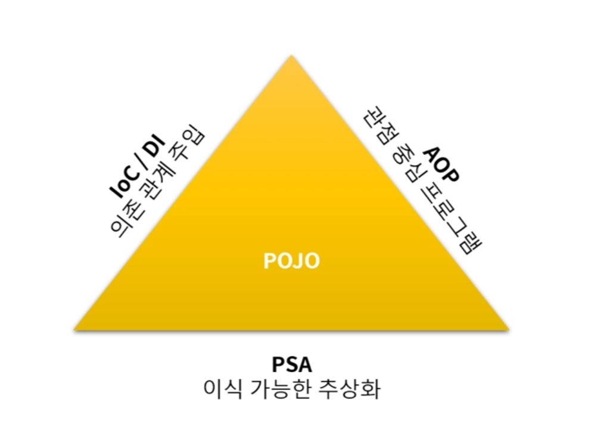
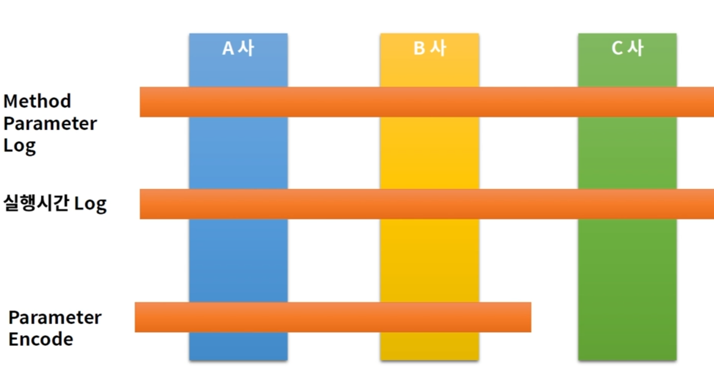
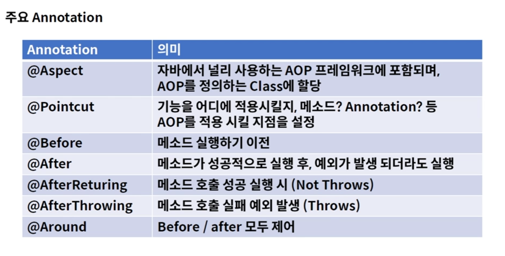
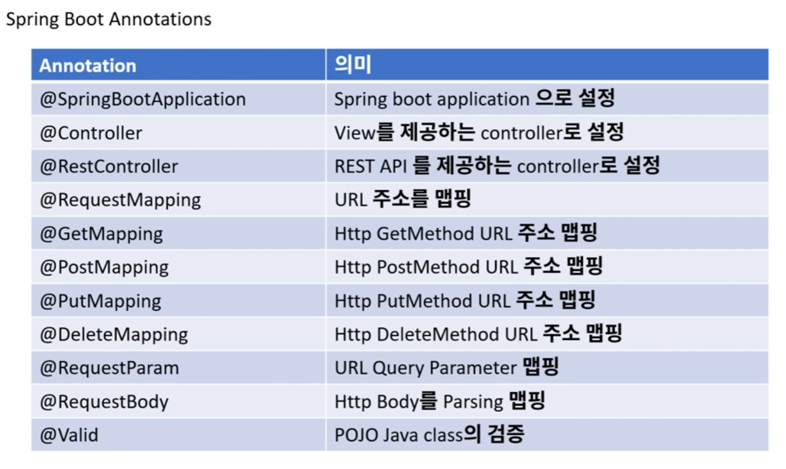
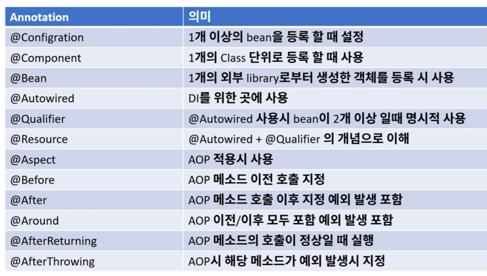

# 자주 쓰이는 Spring 

Spring Boot

Spring Cloud

Spring Data

Spring Batch

Spring Security


# 특징

테스트의 용이성, 느슨한 결합

DI

AOP -> 로깅, 트랜잭션 처리, 시큐리티




# IoC / DI

1. IoC(Inversion of Control)

   1. 개념 

      1. IoC : 개발자 -> 프레임워크로 객체 관리의 권한이 넘어감 = new 생성자 안씀
      2. Bean : Spring Container에서 관리하는 객체

      3. Container : Bean들이 관리되는 장소

   2. 방법

      1. @Component or @Component("이름") : Bean 생성

         @Qualifier("이름") : Bean이 여러개일 때 선택

      2. @Configuration : 여러개 Bean 생성

         1. @Bean("이름") 선언 후 생성자 구현

         2. context.getBean("이름",클래스이름.class) : bean 가져오기

2. DI(Dependency Injection)

   1. 장점

      * 의존성으로부터 격리시켜 테스트하기 용이(Mock)
      * 코드 확장이나 변경시 영향 최소화(추상화)
      * 순환참조 막을 수 있다.

   2. 방법(전략정 패턴)

      * 인터페이스로 확장함
      * 객체 구현
        * 생성자 - 인터페이스를 구현한 객체 선택
        * 함수 - 인터페이스 함수 실행
      * 생성자로 인스턴스 생성 -> 함수 실행

      ex) encoder


# AOP

AOP(Aspect Oriented Programming) 관점지향 프로그램

특정구역 반복되는 로직들을 몰아서 다른곳으로 빼서 구현함

관점 3

1. Web Layer : REST API 제공, Client 중심 로직
2. Business Layer : 개발
3. Data Layer : DB 연동 처리


횡단 관심






1. Parameter Log 실습

   1. aop 클래스 생성 -> @Aspect, @Component 선언

   2. @PointCut("경로") 선언 : 제약

   3. @Before : 실행전에 뭐할 것인지 구현

   4. @AfterReturning : 실행후에 뭐할 것인지 구현

      ```java
      @Aspect	// aop임을 명시
      @Component	// 객체관리 권한 넘김
      public class ParameterAop {	// 메서드 실행 전후 실행
      
          @Pointcut("execution(* com.example.aop.controller..*.*(..))")	// 제약 : 컨트롤러 모든 메서드에 적용
          private void cut(){}
      
          @Before("cut()")	// 메서드 실행 전
          public void before(JoinPoint joinPoint){	// 매개변수 잘 받아오는지 확인
              MethodSignature methodSignature = (MethodSignature) joinPoint.getSignature();
              Method method = methodSignature.getMethod();
              System.out.println(method.getName());	// 메서드 이름 출력
              Object[] args = joinPoint.getArgs();
              for(Object obj : args){
                  System.out.println("type : "+obj.getClass().getSimpleName());	// 객체 타입 출력
                  System.out.println("value : "+obj);	// 객체 출력
              }
          }
      
          @AfterReturning(value = "cut()", returning = "returnObj")	// 메서드 실행 후
          public void afterReturn(JoinPoint joinPoint, Object returnObj){	// 메서드 return 값 확인
              System.out.println("return obj");	
              System.out.println(returnObj);	
          }
      }
      ```

      

2. 실행시간 Log 실습

   1. Annotaion 구현

      ```java
      @Target({ElementType.TYPE, ElementType.METHOD})
      @Retention(RetentionPolicy.RUNTIME)
      public @interface Timer {
      }
      ```

      

   2. Controller에서 사용하는 메서드에 Annotation 붙여주기

      ```java
      @Timer
      @DeleteMapping("/delete")
      public void delete() throws InterruptedException {
          // db logic
          Thread.sleep(1000 * 2);	// 삭제 후 2초간 대기
      }
      ```

      

   3. aop 클래스 생성 -> @Aspect, @Component 선언

   4. @PointCut("경로") 선언 : 제약

   5. @Around("aop함수") : Time은 공유할수 없어서 Around 로 함

      ```java
      @Aspect	// aop임을 명시
      @Component	// 객체관리 권한 넘김
      public class TimerAop {	// 메서드 실행시간 출력기
      
          @Pointcut("execution(* com.example.aop.controller..*.*(..))")	// 제약 : 컨트롤러 모든 메서드에 적용
          private void cut(){}
      
          @Pointcut("@annotation(com.example.aop.annotation.Timer)")	// 제약 : Timer에 있는 메서드만 로깅함
          private void enableTimer(){}
      
          @Around("cut() && enableTimer()")	// Time은 공유할수 없으므로
          public void around(ProceedingJoinPoint joinPoint) throws Throwable {
              // 실행 전
              StopWatch stopWatch = new StopWatch();
              stopWatch.start();	// 시간 세기 시작
      		
              // 실행
              Object result = joinPoint.proceed();	// 메서드 실행
      		
              // 실행 후
              stopWatch.stop();	// 시간 세기 끝
              System.out.println("total time : "+stopWatch.getTotalTimeSeconds());	// 실행시간 출력
          }
      }
      ```

   

3. 값변환 실습(암호화)

   1. Annotaion 구현

      ```java
      @Target({ElementType.TYPE, ElementType.METHOD})
      @Retention(RetentionPolicy.RUNTIME)
      public @interface Decode {
      }
      ```

   2. Controller에서 사용하는 메서드에 Annotation 붙여주기

      ```java
      @Decode
      @PutMapping("/put")
      public User put(@RequestBody User user){
          System.out.println("put");
          System.out.println(user);
          return user;
      }
      ```

   3. aop 클래스 생성 -> @Aspect, @Component 선언

   4. @PointCut("경로") 선언 : 제약

   5. @Before : 실행전에 뭐할 것인지 구현

   6. @AfterReturning : 실행후에 뭐할 것인지 구현

      ```java
      @Aspect	// aop임을 명시
      @Component	// 객체관리 권한 넘김
      public class DecodeAop {
      
          @Pointcut("execution(* com.example.aop.controller..*.*(..))")	// 제약 : 컨트롤러에 있는 메서드에만 적용
          private void cut(){}
      
          @Pointcut("@annotation(com.example.aop.annotation.Decode)")	// 제약 : Decode에 있는 메서드만 값 변환
          private void enableDecode(){}
      
      
          @Before("cut() && enableDecode()")	// 실행 전
          public void before(JoinPoint joinPoint) throws UnsupportedEncodingException {	// decode
              Object[] args = joinPoint.getArgs();
              for(Object arg : args){
                  if(arg instanceof User){	// User class 매칭이 되면
                      User user = User.class.cast(arg);	// text -> class 형변환
                      String base64Email = user.getEmail();	// email 값 가져오기
                      String email = new String(Base64.getDecoder().decode(base64Email),"UTF-8");	// decoding
                      user.setEmail(email);	// decoding 한값으로 값 넣기
                  }
              }
          }
      
          @AfterReturning(value = "cut() && enableDecode()", returning = "returnObj")	// 실행 후
          public void afterReturn(JoinPoint joinPoint, Object returnObj){	// encode
              if(returnObj instanceof  User){
                  User user = User.class.cast(returnObj);	// 형변환
                  String email = user.getEmail();	// email 값 가져오기
                  String base64Email = Base64.getEncoder().encodeToString(email.getBytes());	// encoding
                  user.setEmail(base64Email);	// encoding 한값으로 값 넣기
              }
          }
      }
      ```

      

# Object Mapper

1. 환경 설정
   1. dependeny에 object mapper 라이브러리 추가(maven repository 검색해서 찾기)
   2. UTF-8 설정
      1. File Encodings -> UTF-8로 다 변경 -> edit Custom VM -> -Dfile.encoding=UTF-8 추가 -> 종료 후 다시 실행
2. dto class 구현
   1. 변수 선언 ,getter, setter, toString
   2. 변수명 매칭(JsonProperty("json변수명"))
3. object -> json
4. json -> object
5. json의 값 가져오기
6. json body 변경하기

```java
public class Main {

    public static void main(String args[]) throws JsonProcessingException {
        ObjectMapper objectMapper = new ObjectMapper();
        objectMapper.configure(DeserializationFeature.FAIL_ON_UNKNOWN_PROPERTIES, false);
        // User instance 생성
        User user = new User();
        user.setAge(10);
        user.setName("홍길동");
		
        // Car instances 생성
        Car car1 = new Car();
        car1.setName("AUDI");
        car1.setNumber("1111");

        Car car2 = new Car();
        car2.setName("BMW");
        car2.setNumber("2222");
		
        // Car list 생성
        List<Car> carList = Arrays.asList(car1, car2);
        user.setCar(carList);
		
        // 2. object -> json
        String json = objectMapper.writeValueAsString(user);
        System.out.println(json);
		
        // 3. json -> object
        User parsing = objectMapper.readValue(json, User.class);
        System.out.println(parsing);

        // 4. node parsing
        JsonNode jsonNode = objectMapper.readTree(json);
        // String 
        String name = jsonNode.get("name").asText();	// String
        System.out.println(name);
        // int
        int age = jsonNode.get("age").asInt();			// int
        System.out.println(age);
        // List
        JsonNode cars = jsonNode.get("car");
        ArrayNode arrayNode = (ArrayNode)cars;
        List<Car> _car = objectMapper.convertValue(arrayNode, new TypeReference<List<Car>>() {});
        System.out.println(_car);

		// 5. json 값 변경
        ObjectNode objectNode = (ObjectNode)jsonNode;
        objectNode.put("name","abcd");
        System.out.println(objectNode.toPrettyString());
    }
}
```

+json validator 사용해서 json 이쁘게 보기 가능


# 자주사용하는 Anotation





.