# Spring Boot란?

## 사용하는 이유

* 프로덕션 수준의 스프링 기반 어플리케이션을 쉽게 만들 수 있다.
  * 어플리케이션 개발에 필수 요소들만 모아두었다.
  * 간단한 설정으로 개발 및 커스텀 가능(어노테이션)
  * 간단하고 빠르게 어플리케이션 실행 및 배포가 가능(jar)
  * 대규모프로젝트에 필요한 비 기능적 기능도 제공
  * 오래되서 안정적인 운영 가능
  * Spring 불편한거 없앰(XML 설정)

* Spring 구성이 거의 필요하지 않다.

* java 어플리케이션 만들 수 있다.

## Spring Boot vs Spring MVC

Spring Web이 `Spring MVC` 기반의 프로젝트를 생성함을 의미

1. 설정 자동화

   `Dispatcher Servlet` `Handler Mapping` `View Resolver` 설정(XML) -> Annotation으로 간편해짐

2. 내장 서버

   WAS 서버 내장

   

## Build Tool

* Maven

* Gradle 사용

## Servlet Contatiners

* Tomcat 사용

* Jetty

* undertow

* Netty

## IntelliJ로 실행하는 법

* spring initializr로 프로젝트 다운받아서도 가능 -> 무료

* IntelliJ에서 plugin 다운 받아서도 가능 -> 유료

# REST API Client

## 용도

웹 어플리케이션 테스트 용도

## 설치 방법

Chrome  웹 스토어 -> REST API Client 검색 -> Talent API Tester 추가

# 설정

## 포트 변경

src -> main -> resorces -> application properties -> server.port = 원하는포트 작성

# Controller

## 공통

1. 클래스 위 Annotation
   1. @RestController : 컨트롤러임을 명시
   2. @RequestMapping("주소") : 공통 주소 

## GET API

Resource Read, parameter header에 작성

1. 고정된 주소

   @GetMapping("주소");

2. PathVariable(변하는 주소)

   1. 함수 위에 GetMapping("/주소/{변수이름}")

   2. 함수 매개변수에 @PathVariable

      1. 매개변수이름 = 변수이름 인 경우 : @PathVariable 타입 변수이름

         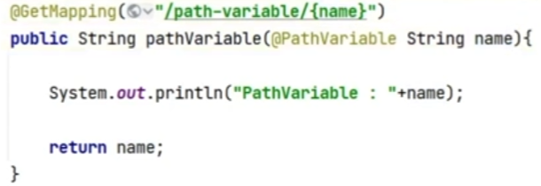

      2. 매개변수이름 != 변수이름 인 경우 : @PathVariable(name = "변수이름") 타입 매개변수이름 
      
         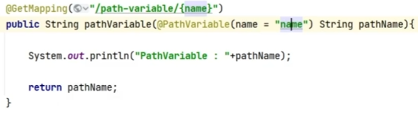

3. QueryParam(?뒤, &) 

   1. 함수 매개변수에 @RequestParam

      1. Map : 뭐가 들어올지 모를 때
   
         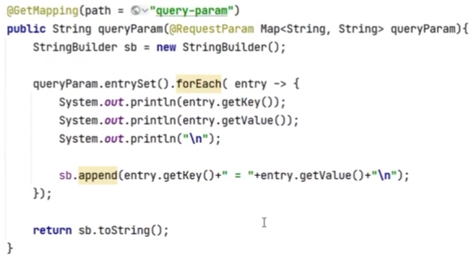
   
      2. 뭐가 들어오는지 알 때
   
         1. 일일히 @ReqeustParam : 수가 적을 때
   
            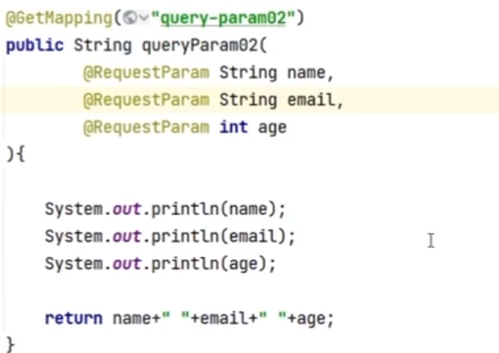
   
         2. dto 객체 : 수가 많고 검증이 필요할 때
   
            1. dto 객체 구현(변수 선언, get 함수,set 함수)
            2. dto 객체 사용
   
            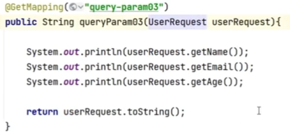
   
      
   
      

## POST API

Resourse Create,  parameter DataBody에 데이터 작성

1. 변수 명칭법
   1. 스네이크 : var_name -> JSON에 사용
   2. 카넬 : varName -> Java에 사용

2. JSON

   1. 자료형

      * int
      * String
      * boolean
      * Object : {}
      * array : []

   2. 형태(key : value)

      

3. post 매핑

   @PostMapping("주소")

   

4. PathVariable 가능 : @PostMapping("/주소/{변수이름}")

   

5. QueryParameter 안씀 : DataBody 있어서

   

6. Request Body

   1. 매핑 : 함수 위 @PostMapping("주소")

   2. Request Body에서 가져오기 

      1. map : 뭐가 들어올지 모를 때

      2. 일일히 @ReqeustBody : 수가 적을 때

         함수 매개변수 : @RequestBody 타입 매개변수 이름

      2. dto 객체 : 수가 많고 검증이 필요할 때

         * 주의점 : 카넬(Java)이나 스네이크(Json) 이름 다를 때
         * 해결
           1.  JsonProperty("json에서 작성한 key이름")로 설정
              1. 카넬 vs 스네이크
              2. 둘다 아닐 때
           2. class 위에 JsonNaming(value = PropertyNamingsStrategy.SnakeCaseStrategy.class) : 반환도 JSON형태로 해줌, 변수이름을 스네이크식으로 이해함

 

## PUT API

Resource Read/Update, parameter DataBody에 작성

1. 고정된 주소

   @PutMapping("주소")

   

2. PathVariable 가능 : {}

   

3. QueryParameter 안씀 : DataBody 있어서

   

4. Data Body

   위 POST API와 동일

## DELETE API

Resource Delete, Query Parameter(데이터가 작아서)

1. 고정된 주소

   @DeleteMapping("주소")

2. PathVariable 가능 : {}

3. QueryParameter 가능

# Response 내려주기

## 1. JSON으로 응답

1. @RestController

   REST API 형태(JSON)로 응답할 경우 사용

   1. @RequestMapping

      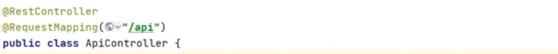

   2. dto 매핑
   
      1. @JsonNaming : JSON(스네이크) -> dto(카넬) -> JSON(스네이크) 자동 매핑
      2. @JsonInclude : null인거 출력 안하기

      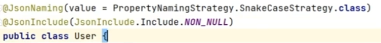

      3. 변수, get 함수, set 함수

   3. JSON으로 응답 방법

      1. dto(JSON Body)

         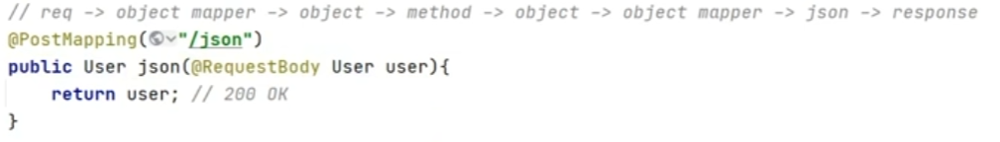

      2. ResponseEntity(JSON Body + 상태메시지)
   
         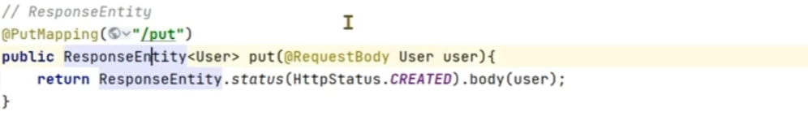

## 2.Html로 응답

1. @Controller

2. @RequestMapping

3. resources -> static -> main.html로 응답

   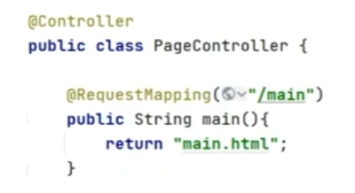

4. 선택(JSON Body에 추가)

   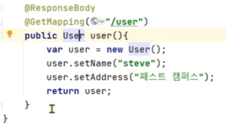

# Object Mapper

object - text 변환기

1. dto 클래스 구현

   1. 타입 변수
   2. 생성자(디폴트, 기타)
   3. get 함수

2. ObjectMapper 클래스

   1. ObjectMapper 생성

      

   2. 함수 

      1. writeValueAsString(dto 인스턴스 이름) : object -> text

         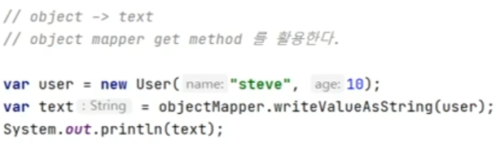

      2. readValue(text이름, dto클래스이름.class) : text -> object

         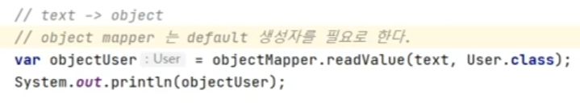

3. 주의점

   1. object -> text

      get메소드 있어야 됨(get함수 외에 함수명에  get들어가면 안 됨)

   2. text -> object 

      디폴트 생성자 있어야 됨

      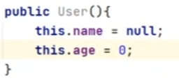

   3. 변수이름 matching(카넬, 스네이크)

      매칭 시킬 변수마다 @JsonProperty(name="json에서 작성한 key이름")로 설정
      
      보통@JsonProperty(name=스네이크)
   
   