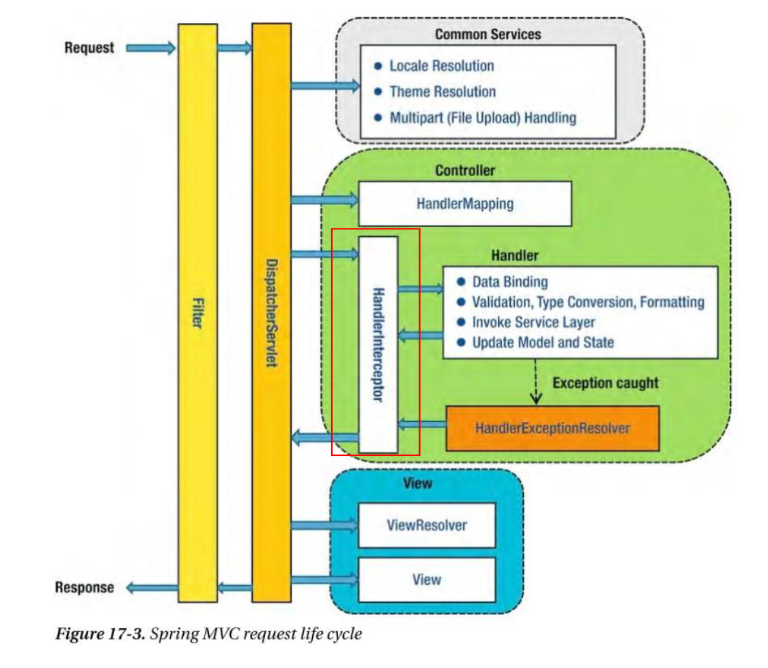

# Validation

## Spring Boot Validation

요청 변수 검증하기

1. dependency 추가

   ```
   implementation group: 'org.springframework.boot', name: 'spring-boot-starter-validation'
   ```

2. @validation spec 확인 

   https://beanvalidation.org/2.0-jsr380/


3. dto class에서 검증 필요한 변수에 validation Annotation 사용

   message = "에러시 발생할 메시지" 속성 사용 가능

4. 검증 필요한 REST API Controller에서 요청 변수에 @Valid 사용

   검증이 실패한 경우 에러 발생

   ```java
   @PostMapping("/user")
   public ResponseEntity user(@Valid @RequestBody User user, BindingResult bindingResult){
   
       if(bindingResult.hasErrors()){
           StringBuilder sb = new StringBuilder();
           bindingResult.getAllErrors().forEach(objectError -> {
           FieldError field = (FieldError) objectError;
           String message = objectError.getDefaultMessage();
   
           System.out.println("field : "+field.getField());
           System.out.println(message);
   
           sb.append("field : "+field.getField());
           sb.append("message : "+message);
   
           });
   
       	return ResponseEntity.status(HttpStatus.BAD_REQUEST).body(sb.toString());
       }
   
   	return ResponseEntity.ok(user);
   }
   ```

   

   

   


## Custom validation

1. 방법1

   AssertTrue / False 와 같은 메소드 지정을 통해서 Custom Logic 적용 가능 -> 재사용 불가

   

2. 방법2

   ConstraintValidator를 적용하여 재사용이 가능한 Custom Logic 적용 가능 -> 재사용 가능

   1. Annotation 만들기

   ```java
   @Constraint(validatedBy = {YearMonthValidator.class})
   @Target({ METHOD, FIELD, ANNOTATION_TYPE, CONSTRUCTOR, PARAMETER, TYPE_USE })
   @Retention(RUNTIME)
   public @interface YearMonth {
   
       String message() default "yyyyMM 형식에 맞지 않습니다.";
   
       Class<?>[] groups() default { };
   
       Class<? extends Payload>[] payload() default { };
   
       String pattern() default "yyyyMMdd";
   }
   ```

   2. 검증 로직 만들기

   ```java
   public class YearMonthValidator implements ConstraintValidator<YearMonth, String> {
   
       private String pattern;
   
       @Override
       public void initialize(YearMonth constraintAnnotation) {
           this.pattern = constraintAnnotation.pattern();
       }
   
       @Override
       public boolean isValid(String value, ConstraintValidatorContext context) {
   
           // yyyyMM
           try{
               LocalDate localDate = LocalDate.parse(value+"01" , DateTimeFormatter.ofPattern(this.pattern));
           }catch (Exception e){
               return false;
           }
   
           return true;
       }
   }
   ```

   

## Spring Boot Exception 처리

1. 방법1

   @RestControllerAdvice : 전체 예외 처리 or 특정 Package / Controller 예외 처리

   ```java
   @RestControllerAdvice(basePackageClasses = ApiController.class)	// 특정 Controller
   public class ApiControllerAdvice {
       @ExceptionHandler(value = Exception.class)		// 전체 예외 처리
       public ResponseEntity exception(Exception e){	// 응답
           System.out.println(e.getClass().getName());
           return ResponseEntity.status(HttpStatus.INTERNAL_SERVER_ERROR).body("");
       }
   }
   ```

   

2. 방법2

   Controller내 @ExceptionHandler : 특정 Controller 예외 처리

   Controller의 @ExceptionHandler 우선순위가 ControllerAdvice @ExceptionHandler보다 높음
   
   ```java
   public class ApiController {
       @ExceptionHandler(value = Exception.class)	
       public ResponseEntity exception(Exception e){
           System.out.println(e.getClass().getName());
           return ResponseEntity.status(HttpStatus.INTERNAL_SERVER_ERROR).body("");
       }
   }
   ```
   
   

## 모범 사례

1. Controller Validation

   ```java
   public class ApiController {
   
       @GetMapping("") 
       public User get(
               @Size(min = 2)	
               @RequestParam String name,
   
               @NotNull
               @Min(1)
               @RequestParam Integer age){
           User user = new User();
           user.setName(name);
           user.setAge(age);
   
           return user;
       }
   
   
       @PostMapping("")
       public User post(@Valid @RequestBody User user){	// validation
           System.out.println(user);
           return user;
       }
   }
   ```
   
2. advice package 생성 후 ApiControllerAdvice class 생성

3. @RestControllerAdvice 선언 후 basePackageClasses로 특정 클래스 선택

   ```java
   @RestControllerAdvice(basePackageClasses = ApiController.class) // 특정 컨트롤러에서만 advice 함
   public class ApiControllerAdvice {    
   ```

4. @ExceptionHandler로 처리할 예외 선택

   ```java
   	@ExceptionHandler(value = Exception.class)
   	public ResponseEntity exception(Exception e){
   ```

5. 에러 관련 dto(Error, ErrorResponse) 구현

   ```java
   public class Error {
   
       private String field;
       private String message;
       private String invalidValue;
   
       public String getField() {
           return field;
       }
   
       public void setField(String field) {
           this.field = field;
       }
   
       public String getMessage() {
           return message;
       }
   
       public void setMessage(String message) {
           this.message = message;
       }
   
       public String getInvalidValue() {
           return invalidValue;
       }
   
       public void setInvalidValue(String invalidValue) {
           this.invalidValue = invalidValue;
       }
   }
   
   public class ErrorResponse {
   
       String statusCode;
       String requestUrl;
       String code;
       String message;
       String resultCode;
   
       List<Error> errorList;
   
       public String getStatusCode() {
           return statusCode;
       }
   
       public void setStatusCode(String statusCode) {
           this.statusCode = statusCode;
       }
   
       public String getRequestUrl() {
           return requestUrl;
       }
   
       public void setRequestUrl(String requestUrl) {
           this.requestUrl = requestUrl;
       }
   
       public String getCode() {
           return code;
       }
   
       public void setCode(String code) {
           this.code = code;
       }
   
       public String getMessage() {
           return message;
       }
   
       public void setMessage(String message) {
           this.message = message;
       }
   
       public String getResultCode() {
           return resultCode;
       }
   
       public void setResultCode(String resultCode) {
           this.resultCode = resultCode;
       }
   
       public List<Error> getErrorList() {
           return errorList;
       }
   
       public void setErrorList(List<Error> errorList) {
           this.errorList = errorList;
       }
   }
   ```

6. response(status, resonseBody) 구현

   ```java
   	@ExceptionHandler(value = Exception.class)
       public ResponseEntity exception(Exception e){	// 그 외 error
           System.out.println(e.getClass().getName());
           return ResponseEntity.status(HttpStatus.INTERNAL_SERVER_ERROR).body("");
       }
   
       @ExceptionHandler(value = MethodArgumentNotValidException.class)	// RequestBody로 받은 파라미터 에러
       public ResponseEntity methodArgumentNotValidException(MethodArgumentNotValidException e, HttpServletRequest httpServletRequest){
   
           List<Error> errorList = new ArrayList<>();
   
           BindingResult bindingResult = e.getBindingResult();
           bindingResult.getAllErrors().forEach(error -> {
               FieldError field = (FieldError) error;
   
               String fieldName = field.getField();
               String message = field.getDefaultMessage();
               String value = field.getRejectedValue().toString();
   
               Error errorMessage = new Error();
               errorMessage.setField(fieldName);
               errorMessage.setMessage(message);
               errorMessage.setInvalidValue(value);
   
               errorList.add(errorMessage);
           });
   
           ErrorResponse errorResponse = new ErrorResponse();
           errorResponse.setErrorList(errorList);
           errorResponse.setMessage("");
           errorResponse.setRequestUrl(httpServletRequest.getRequestURI());
           errorResponse.setStatusCode(HttpStatus.BAD_REQUEST.toString());
           errorResponse.setResultCode("FAIL");
   
           return ResponseEntity.status(HttpStatus.BAD_REQUEST).body(errorResponse);
       }
   
       @ExceptionHandler(value = ConstraintViolationException.class)	// 제약 조건 위배시 에러
       public ResponseEntity constraintViolationException(ConstraintViolationException e, HttpServletRequest httpServletRequest){
   
           List<Error> errorList = new ArrayList<>();
   
           e.getConstraintViolations().forEach(error ->{
               Stream<Path.Node> stream = StreamSupport.stream(error.getPropertyPath().spliterator(), false);
               List<Path.Node> list = stream.collect(Collectors.toList());
   
               String field = list.get(list.size() -1).getName();
               String message = error.getMessage();
               String invalidValue = error.getInvalidValue().toString();
   
               Error errorMessage = new Error();
               errorMessage.setField(field);
               errorMessage.setMessage(message);
               errorMessage.setInvalidValue(invalidValue);
   
               errorList.add(errorMessage);
   
           });
   
           ErrorResponse errorResponse = new ErrorResponse();
           errorResponse.setErrorList(errorList);
           errorResponse.setMessage("");
           errorResponse.setRequestUrl(httpServletRequest.getRequestURI());
           errorResponse.setStatusCode(HttpStatus.BAD_REQUEST.toString());
           errorResponse.setResultCode("FAIL");
   
           return ResponseEntity.status(HttpStatus.BAD_REQUEST).body(errorResponse);
       }
   
       @ExceptionHandler(value = MissingServletRequestParameterException.class)	// 필수 파라미터 누락 시 에러
       public ResponseEntity missingServletRequestParameterException(MissingServletRequestParameterException e, HttpServletRequest httpServletRequest){
   
           List<Error> errorList = new ArrayList<>();
   
           String fieldName = e.getParameterName();
           String invalidValue = e.getMessage();
   
           Error errorMessage = new Error();
           errorMessage.setField(fieldName);
           errorMessage.setMessage(e.getMessage());
   
   
           ErrorResponse errorResponse = new ErrorResponse();
           errorResponse.setErrorList(errorList);
           errorResponse.setMessage("");
           errorResponse.setRequestUrl(httpServletRequest.getRequestURI());
           errorResponse.setStatusCode(HttpStatus.BAD_REQUEST.toString());
           errorResponse.setResultCode("FAIL");
   
           return ResponseEntity.status(HttpStatus.BAD_REQUEST).body(errorResponse);
       }
   }
   ```
   


# Filter

* 특징
  * 유일하게 ServletRequest, ServletResponse의 객체를 변환할 수 있음
  * Spring Context에 등록되지 않고 Web application에 등록됨

* 용도

  * 주로 요청,응답 정보를 변경하거나 값 확인(Logging)

  * 인증과 관련된 Logic들을 선/후 처리(Service와 business logic 분리)

* 동작 순서

  Request -> Filter -> Interceptor -> AOP


* 방법
1. GlobalFilter 구현
     1. @WebFilter(urlPatterns = "~~")
     2. Filter 상속
   3. doFilter() 재정의

* 예시

  로그 남기기

  ```java
  @WebFilter(urlPatterns = "/api/*")	// 적용할 url
  public class RequestFilter implements Filter {	// 상속
      @Override
      public void doFilter(ServletRequest request, ServletResponse response, FilterChain chain) throws IOException, ServletException {	// 필터 구현
          ContentCachingRequestWrapper wrappingRequest = new ContentCachingRequestWrapper((HttpServletRequest)request);
          ContentCachingResponseWrapper wrappingResponse = new ContentCachingResponseWrapper((HttpServletResponse) response);
  
          chain.doFilter(wrappingRequest, wrappingResponse);
  
          System.out.println("---req ---");
          System.out.println(new String(wrappingRequest.getContentAsByteArray(),"UTF-8"));
          byte[] b = wrappingRequest.getContentAsByteArray();
          System.out.println("---req ---");
  
          System.out.println("---res ---");
          System.out.println(new String(wrappingResponse.getContentAsByteArray(),"UTF-8"));
          System.out.println("---res ---");
          wrappingResponse.copyBodyToResponse();
      }
  }
  ```

  


# Interceptor

* 특징

  * Spring Context에 등록되어 AOP와 유사한 기능 제공

* 용도

  * 주로 인증 단계 처리
  * Logging
  * 인증과 관련된 Logic들을 선/후 처리(Service와 business logic 분리)

* 동작 순서

  

* 예시

  인증
  
  1. Auth annotation 구현
  2. AuthInterceptor 구현
  3. config 구현
  4. Controller에 AuthInterceptor 적용
  5. exception 구현
  
  
  
  


# 비동기 처리

* 별도의 쓰레드를 통해 처리

* @Async를 통해 비동기 처리

* 쓰레드 직접 설정 가능

  
