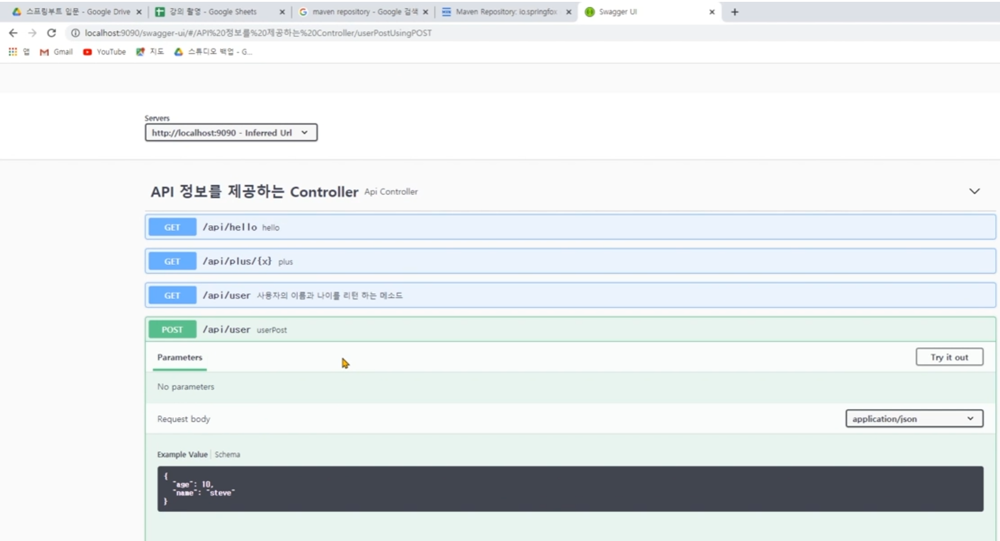
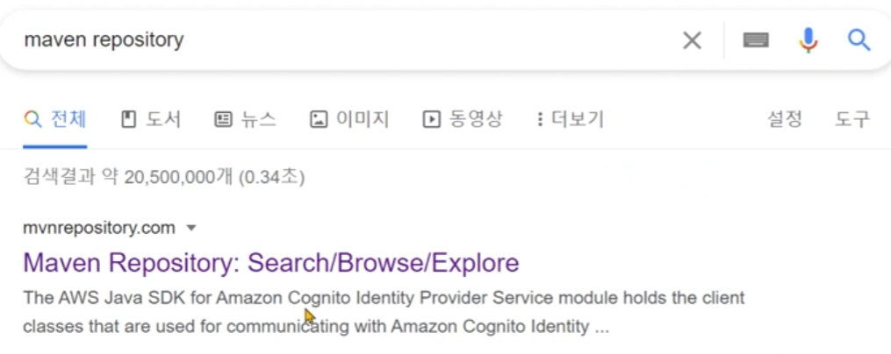
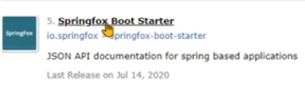
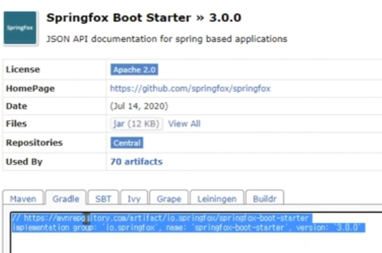
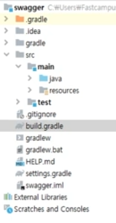
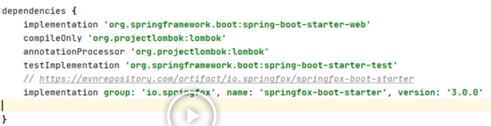
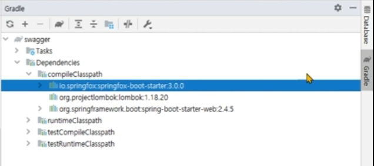
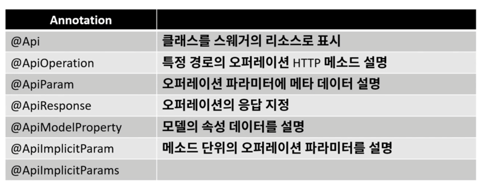

# 기능

* REST API 편하게 문서화 해줌
* 제3자가 편리하게 API를 호출해보고 테스트할 수 있는 프로젝트




# 설정

* springfox-boot-starter를 gradle dependencies에 추가해서 사용

  * maven repository 사이트 들어가기 

  

  * maven repository에서 springfox 검색 

  * Springfox Boot Starter 클릭

    

  * Gradle 복사

    

  * 프로젝트에서 build gradle 클릭

    

  * dependencies에 붙여넣기

    

  * gradle 설치 됐는지 확인

    


# 주의점

* 외부에 노출되면 안되는 곳에는 사용안함


# 사용법(Annotation)

```java
package com.example.swagger.controller;

import com.example.swagger.dto.UserRequest;
import com.example.swagger.dto.UserResponse;
import io.swagger.annotations.*;
import org.springframework.web.bind.annotation.*;

@Api(tags = {"REST API CONTROLLER"})	// 전체 Api 태그
@RestController							// Json 형태로 객체 데이터를 반환
@RequestMapping("/api")					// 공통주소
public class ApiController {

    @ApiOperation(value = "hello method", notes = "기본적인 인사 GET API")
	
    /*  1. 함수 단위의 매개변수들 한번에 지정
	@ApiImplicitParams({
            @ApiImplicitParam(name = "name", value = "사용자 이름", required = true, dataType = "string", paramType = "path"),
            @ApiImplicitParam(name = "age", value = "사용자 나이", required = true, dataType = "int", paramType = "query")
    })
    @GetMapping("/hello/{name}")	// GET 매핑
    public String hello(
            @PathVariable String name,	   // 경로 변수
            @RequestParam int age){		   // 요청 변수
        return "hello";
    }
    */
    
    // 2. 일일히 변수 지정
    @GetMapping("/hello/{name}")	// GET 매핑
    public String hello(
            @ApiParam(value = "사용자 이름")	// 변수설명
            @PathVariable String name,	   // 경로 변수

            @ApiParam(value = "사용자 나이")	// 변수설명
            @RequestParam int age){		   // 요청 변수
        return "hello";
    }
	
    @GetMapping("/user")	// GET 매핑
    public UserResponse user(UserRequest userRequest){
        return new UserResponse(userRequest.getName(), userRequest.getAge());
    }

    @PostMapping("/user")	// POST 매핑
    @ApiResponse(code = 404, message = "not found")	// 응답 Http 상태 메시지 지정 
    public UserResponse post(@RequestBody UserRequest userRequest){
        return new UserResponse(userRequest.getName(), userRequest.getAge());
    }
}
```


# Anotation


