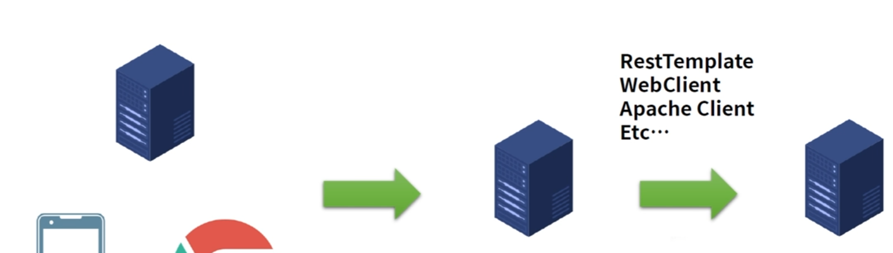

# Server로 연결하기




1. Client

   1. RestTemplateService 만들기

      1. uri 생성
         1. 공통 주소
         2. 특정 주소
         3. QueryParam
         4. 인코딩
         5. 빌드
         6. VariablePath
         7. uri로 변환
      2. object 생성 or json 생성
      3. uri로 보내서 응답 받기
         1. 요청 보내기
            1. 함수
               1. GET
               2. POST
            2. 형태
               1. Object
               2. Json
         2. 응답 받기
            1. Object
            2. Json

   2. Controller 

      1. @RestController, @RequestMapping("경로")

      2. @Autowired RestTemplateService  -> 최신은 생성자로 처리함

      3. REST API 구현

   

2. Server 

   1. REST API 구현 

   

   

# rest-template 코드

1. controller

   ```java
   package com.example.resttemplate.controller;
   
   import com.example.resttemplate.service.UserService;
   import lombok.RequiredArgsConstructor;
   import org.springframework.web.bind.annotation.*;
   
   
   @RestController
   @RequestMapping("/api/user")
   @RequiredArgsConstructor
   public class UserApiController {
   
       private final UserService userService;
   
       @GetMapping("")
       public void get(){
           userService.naver();
       }
   
   }
   ```

   

2. dto

   ```java
   package com.example.resttemplate.dto;
   
   import lombok.AllArgsConstructor;
   import lombok.Data;
   import lombok.NoArgsConstructor;
   
   import java.util.List;
   
   @Data
   @NoArgsConstructor
   @AllArgsConstructor
   public class User {
   
       private String name;
       private int age;
       private List<Car> carList;
   }
   ```


3. service

   ```java
   package com.example.resttemplate.service;
   
   import com.example.resttemplate.dto.User;
   import lombok.extern.slf4j.Slf4j;
   import org.springframework.core.ParameterizedTypeReference;
   import org.springframework.http.*;
   import org.springframework.stereotype.Service;
   import org.springframework.web.client.RestTemplate;
   import org.springframework.web.util.UriComponentsBuilder;
   
   import java.net.URI;
   
   @Slf4j	// log 사용
   @Service	// 서비스 레이어
   public class UserService {
   	
       // GET, staticPath, QueryParam -> Object로 받기
       public void getForObject(){
           // 1. uri 생성
           URI uri = UriComponentsBuilder
                   .fromUriString("http://localhost:9090")	// 공통주소
                   .path("/api")							// 특정주소
                   .queryParam("name","steve")				// QueryParam
                   .queryParam("age",10)
                   .encode()								// 인코딩
                   .build()								// 빌드
                   .toUri();								// uri로 변환
           log.info("uri : {}",uri);
   		
           // 2. uri에서 응답 Object로 받기
           RestTemplate restTemplate = new RestTemplate();
           User user = restTemplate.getForObject(uri, User.class);	
           log.info("user : {}", user);
       }
       
       // GET, PathVariable, QueryParam -> json으로 받기
       public void getForEntity(){
           // 1. uri 생성
           URI uri = UriComponentsBuilder
                   .fromUriString("http://localhost:9090")	// 공통 주소
                   .path("/api/{path}")					// 특정 주소
                   .queryParam("name","steve")				// QueryParam
                   .queryParam("age",10)
                   .encode()								// 인코딩
                   .build()								// 빌드
                   .expand("user")							// PathVariable
                   .toUri();								// uri로 변환
           log.info("uri : {}", uri);
   		
           // 2. uri에서 응답 json으로 받기
           RestTemplate restTemplate = new RestTemplate();
           ResponseEntity<User> response = restTemplate.getForEntity(uri, User.class);
           log.info("{}",response.getStatusCode());
           log.info("{}",response.getHeaders());
           log.info("{}",response.getBody());
       }
       
       // POST, PathVariable -> Object로 받기 
       public void postForObject(){
           // uri 생성
           URI uri = UriComponentsBuilder
                   .fromUriString("http://localhost:9090")	// 공통주소
                   .path("/api/{path}")					// 특정 주소
                   .encode()								// 인코딩
                   .build()								// 빌드
                   .expand("user")							// PathVariable
                   .toUri();								// uri로 변환
           log.info("uri : {}", uri);
   		
           // Object 생성
           User user = new User();
           user.setName("홍길동");
           user.setAge(10);
           
           // 2. uri로 Object 보내기 -> 응답 Object로 받기
           RestTemplate restTemplate = new RestTemplate();
           User response = restTemplate.postForObject(uri, user, User.class);
           log.info("response : {}", response);
       }
   	
       // POST, PathVariable -> json으로 받기
       public void postForEntity(){
           URI uri = UriComponentsBuilder
                   .fromUriString("http://localhost:9090")	// 공통 주소
                   .path("/api/{path}")					// 특정 주소
                   .encode()								// 인코딩
                   .build()								// 빌드
                   .expand("user")							// PathVariable
                   .toUri();								// uri로 변환
           log.info("uri : {}", uri);
   		
           // Object 생성
           User user = new User();
           user.setName("홍길동");
           user.setAge(10);
   		
           // 2. uri로 Object 보내기 -> 응답 json으로 받기
           RestTemplate restTemplate = new RestTemplate();
           ResponseEntity<User> response = restTemplate.postForEntity(uri, user, User.class);
           log.info("{}",response.getStatusCode());
           log.info("{}",response.getHeaders());
           log.info("{}",response.getBody());
       }
       
       // POST, PathVariable, header, body -> Json으로 받기
       public void exchange(){
           URI uri = UriComponentsBuilder
                   .fromUriString("http://localhost:9090")	// 공통 주소
                   .path("/api/{path}/header")				// 특정 주소
                   .encode()								// 인코딩
                   .build()								// 빌드
                   .expand("user")							// PathVariable
                   .toUri();								// uri로 변환
           log.info("uri : {}", uri);
   		
           // Object 생성
           User user = new User();
           user.setName("홍길동");
           user.setAge(10);
   		
           // json 만들기
           RequestEntity<User> req = RequestEntity				// Request, object mapping
                   .post(uri)									// POST
                   .contentType(MediaType.APPLICATION_JSON)	// JSON
                   .header("x-authorization","my-header")		// Header
                   .body(user);								// Body
   		
           // uri로 JSON 보내기 -> 응답 Json으로 받기
           RestTemplate restTemplate = new RestTemplate();
           ResponseEntity<User> response = restTemplate.exchange(req, new ParameterizedTypeReference<>(){});	// User 형식
           log.info("{}",response.getStatusCode());
           log.info("{}",response.getHeaders());
           log.info("{}",response.getBody());
       }
       
       // open api 활용
       
       public void naver(){
           URI uri = UriComponentsBuilder
                   .fromUriString("https://openapi.naver.com")	// 고정 주소
                   .path("/v1/search/local.json")				// 특정 주소
                   .queryParam("query","%EC%A3%BC%EC%8B%9D")	// QueryParam
                   .queryParam("display","10")
                   .queryParam("start","1")
                   .queryParam("sort","random")
                   .encode()									// 인코딩
                   .build()									// 빌드
                   .toUri();									// uri로 변환
           log.info("uri : {}", uri);
   		
           // json 만들기
           RequestEntity<Void> req = RequestEntity
                   .get(uri)											// GET
                   .header("X-Naver-Client-Id","Zi3o1uQftp59zuIqEAz4")	// header
                   .header("X-Naver-Client-Secret","iy6YKSWpLM")
                   .build();											// 빌드
   		
           // uri로 JSON 보내기 -> 응답 Json으로 받기
           RestTemplate restTemplate = new RestTemplate();
           ResponseEntity<String> response = restTemplate.exchange(req, new ParameterizedTypeReference<>(){}); // String 형식
           log.info("{}",response.getStatusCode());
           log.info("{}",response.getHeaders());
           log.info("{}",response.getBody());
       }
   }
   ```


# server 코드

1. controller

   ```java
   package com.example.server.controller;
   
   import com.example.server.dto.Car;
   import com.example.server.dto.User;
   import lombok.extern.slf4j.Slf4j;
   import org.springframework.web.bind.annotation.*;
   
   import java.util.Arrays;
   
   @Slf4j
   @RestController
   @RequestMapping("/api/user")
   public class UserApiController {
   
       @GetMapping("")
       public User get(@RequestParam String name, @RequestParam int age){
           User user = new User();
           user.setName(name);
           user.setAge(age);
           return user;
       }
   
       @GetMapping("/user")
       public User user(){
           User user = new User();
           user.setName("홍길동");
           user.setAge(10);
   
           user.setCarList(Arrays.asList(
                   new Car("K5","11가 1111"),
                   new Car("A4","22나 2222"),
                   new Car("BMW","33가 3333")
           ));
   
           return user;
       }
   
       @PostMapping("")
       public User post(@RequestBody User user){
           return user;
       }
   
       @PostMapping("header")
       public User header(@RequestHeader(value = "x-authorization") String header, @RequestBody User user){
           log.info("header : {}",header);
           log.info("body : {}", user);
           return user;
       }
   }
   ```

   

2. dto

   ```java
   package com.example.server.dto;
   
   import lombok.AllArgsConstructor;
   import lombok.Data;
   import lombok.NoArgsConstructor;
   
   import java.util.List;
   
   @Data
   @NoArgsConstructor
   @AllArgsConstructor
   public class User {
   
       private String name;
       private int age;
       private List<Car> carList;
   }
   ```

   