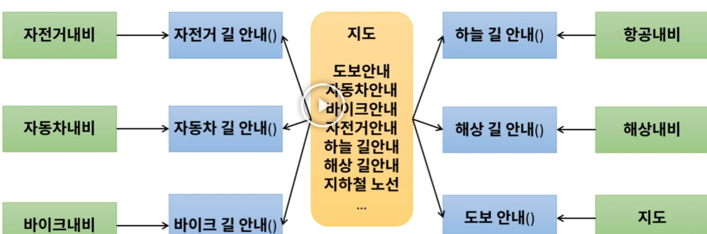
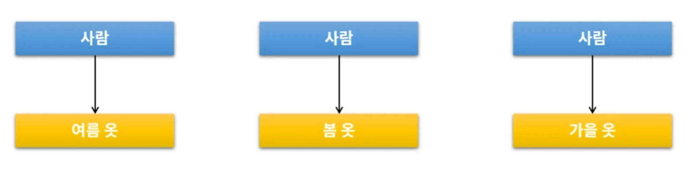
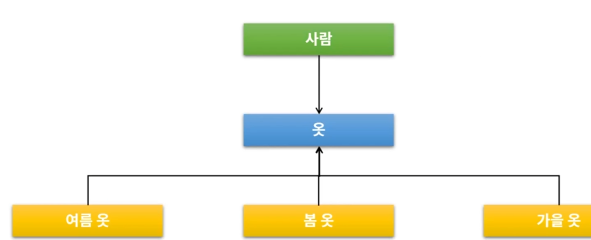

# 객체지향이란?

## 개념

실제 사물이나 개념의  `속성`과 `행위`를 정의하는 객체를 만들고, 절차적이 아닌 `객체가 중심`이 되어 실제 사물이 동작하는 방식으로 설계

## 등장배경

1. 절차 지향적 프로그래밍 비효율성 발생

   프로그램 복잡도 증가하면서 유지보수, 개발기간 비효율성 발생

2. 객체지향 언어 Java 등장

   여러 플랫폼에서 호환성 제공

   GC

## 객체의 3가지 요소

1. 상태(변수)

2. 기능(Method)

   속성 변경

3. 고유 식별자(Primary Key)

   

# 객체지향 특징 4

## 1. 캡슐화

클래스 안에 서로 연관있는 `속성과 기능들을 하나의 캡슐로 만들어` `데이터를 외부로부터 보호`하는 것을 말함

1. method 설계 

   1.  자신의 객체의 상태 변화시키기, 다른 객체 ㄴ

   2. 다른 객체 속성을 전달받을 때는 get메소드로

   3. 종류 

      * getter/setter로 접근
   * CRUD
      * 비즈니스로직
   * 객체의 생명주기 처리(소멸)
      * 객체의 영구성 관리
     * private 변수
        * Method를 통한 사용

2. 장점

   * `유지보수` 효율 향상
     
     * `추상화` 제공

       호출만하면 기능 실행 가능, 어떻게 동작하는지 알 필요 없음
     
     * `재사용성` 향상
     
   * `무결성`
   
     * `변수`는 `private`
   
     * `method`는 `public`
     
       입력된 매개변수를 `validation`을 한 후 실행

## 2. 상속

하위로 갈수록 구체화 되는 것

1. 효과
   * 프로그램 구조 이해도 향상
   * 재사용성 향상
   * 확장성 향상
   * 유지보수성 향상

## 3. 다형성

하나의 객체가 여려개의 형태로 변화하는 것

오버라이딩으로 다양하게 표현 가능

## 4. 추상화

공통적인 부분과(속성 + 행위) + 특정 특성(속성+행위)을 분리해서 재조합 하는 것

상속, 다형성 모두 추상화

# 객체지향의 설계원칙 5

## 목표

결합도 낮추기 : 의존성 낮추기

응집도 높이기 : 기능적 관련성이 높은것으로 응집시켜야 됨

## 방법 SOLID

1. 단일 책임 원칙(SRP(Single Responsibility Principle))

   * 개념 : 어떠한 클래스를 변경해야 하는 이유는 한가지 뿐 이여야 한다.	

   * 방법 : 기능별로 나누기 -> 결합도 낮춤, 응집도 높임, 재사용 용이

2. 개방 폐쇄 원칙(OCP(Open Closed Principle))

   * 개념 : 확장은 열려있고 변화는 닫여있음 

   * 방법 :  interface, 상위 클래스 상속

     ex) JDBC - > 같은 인터페이스이지만 종류가 다양

3. 리스코프 치환 원칙(LSP(Liskov Substitution Principle))

   * 개념 : 서브타입은 언제나 자신의 상위 타입으로 교체할 수 있다.

4. 인터페이스 분리 원칙(ISP(Interface Segregation Principle))

   * 개념 : 클라이언트는 자신이 사용하지 않는 메서드에 의존 관계를 맺으면 안된다.

     ex) 초록색이 클라이언트, 파란색이 메서드

     

5. 의존 역전 원칙(DIP (Dependency Inversion Principle))
   * 개념 : 자신보다 변하기 쉬운것에 의존하지 말아야 한다.

​						ex) 틀린 경우

​							

​						ex) 올바른 경우 : 가운데에 옷이라는 인터페이스 구현

​					

# POJO JAVA

## 개념

Plain Old Java Object : 순수한 자바 오브젝트

POJO 위배 시 Module의 교체, 시스템 업그레이드 시 불편함 발생

## 특징

1. 특정 규약에 종속되지 않는다.

   특정 Library, Module에서 정의된 클래스를 상속 받아서 구현하지 않는다.

2. 특정 환경에 종속되지 않는다.

   비즈니스 로직을 처리하는 부분에 외부종속적인 http request

   Annotation 기반으로 설정

## POJO Framework

1. 종류 : Spring, Hibernate
2. 기능 : 개발자가 서비스 로직에 집중하고 이를 POJO로 쉽게 개발 할 수 있도록 지원

# Spring

## 객체 지향적 체크사항

if else , switch 난무하고 있는가?

책임과 역할이 다른 코드가 하나의 클래스에 다들어가 있는가?

절차지향적으로 한개의 파일에 모든 코드를 넣고 있는가?

재사용이 가능한가?

## 사용하는 이유

복잡한 엔터프라이즈 로직은 Spring,Hibernate에게 떠넘김

프로그래머들이 객체지향적으로 프로그래밍할수 있게 지원함

