# 1. 디자인 패턴이란?

## 개념

자주 사용되는 설계 패턴을 정형화 해서 이를 유형별로 가장 최적의 방법으로 개발할 수 있도록 정해둔 설계 패턴

## Gof 디자인 패턴

객체 지향 개념에 따른 디자인 패턴

## 장점 및 단점

장점  

* 개발자의 원활한 소통
* 소프트웨어 구조 파악 용이
* 설계 변경시 유연한 대처 가능
* 재사용 가능

단점

* 객체 지향에 대한 지식이 필요
* 초기 투자 비용 부담

# 2. 종류

## 생성 패턴

 개념 : 객체 생성 변경, 시스템 영향 최소화, 코드 유연성 높임

### 싱글톤 패턴

1. 개념 : 객체 1개만 생성해서 공유 ex) TCP 소켓

2. 작성법
   1. 디폴트 생성자 private
   2. public static getInstance() -> 인스턴스가 없으면 생성, 있으면 return 인스턴스
   2. 생성할 클래스 마다 getInstance() 사용

3. 예시

   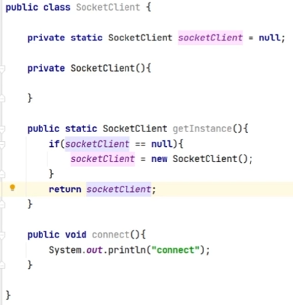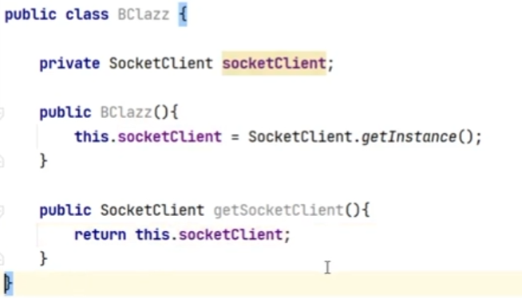

## 구조 패턴

 개념 : 프로그램 구조(자료구조, 인터페이스)를 설계하는 패턴, 복잡한 구조에 용이

### Adapter 패턴

1. 개념 : 인터페이스로 객체 변경없이 재사용 가능, OCP 따름

2. 작성법
   1. 결과물을 implements
   2. 바꿀 객체를 선언, 생성자 선언

3. 예시

   1. Interface 110V

      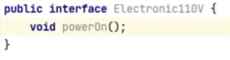

   2. Interface 220V

      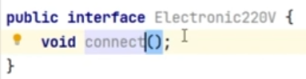

   3. Class 클리너 - 220V 사용

      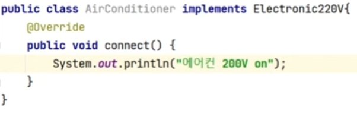

   4. 어댑터 - 220V - > 110V

      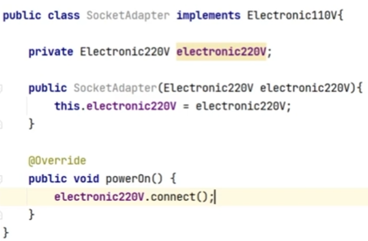

5. Main에 어댑터 사용

   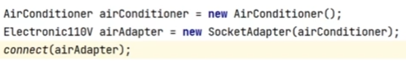

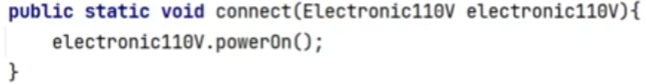

###  Proxy 패턴 

1. 개념 : 대신 처리하는 것, OCP, DIP 따름

   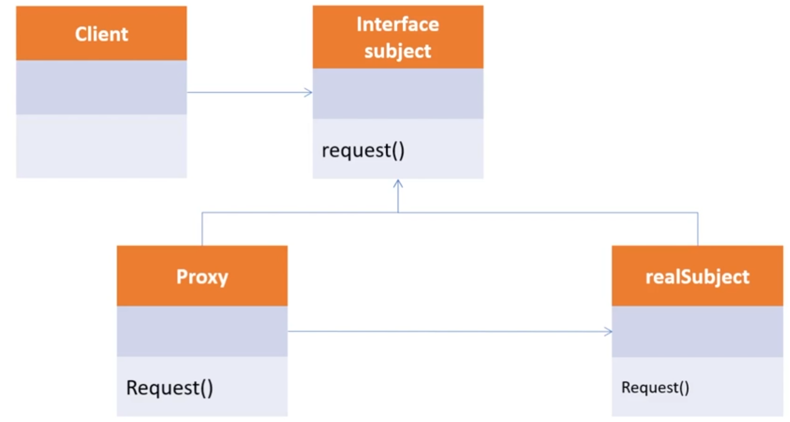

2. 사용처

   1. 캐시

      1. Interface  IBrowser 구현 - Html 파일 출력

         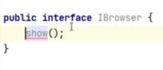

      2. Class Html 구현 - url에 있는 Html 로딩

         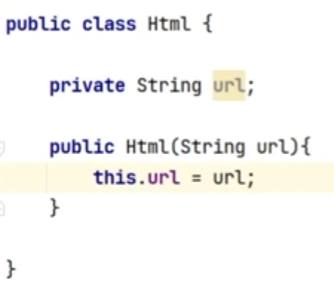

      3. Browser에 캐시 기능 구현

      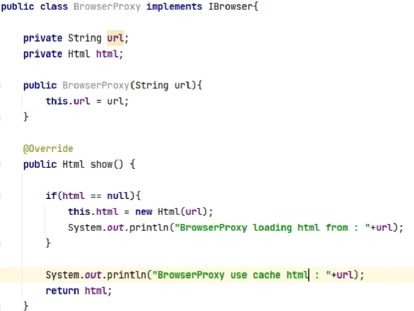

      4. 실행 -> 처음만 Html에 새로 가져오고, 다음부터는 기존 Html 가져옴

      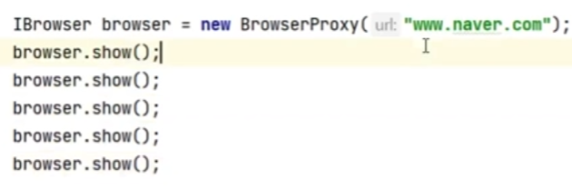

      

   2. AOP 패턴 : 특정 메소드 앞뒤로 Argument 조작, 흩어져 있는 하나로 공통된 기능을 묶어 줄수 있음, 시간 체크

      1. 전,후 시간재기기능 구현

      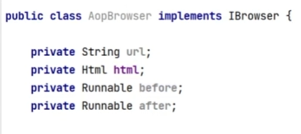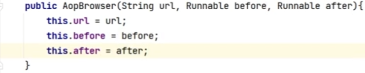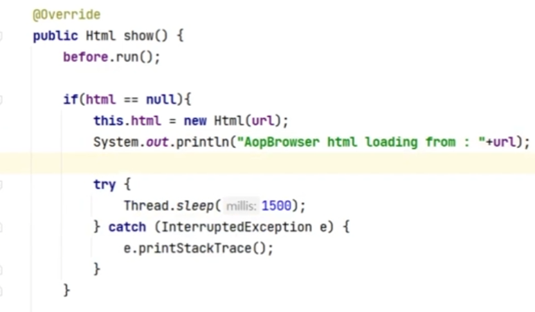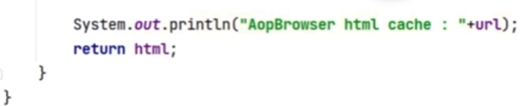

      ​	

   2. main에서 실행 -> 1.5초, 0초 나옴

      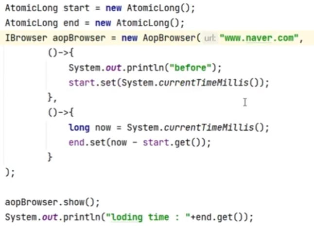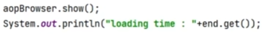

### Decorator 패턴

1. 개념 : 기존 뼈대 유지, 기능 추가, OCP, DIP 따름

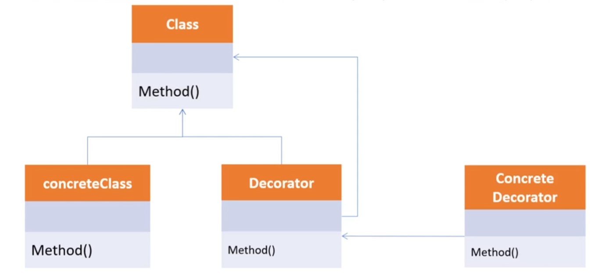

​	ex) 커피 레시피, 자동차 등급별 가격

### Facade 패턴

1. 개념 : 기능 묶기

   ​			ex) facade.connect() = FTP.connect() + WRIETER.connect() + READER.connect()

   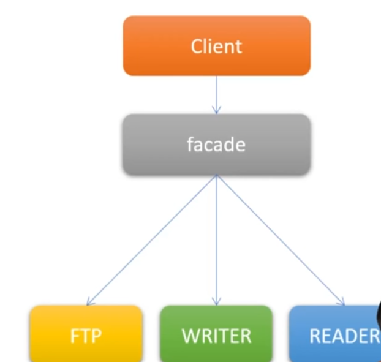

2. 예제 - main에서 Facacd class만 사용하면 됨
   1. FTP 구현 - 생성자, connect, moveDirectory, disconnect
   2. WRITER 구현 - 생성자, connect, write, disconnect
   3. READER 구현 - 생성자, connect, read, disconnect
   4. Facade로 FTP , WRITER, READER 묶기 - 생성자, connect, read, write, disconnect
   5. main에서 Facade로 실행  

## 행위 패턴

개념 : 반복적으로 사용되는 객체들의 상호작용을 패턴화 한 것, 상호작용하는 방법, 책임 분산

### Observer 패턴

1. 개념변화가 일어났을 때 미리 등록된 다른 클래스에 미리 통보해주는 패턴

   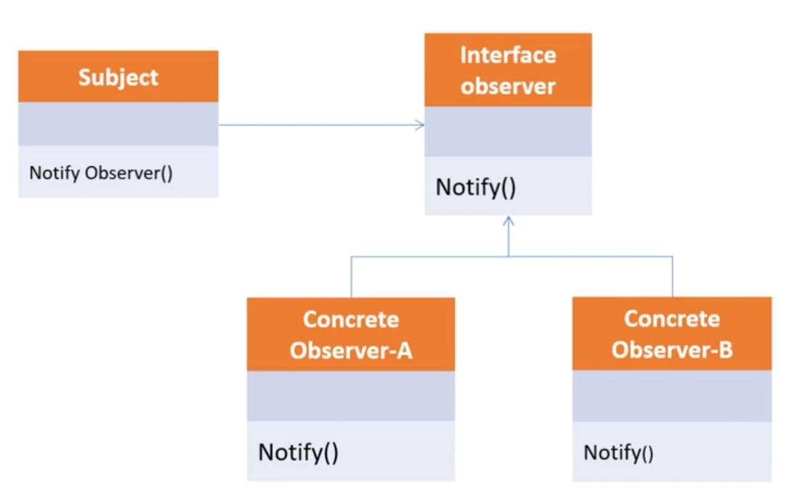

ex) event listener(이벤트 전달)

### Strategy 패턴

개념 : 유사한 행위들을 캡슐화 하여 객체의 행위를 바꾸고 싶은경우 전략만 바꿔서 변경

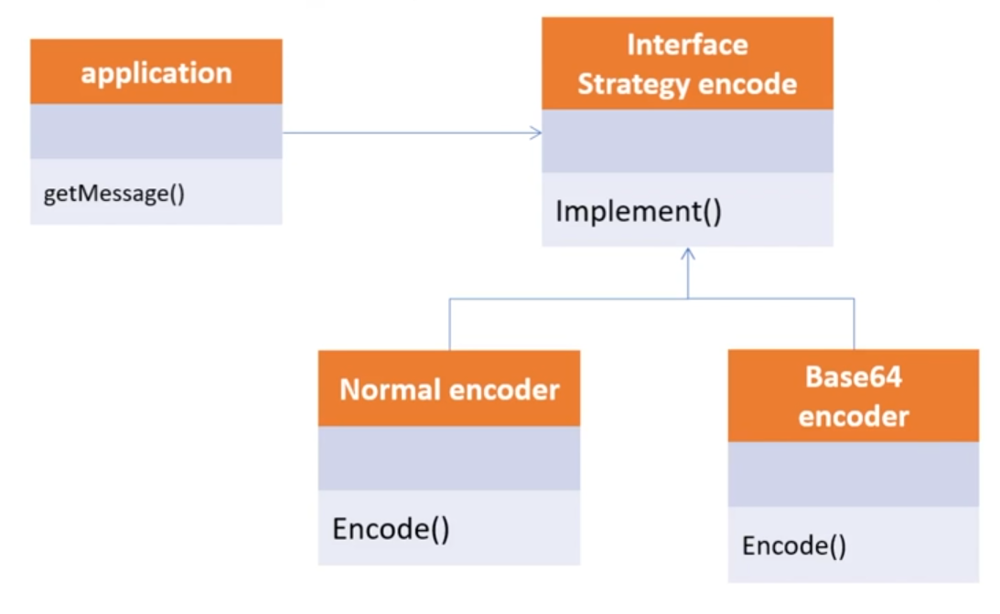

ex) Encoder

1. EncoderStrategy interface 만들기
2. Base64, normal 클래스로 각자 인터페이스 구현
3. Encoder 클래스로 EncoderStrategy를 선택할 수 있게 함
   1. setEncoderStrategy(EncoderStrategy  strategy)
   2. 기능 수행 함수 만들기
4. 전략에 맞게 사용
   1. 전략선택 (encoder.setEncoderStrategy(전략 선택))
   2. 함수 실행