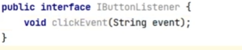
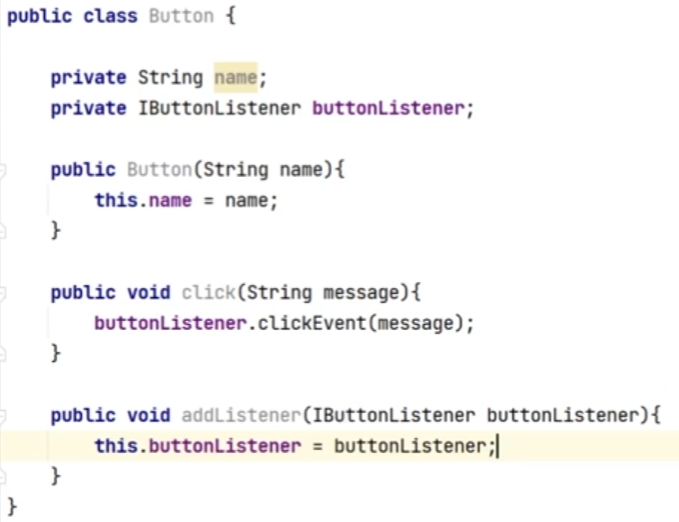
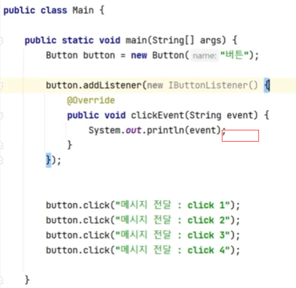
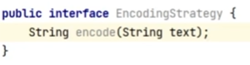
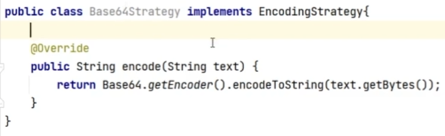
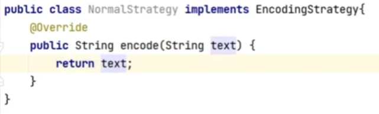
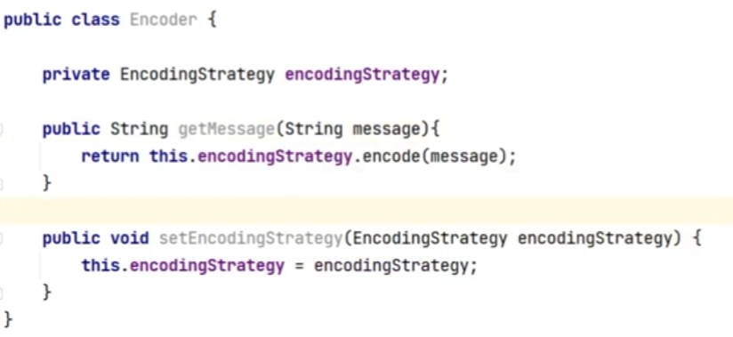
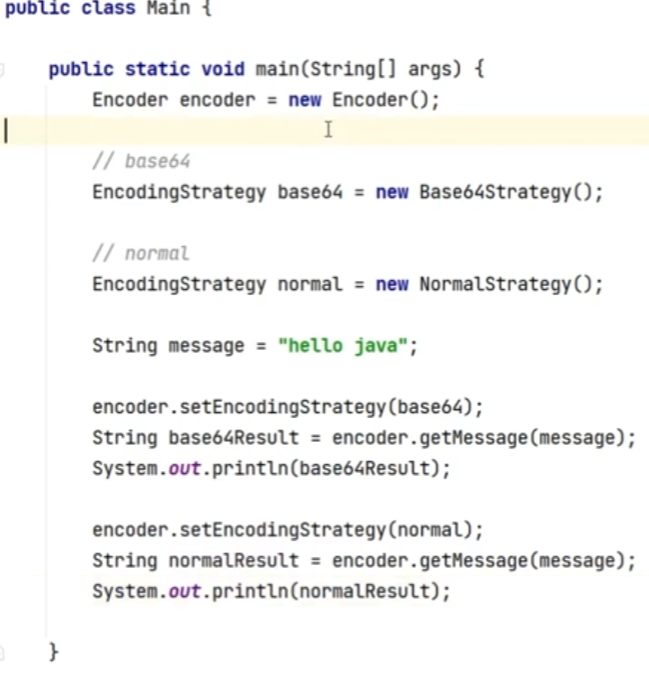

# 1. 디자인 패턴이란?

## 개념

자주 사용되는 설계 패턴을 정형화한 설계 패턴

## Gof 디자인 패턴

객체 지향 개념에 따른 디자인 패턴

## 장점 및 단점

장점  

* 개발자의 원활한 소통
* 소프트웨어 구조 파악 용이
* 설계 변경시 유연한 대처 가능
* 재사용 가능

단점

* 객체 지향에 대한 지식이 필요
* 초기 투자 비용 부담

# 2. 종류

## 생성 패턴

* 개념

  객체를 생성하는 것과 관련된 패턴

* 효과
  * 객체 생성 변경이 전체 시스템에 미치는 영향 최소화
  * 코드 유연성 높임

* 종류
  * Factory Method
  * Singleton
  * Prototype
  * Builder
  * Abstract Factory
  * Chaining

### 싱글톤 패턴

1. 개념

   객체 1개만 생성해서 공유하는 패턴 ex) TCP 소켓

2. 작성법
   1. private static class이름 객체이름 = null;
   
   2. private 디폴트 생성자

   3. public static getInstance() 
   
      * 인스턴스가 없으면 생성
   
      * 있으면 return 인스턴스
   
   2. 생성할 클래스 마다 getInstance() 사용
   
3. 예시

   

## 구조 패턴

* 개념

  프로그램 구조(자료구조,인터페이스)를 설계하는데 활용 될 수 있는 패턴

* 효과

  복잡한 구조 개발에 용이

* 종류
  * Adapter
  * Composite
  * Bridge
  * Decorator
  * Facade
  * Proxy

### Adapter 패턴

1. 개념 

   * 호환성이 없는 기존 클래스의 인터페이스를 변환하여 재사용할 수 있도록 한다.

     ex) 220v -> 110v 변환기

   * 개방페쇄 원칙(OCP) 따름

2. 작성법
   1. interface 2개 작성
   
   2. class이름 implements interface1
   
      interface 함수 재정의
   
   3. AdapterClass implements interface2
   
      1. interface1 객체 선언
      2. 생성자로 interface1 객체 주입
      3. interface1 함수 사용해서 interface2 재정의
   
   4. 변환
   
      1. 바꿀 객체 생성
      2. 변환기 적용
   
3. 예시

   1. Interface 110V

      

   2. Interface 220V

      

   3. Class 클리너 - 220V 사용

      

   4. 어댑터 - 220V - > 110V

      

   5. Main에 어댑터 사용

   

###  Proxy 패턴 

1. 개념

   뭔가를 대신 처리하는 것
   
   OCP, DIP 따름
   
   

2. 사용처

   1. 캐시

      1. Interface  IBrowser 구현 - Html 파일 출력

         

      2. Class Html 구현 - url에 있는 Html 로딩

         

      3. Browser에 캐시 기능 구현

      

      4. 실행 -> 처음만 Html에 새로 가져오고, 다음부터는 기존 Html 가져옴

      

      

   2. AOP 패턴 

      특정 메소드 앞뒤로 Argument 조작, 흩어져 있는 하나로 공통된 기능을 묶어 줄수 있음, 시간 체크

      1. 실행전 -> 로직 -> 실행 후

      

      ​	

      2.  생성자 + 람다로 전, 후 함수 구현 후 실행
   
      

### Decorator 패턴

1. 개념

   기존 뼈대 유지하되, 확장이 필요한 경우 활용

   OCP, DIP 따름

​	ex) 커피 레시피, 자동차 등급별 가격, BufferedReader

### Facade 패턴

1. 개념 : 기능 묶기

   ​			ex) facade.connect() = FTP.connect() + WRIETER.connect() + READER.connect()

   

2. 예제 - main에서 Facacd class만 사용하면 됨
   1. FTP 구현 - 생성자, connect, moveDirectory, disconnect
   2. WRITER 구현 - 생성자, connect, write, disconnect
   3. READER 구현 - 생성자, connect, read, disconnect
   4. Facade로 FTP , WRITER, READER 묶기 - 생성자, connect, read, write, disconnect
   5. main에서 Facade로 실행  

## 행위 패턴

* 개념

  반복적으로 사용되는 객체들의 상호작용을 패턴화 한 것, 

* 효과

  상호작용하는 방법, 책임 분산

* 종류
  * Template Method
  * Interpreter
  * Iterator
  * Observer
  * Strategy
  * Visitor
  * Chain of responsibility
  * Command
  * Mediator
  * State
  * Memento

### Observer 패턴

개념 : 변화가 일어났을 때, 미리 등록된 클래스에 통보해주는 패턴

사용처 : event listener(이벤트 전달)

ex) 

1. Event Interface

   

2. Button Class 

   1. 생성자
   2. 인터페이스 생성자
   3. 인터페이스 함수 사용 함수

   

3. 실행

   1. Button 인스턴스 생성
   2. 인터페이스 구현

   

### Strategy 패턴

개념 : 유사한 행위들을 캡슐화하여, 객체의 행위를 바꾸고 싶은경우 직접 변경하는 것이 아닌 전략만 변경하여, 유연하게 확장하는 패턴

ex) Encoder

1. EncoderStrategy interface 만들기

   

2. Base64, normal 클래스로 각자 인터페이스 구현

   

   

3. Encoder 클래스로 EncoderStrategy를 선택할 수 있게 함
   
   
   
4. 전략에 맞게 사용
   
   1. Interface 객체 생성
   2. 사용할 전략 객체 생성
   3. 사용할 객체 선택
   4. 사용
   
   
   