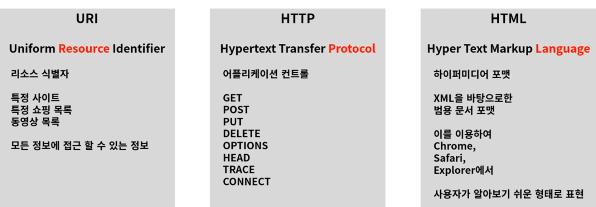
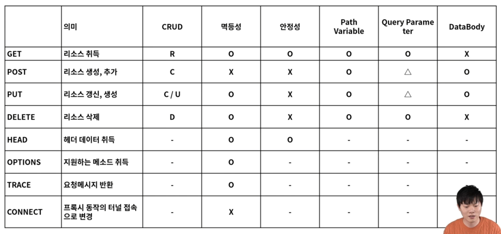
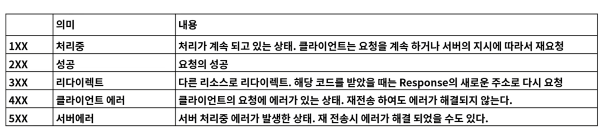
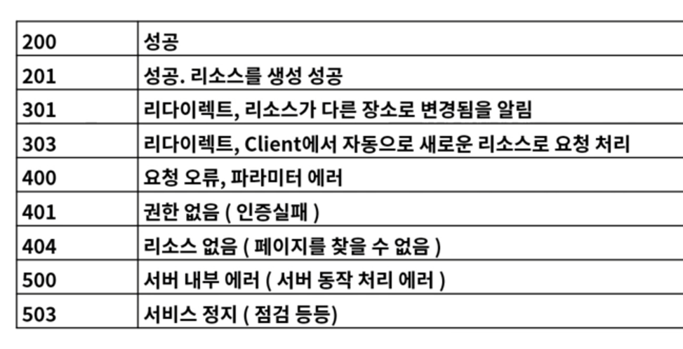

# 1. Web

## WWW란?

Worl Wide Web : 인터넷에 연결된 컴퓨터를 통해 정보를 공유할 수 있는 전 세계적인 정보 공간


## Web 용도

1. Web Site

   HTML로 구성된 웹사이트들

2. API Web Service

   Open API

3. User Interface

   시각적으로 표현

   

## Web 구성요소




# 2. REST API

## REST API란?

REST(Representational State Transfer 자원의 상태 전달) - 네트워크 아키텍처

1. Client, Server 분리 
2. Stateless : 서버에는 상태 저장 ㄴ
3. Cache : 서버의 response를 임시저장이 가능해야한다. -> 서버 과부화 방지
4. 계층화 : 게층형태(클라이언트, 방화벽, 게이트웨이, Proxy) + 확장 가능해야 한다.
5. 인터페이스 일관성 : 서버나 클라이언트가 바뀌어도 똑같이 작동해야 됨
6. Code on Demand : 특정한 기능을 서버로부터 클라이언트가 받아 코드를 실행 할 수 있어야 한다. ex) JS, HTML


## 판단 기준

1. 자원의 식별 : URI로 자원 식별

2. 메시지를 통한 리소스 조작 : Header나 URI로 리소스 조작이나 설명이 이뤄짐

3. 자기 서술적 메시지 : HTTP Method, Header 정보, URI로 정보를 표현함

4. 애플리케이션 상태에 대한 엔진으로써 하이퍼 미디어 -> 이건 잘 안지켜도 됨

   Client 요청에 대한 응답 + 관련된 리소스 Link 정보까지 같이 포함되어져야 한다. 


# 3. URI 설계 패턴

## URI vs URL

URI(Uniform Resource Identifier) : 인터넷에서 특정 자원의 주소 값(유일함)

ex) 요청 : https://www.naver.com/resource/sample/1 

​	  응답 : homework.pdf

URL(Uniform Resource Location) : 인터넷 상에서의 자원이 어디있는지 식별하는 주소

ex) 요청 : http://www.naver.com/homework.pdf

URL이 URI 하위 개념임


## URI 설계 원칙

1. ```/```는 계층 관계를 나타내는 데 사용한다.
2. 마지막에 ```/```를 사용하지 않는다.
3. 가독성을 위해 ```-```를 사용, ```_```는 안쓴다.
4. 소문자 써라
5. 확정자 안쓴다 ex) .jsp, .do
6. 구현에 의존적인 경로 안쓴다 ex) servlet
7. 세션 ID는 포함하지 않는다.
8. 메소드 명을 이용하지 않는다.
9. 명사형에 복수형 사용
10. 컨트롤러 이름으로는 동사나 동사구 사용한다.
11. 경로 부분 중 변하는 부분은 유일한 값으로 대체한다.
12. CRUD 기능을 나타내는 단어를 사용하지 않는다.
13. 서브 도메인은 일관성이 있어야 한다.


# 4. HTTP

## HTTP란?

* Hyper Text Transfer Protocol

* TCP 기반으로 REST의 특징을 모두 구현하고 있는 Web기반의 프로토콜
* Request, Response 형태의 통신 방법
  * 요청 후 특정 시간이 지나도 응답이 없으면 통신 안함


## 메소드




## 응답 상태 코드



