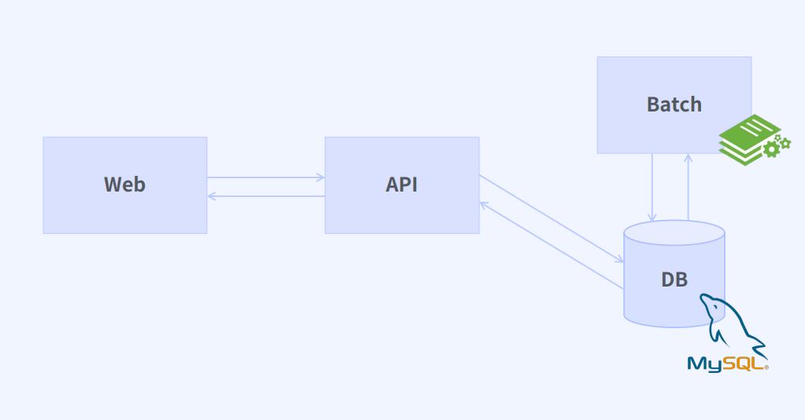
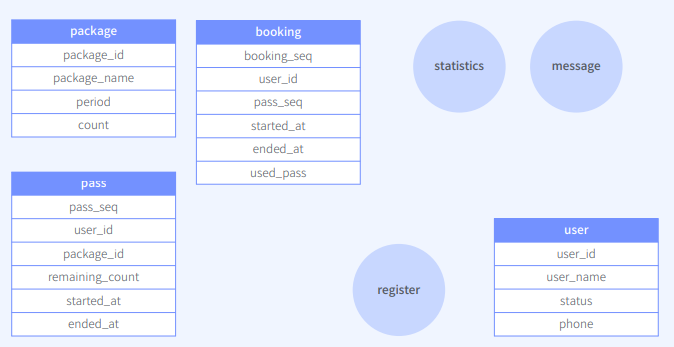
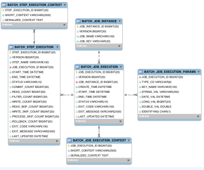

# Batch

1. 사용처
   1. 예약 시간에 광고성 메시지
   2. 결제 정산 작업
   3. 통계 데이터 구축
   4. 대량 데이터를 모델 학습 작업

2. Spring Batch 사용이유
   1. Spring에서 제공하는 특성 그대로 사용 가능
   2. 스케쥴러와 다름

3. 구조

   DB update

   

# 요구사항

1. 상황

   이용권을 등록하는 상황

2. 구현할 기능
   1. 이용권
      * 사용자는 N개의 이용권을 가질 수 있다. 
      * 이용권은 횟수가 모두 소진되거나 이용기간이 지나면 만료된다. 
      * 이용권 만료 전 사용자에게 알림을 준다. 
      * 업체에서 원하는 시간을 설정하여 일괄로 사용자에게 이용권을 지급할 수 있다
   2. 수업
      * 예약된 수업 10분 전 출석 안내 알람을 준다. 
      * 수업 종료 시간 시점 수업을 예약한 학생의 이용권 횟수를 일괄로 차감한다. (-1)
   3. 통계
      * 사용자의 수업 예약, 출석, 이용권 횟수 등의 데이터로 유의미한 통계 데이터를 만든다.

3. Features
   1. Batch
      * 이용권 만료 
      * 이용권 일괄 지급 
      * 수업 전 알림 
      * 수업 후 이용권 차감 
      * 통계 데이터 구축
   2. View
      * 사용자 이용권 조회 페이지 
      * 관리자 이용권 등록 페이지 
      * 관리자 통계 조회 페이지
   3. API
      * 사용자 이용권 조회 API 
      * 관리자 이용권 등록 API 
      * 관리자 통계 조회 API

# 설계

1. 테이블 설계

   

2. Batch 구조 설계

   1. step : 배치 처리를 정의하고 제어하는 독립된 작업의 단위

   2. job : 순서가 지정된 여러 스텝들의 모음

   3. jobRepository : RDB

      

3. 