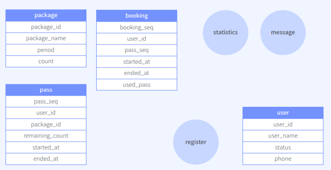
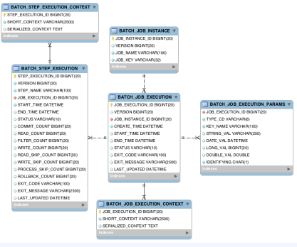

# Batch란?

1. 사용처
   1. 예약 시간에 광고성 메시지
   2. 결제 정산 작업
   3. 통계 데이터 구축
   4. 대량 데이터를 모델 학습 작업

2. Spring Batch 사용이유
   1. Spring에서 제공하는 특성 그대로 사용 가능
   2. 스케쥴러와 다름

3. 구조

   DB update

   


# 요구사항

1. 상황

   이용권을 등록하는 상황

2. 구현할 기능
   1. 이용권
      * 사용자는 N개의 이용권을 가질 수 있다. 
      * 이용권은 횟수가 모두 소진되거나 이용기간이 지나면 만료된다. 
      * 이용권 만료 전 사용자에게 알림을 준다. 
      * 업체에서 원하는 시간을 설정하여 일괄로 사용자에게 이용권을 지급할 수 있다
   2. 수업
      * 예약된 수업 10분 전 출석 안내 알람을 준다. 
      * 수업 종료 시간 시점 수업을 예약한 학생의 이용권 횟수를 일괄로 차감한다. (-1)
   3. 통계
      * 사용자의 수업 예약, 출석, 이용권 횟수 등의 데이터로 유의미한 통계 데이터를 만든다.

3. Features
   1. Batch
      * 이용권 만료 
      * 이용권 일괄 지급 
      * 수업 전 알림 
      * 수업 후 이용권 차감 
      * 통계 데이터 구축
   2. View
      * 사용자 이용권 조회 페이지 
      * 관리자 이용권 등록 페이지 
      * 관리자 통계 조회 페이지
   3. API
      * 사용자 이용권 조회 API 
      * 관리자 이용권 등록 API 
      * 관리자 통계 조회 API


# 설계

1. 테이블 설계

   

2. Batch 구조 설계

   1. step : 배치 처리를 정의하고 제어하는 독립된 작업의 단위

      1. ItemReader 
      2. ItemProcessor 
      3. ItemWriter 

   2. job : 순서가 지정된 여러 스텝들의 모음

   3. jobRepository : RDB

      


3. 실제 Job 설계

   1. 이용권 만료

      

   2. 이용권 일괄 지급

      

   3. 예약 수업 전 알람

      알람 대상 가져오기 -> 알람 전송하기(병렬처리)

      

   4. 수업 종료 후 이용권 차감

      

   5. 통계 데이터 생성
   
      


# 환경세팅

## Batch 프로젝트 생성 및 git 설정

1. spring initialzr
   1. gradle, Java, SpringBoot2.7.8, Jar, Java18
   2. dependencies - Spring Batch, JPA, MySQL Driver, H2, Lombok
   
2. git 연동
   1. git init
   2. git remobe add origin 주소
   3. git add .-> git commit -m "메시지" -> git  -u origin master

3. application.yml - h2 설정

4. spring batch 사용해보기
   1. @EnableBatchProcessing
   
   2. @Autowired step, job
   
   3. @Bean으로 step, job 생성
   
      

## Docker MySQL 설치 및 테이블 생성

1. docker-compose.yml 파일 생성

2. docker-compose 설정

   https://hub.docker.com/_/mysql 참고

   * version : docker-compose 버전

   * mysql : 서비스 이름

   * container_name : 컨테이너 이름

   * image : mysql 버전

   * volumes : 생명주기와 상관없이 데이터 유지

     * 형식 

       host directory : container 

     * 사용하는 이유

       호스트에서 초기 실행 쿼리 관리

     * 구성
       * 설정(utf-8, 인증정책)
       * 초기 실행 쿼리(create,insert)

   * ports : port번호

   * envionment : 환경변수(DB이름, user이름, pwd, Timezone)

   

## JPA를 사용한 MySQL연동

1. JpaConfig
2. entity 생성
3. respository 생성
4. BaseEntity 생성
5. application.yaml 설정
6. RespoositoryTest
   1. CRUD


# Batch 구현

설계 내용 바탕으로 구현

## 이용권 만료

ItemReader, ItemWriter

1. @Bean 구현
1. Job 구현
   
2. step 구현
   
3. ItemReader 구현
   
   * cursor : 1개씩 -> 무결성 조회 가능 -> 사용
   
   * paging : chunk단위로
   
4. ItemProcessor 구현
   
5. ItemWriter
2. test


## 이용권 일괄 지급

Tasklet

1. @Bean 구현(AddPassesJobConfig)
   1. job
   2. step
2. tasklet 구현(AddPassesTasklet)
   1. execute(RepeatStatus)
   2. addPasses


## 예약 수업 전 알람

Multi-Threaded Step


@Bean 구현

1. Job 구현 : step 순서
2. Step 
   1. 알람대상 읽어오기
   2. 알람 보내기 - 멀티 쓰레드를 위해서 taskExecutor 사용
3. ItemReader 
   1. JpaPaging - update가 필요없으므로
   2. SynchronizedReader - reader는 순차적으로 가게하고, writer는 멀티쓰레드하게 함
4. ItemProcessor
5. ItemWriter


## 수업 종료 후 이용권 차감

AsyncItemProcessor, AsyncItemWirter

@Bean 구현

1. Job 구현 : step 순서

2. Step 

3. ItemReader 

   1. cursor

4. ItemProcessor

   1. 일반

   2. Async -> 병목현상이 있을 때 좋음

      delegate로 기존에 사용했던 ItemProcessor를 설정하면, 해당 ItemProcessor에게 위임됨

5. ItemWriter

   1. 일반

   2. Async -> 병목현상이 있을 때 좋음

      delegate로 기존에 사용했던 ItemWriter를 설정하면, 해당 ItemWriter에게 위임됨


## 통계 데이터 생성

Parallel Steps - 일, 주 통계 데이터(출석횟수, 취소 횟수)

@JobScope

1. statics table 생성

2. StaticsEntity 생성

3. StaticsRepository 생성

4. AggregatedStaticstics class 생성

   1.  merge함수 구현

5. MakeStaticsJobConfig 생성

   1. step

      1. Daily - tasklet 사용

         값 가져오기 -> 출력 -> repaeatStatus finished

      2. Weekly - tasklet 사용

         week 별로 merge후 출력 -> repaeatStatus finished

   2. job

      flow x 4

      1. addStaticsFlow
      2. daily
      3. weekly
      4. parallel

      

   3. ItemReader

      * 상태=completed, endAt<now인 데이터 가져오기

      * StepScope

      * cursor

   4. ItemProcessor

      잔여 횟수 차감 + 이용권 사용 여부 업데이트

   5. ItemWriter

      잔여 횟수 업데이트 + 이용권 사용여부 업데이트


# View + API 구현

1. 요구사항

   |           View            |          API           |
   | :-----------------------: | :--------------------: |
   | 사용자 이용권 조회 페이지 | 사용자 이용권 조회 API |
   | 관리자 이용권 등록 페이지 | 관리자 이용권 등록 API |
   |  관리자 통계 조회 페이지  |  관리자 통계 조회 API  |

2. 환경 세팅

   1. dependency (https://start.spring.io/ 참고)
      * Spring Web
      * Thymeleaf 
      * MySQL Driver
      * JPA
      * lombok

   2. git 연동

      

## 사용자 이용권 조회 페이지 


* 사용자 이름 조회

* pass 시작, 종료일시, 남은 횟수, 상태 조회

* 패키지 이름 조회


1. controller

   1. 이용권 정보 가져오기 by service
   2. 사용자 정보 가져오기 by service

   2. modelAndView.addObject()
   3. modelAndView.setViewName()

2. Entity

   1. DB에 있는 entity

      1. passEntity

         packageEntity와 join 관계 

      2. UserEntity

         모든 유저 정보

   2. 뷰에 사용할 Entity
      1. Pass
      2. User

3. service

   1. 이용권 정보 가져오기 by repository + modelMapper 
   2. 사용자 정보 가져오기 by repository + modelMapper 

4. repository

   1. @Query를 통해 custom하기
      1. 이용권 정보 가져오기
      2. 사용자 정보 가져오기

5. Mapper

   1. PassEntity -> Pass

      join 변수 고려

   2. UserEntity -> User

      필요한 정보만

6. View

   * 사용자 이름
   * 패키지 이름
   * pass 시작, 종료일시, 남은 횟수, 상태

   


## 관리자 이용권 등록 페이지 


* 이용권 일괄 지급 정보인 bulk_pass 조회
* 필수값을 선택하기 위한 package, user_group 조회
* bulk_pass 생성


1. controller
   1. 이용권 일괄 지급 정보인 bulk_pass 조회 + 필수값을 선택하기 위한 package, user_group 조회
      1. GET
         1. modelAndView.addObject()
            1. 모든 bulkPass by service
            2. 모든 package by service
            3. 모든 userGroupId by service
         2. modelAndView.setViewName
         3. return modelAndView
   2. bulk_pass 생성 
      1. POST
         1. redirect 

2. service
   1. 모든 bulkPass 조회 by repository + modelMapper 
   2. 모든 package 조회 by repository + modelMapper 
   3. 모든 userGroupId 조회 by repository + modelMapper 
   4. bulkPassRequest 기반으로 passEntity를 생성하여 DB에 저장
      1. bulkPassRequest의 packageSeq으로 모든 package 조회
      2. bulkPassRequest -> bulkPass로 변환
      3. bulkPass set values
         1. status = READY
         2. count = package의 count
         3. endAt = package의 period
      4. repository save
3. repository 
   1. 모든 bulkPass 조회 + 시작일 내림차순 정렬 ->  @Query
   2. 모든 package 조회 by repository + 패키지이름 오름차순 정렬 -> @Query 
   3. 모든 userGroupId 조회 + 중복ㄴ -> @Query
   4. bulkPassRequest 기반으로 passEntity를 생성하여 DB에 저장

4. modelMapper 

   1. bulkPassEntities -> bulkPass list
   2. bulkPassEntities -> Package list
   3. UserEntity-> User
   4. bulkpassRequest -> bulkPass

5. Entity

   1. DB에 있는 entity

      1. bulkPassEntity

      2. pakageEntity

   2. 뷰에 사용할 Entity

      1. bulkPass
      2. package

6. view

   1. 반복되는곳 header, footer thymeleaf

   2. 데이터 출력

   3. bulk pass form -> request

      

## 관리자 통계 조회 페이지


* 일별 출석,취소 횟수를 위해 statistics 조회


1. view
   1. 라벨(월)
   2. 출석횟수
   3. 취소횟수
2. Entity 
   1. CharData
      1. 라벨
      2. 출석횟수
      3. 취소횟수
3. controller

   1. @RequestParam("to") 받아오기
   2. modelAndView.addObject()
      1. to를 기준으로 데이터 가져오기
   3. modelAndView.setViewName
   4. return modelAndView
4. service

   1. 종료일-10 ~ 종료일 까지 합치기
   2. 라벨, 출석횟수, 취소횟수 뽑아내기


# 단위테스트

테스트가 가능한 최소 단위로 나눠서 기능에 대한 유효성을 검증한다. 


## JUnit

* 단위테스트 프레임워크

* JUnit4 vs JUnit5

  @Nested, @DisplayName(), class 안에 @Test 가능

  ```java
  @Nested	// 계층적인 테스트
  @DisplayName("설명")	// 테스트 설명
  class MakeChartData {	
      final LocalDateTime to = LocalDateTime.of(2022, 9, 10, 0, 0);
  
      @DisplayName("설명 1")
      @Test
      void makeChartData_when_hasStatistics() {	// 조건1, 같은함수
          // given
          // when
          // then
      }
  
      @DisplayName("설명 2")
      @Test
      void makeChartData_when_notHasStatistics() {	// 조건2, 같은함수
          // when
          // then
      }
  }
  ```

  

## Mockito

* 테스트 대상이 외부 서비스에 의존적이고, 환경구축이 어려운 경우 가짜 객체를 만듦

  ex) DB 구현하지 않고 service만 단위테스트

* lombok

  * @ExtendWith(MockitoExtension.class) : mockito 사용
  * @Mock : 주입할 가짜 객체 만들기
  * @InjectMocks : 가짜 객체 주입

## 실습

repository를 사용하는 service(인수) 테스트

1. Mockito lombok 선언
   1. @ExtendWith(MockitoExtension.class)
   2. DB를 mock으로 선언
   3. service에 mock 주입

2. Test 코드

   1. given : 데이터 미리 만들기
      1. service 인수
      2. repository 값

   2. when : 위 데이터 값으로 실행

      1. repository 값 given걸로 설정

      2. service 실행

   3. then : 검증

   4. verify() : repository가 몇번 호출이 되었는지

   5. assertNotNull() : 결과물이 나오는지

   6. assertEquals() : 값 비교


 

# 기능 테스트

요구사항 기능 확인

1. 테스트 시나리오

   

2. REST API로 Job 실행하기

   JobLauncherController로 구현

3. Talend API Tester로 JSON BODY에 값넣어서 Job 실행해보기

   1. 이용권일괄지급 등록 -> 관리자 페이지 확인, 사용자 페이지 확인
   2. 통계데이터 생성 -> 통계 차트 조회


# 정리

1. 요구사항 

2. 상세 기능 구현

   1. DB 

   2. Batch 

      1. 이용권 만료(ItemReader, ItemWriter)
      2. 이용권 일괄 지급(Tasklet)
      3. 예약 수업 전 알람(Multi-Threaded Step)
      4. 수업 종료 후 이용권 차감(AsyncItemProcessor, AsyncItemWirter)
      5. 통계 데이터 생성(Parallel Steps)

   3. Web

      thymeleaf 사용

      1. 사용자 이용권 조회 페이지
      2. 관리자 이용권 등록 페이지
      3. 관리자 통계 조회 페이지

3. 기능 테스트(테스트 시나리오)

4. 추가 필요 작업

   1. 배포
   2. Jenkins 등과 같은 CI 도구로 Job 실행할 수 있도록 설정(관리 측면에서 CI tool 사용함)
   3. 다른 자원 환경에서 데이터를 읽고 쓰는 Job 구현(다른 DB)

https://github.com/kjs92980/pass-batch
