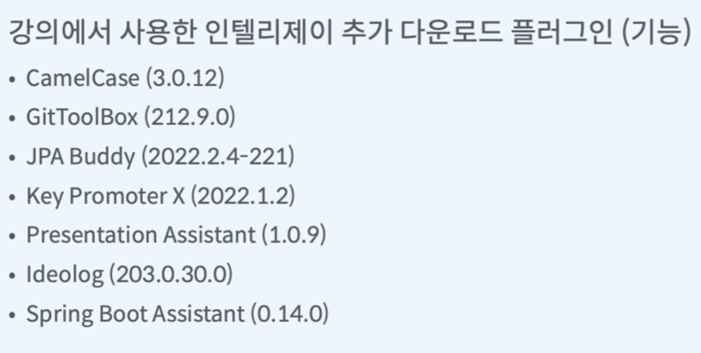
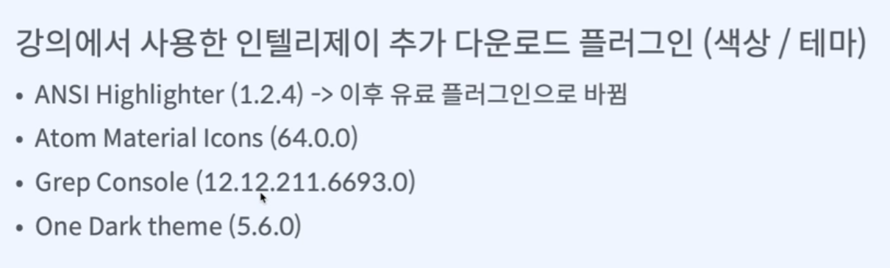

* 문서작업
  * ERD 설계, 유즈케이스 : diagrams.net(draw.io)
  * API 디자인 : 구글 시트
  * 커밋 메시지, 협업환경 : git + gitHub
* IDE : IntelliJ 

* 언어 : java

* 프레임워크 : spring boot

* 빌드도구 : gradle

* git GUI : GitKraken

* 경험 
  * 개발전략
  * 도메인 설계
  * 실무 디자인 패턴
  * 비즈니스 로직 구현

* 테스트 : 오류 없이 요구사항 모두 구현 
  * JUnit5
  * 테스트 라이브러리(Mockito, AssertJ)
  * Spring boot slice test 테크닉
  * github 테스트/빌드 자동화

* 배포 
  * 클라우드 서버(Heroku)
  * 깃헙 : Heroku 배포 자동화

* 플러그인

