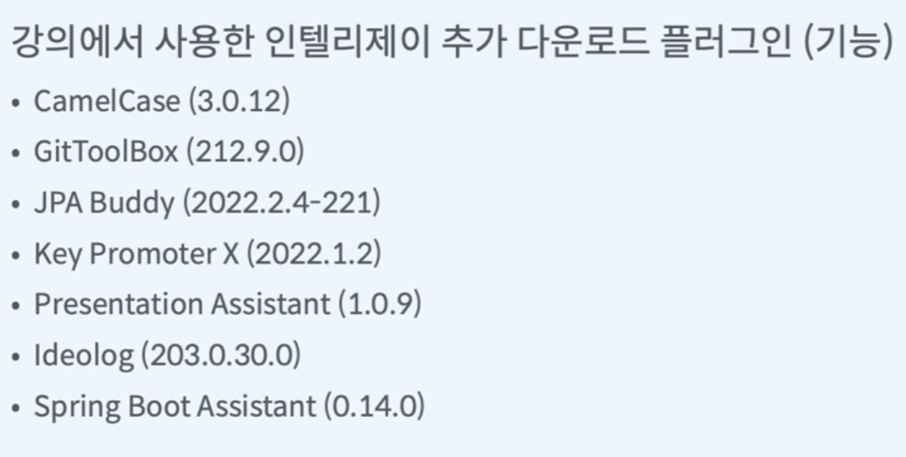
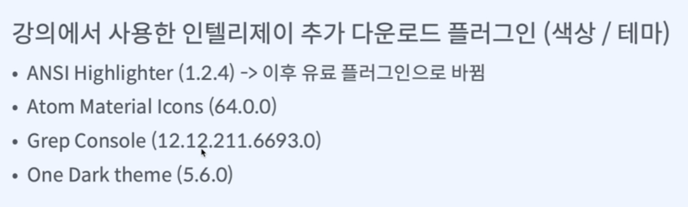
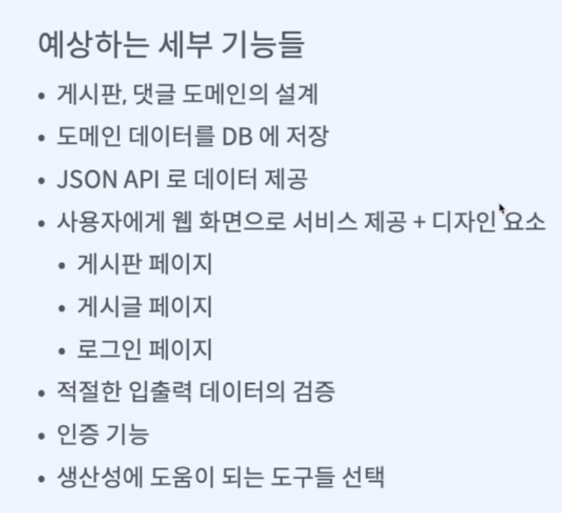
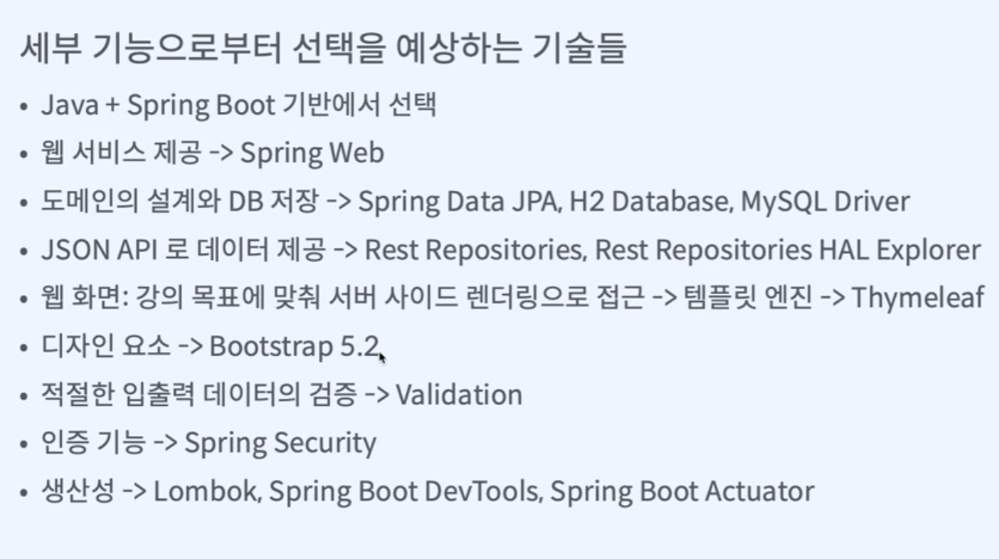
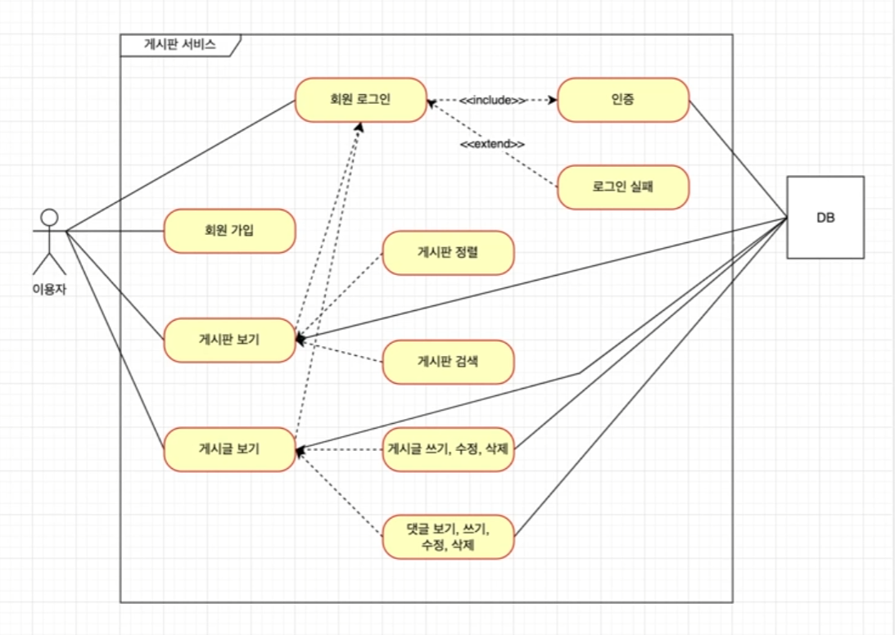

# 0. Intro

## 배울거

* 문서작업
  * ERD 설계, 유즈케이스 : diagrams.net(draw.io)
  * API 디자인 : 구글 시트
  * 커밋 메시지, 협업환경 : git + gitHub
* IDE : IntelliJ 
* 언어 : java
* 프레임워크 : spring boot
* 빌드도구 : gradle
* git GUI : GitKraken
* 경험 
  * 개발전략
  * 도메인 설계
  * 실무 디자인 패턴
  * 비즈니스 로직 구현
* 테스트 : 오류 없이 요구사항 모두 구현 
  * JUnit5
  * 테스트 라이브러리(Mockito, AssertJ)
  * Spring boot slice test 테크닉
  * github 테스트/빌드 자동화
* 배포 
  * 클라우드 서버(Heroku)
  * 깃헙 : Heroku 배포 자동화
* 플러그인






## 기능




## 선택한 기술



[spring initializr](https://start.spring.io/) - 처음 프로젝트 설정(dependencies)


# 1. gitHub 프로젝트와 이슈

1. GitHub에서 프로젝트 생성
   1. 이름
   2. public vs private
   3. add README
   4. gitignore -> IntelliJ에서 할거라서 필요 없음
2. GitKraken에 연동
   1. GitHub id 연동
   2. workspace 만들기
   3. repository add
   4. clone
   5. branch 이름 main -> master로 바꾸기
   6. push -> initialize
3. Projects
   1. 팀 백로그 만들기(애자일 소프트웨어 개발법)
      1. backlog에 업무 추가하기
      2. 업무를 sprint(1~2주) 단위로  나누기
      3. 이번주 sprint ready로 옮기기
      4. 진행중이면 in progress 이동
      5. 다하면 done으로 이동
4. Issues
   1. milestone(일정표) 만들기
   2. 할거 적기
   3. 한거 적기
   4. 다 한거 close 하기
5. pull request : merge 요청
6. Actions : 빌드 배포 자동화
7. settings : 자동화, 설정, 인증
8. workflows : 자동화
9. discussion : 토의하는 곳, setting에서 추가해야 됨
10. sprint : 주 단위로 업무 구분하기, 새로 추가해야 됨


# 2. git branch 전략


## git flow

대규모

* master
* develop
* feature
* release
* hotfix

## github flow

소규모

* master
* feature


## 사용하는 이유, 요령

* 사용하는 이유

  개발 협업 원활하게 하기 위해

* 고려 요소

  * 이 브랜치는 제품으로 내보낼수 있는가?

  * 이 브랜치는 빌드 실패를 허용하는가?

  * 이 브랜치는 테스트 실패를 허용하는가?

  * 이 브랜치는 임시로 운영하는가?


## github flow by GitKraken

* git flow 단축키 : comman +콤마

* github flow branch는 따로 없어서 git flow로 구현해야 됨

  1. dummy branch 생성	

  2. branch 변경

     * master -> dummy

     * Develop -> main


# 3. 유즈케이스

1. app.diagrams.net 사용

   1. GitKraken으로 디렉토리 만들기

      1. terminal

         * 디렉토리 생성

           ```bash
           mkdir document
           ```

         * 빈 파일 생성

           ```bash
           fsutil file createnew document/use-case.svg 0
           ```

      2. Stage all changes

      3. commit message 남기기

         * #번호 - 제목

           왜 했는지 

      4. push

   2. use-case 작성

      * include
      * extend
      * 연관

      

   3. Export

      Export -> SVG -> 이름작성 -> Github 클릭 -> 선택 -> commit message 작성

   4. GitKraken push

      1. push

   5. GitHub merge

      * pull request
      * files changed 확인 -> viewed 체크
      * merge
      * feature branch 삭제(둘중 하나 선택) 
        * 직접 삭제
        * setting에서 자동으로 삭제 설정(Automatically delete head branches)


# 4. API 설계

구글 스프레드 시트 사용, use-case 보고 작성함

* endpoints

  * 종류
    * 뷰
    * data api

  * url

  * method
    * GET : 조회
    * POST : 추가
    * PUT, PATCH : 수정
    * DELETE : 삭제

  * 기능

  * 설명

* api spec
  * url
  * method
  * 입력 데이터
