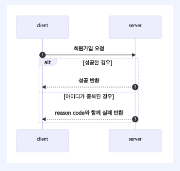
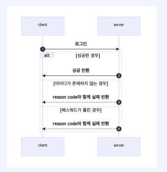
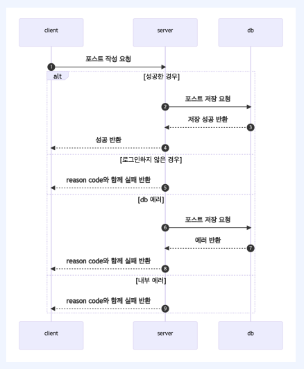
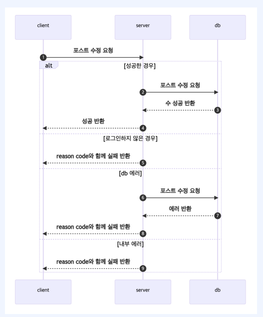
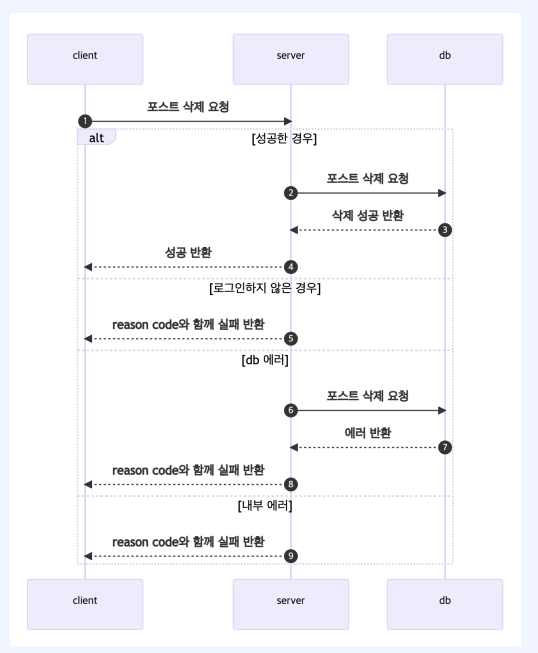
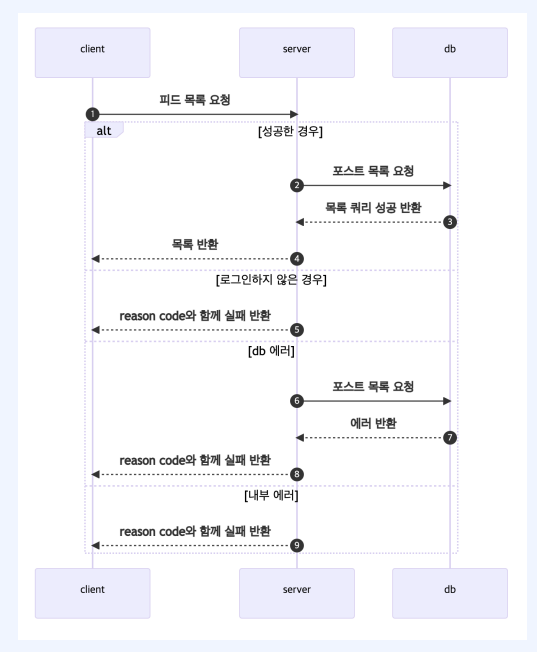

# TDD

실패 테스트 작성 -> 테스트가 성공하도록 수정 -> 리팩토링

# 시퀀스 다이어그램

1. 회원가입

   

2. 로그인

3. 포스트 작성

   

4. 포스트 수정

   

5. 포스트 삭제

   

6. 피드 목록

   

# Test 

## 회원가입

1. controller

   1. 성공시 -> isOk()
   2. 이미 있는 아이디로 회원가입 요청 -> DUPLICATED_USER_NAME 

2. service
   1. 성공

      1. given
         1. userName, pwd
      2. when
         1. findByUserName -> user entity DI
         2. pwd encode -> String DI
         3. save  -> user entity DI
      3. then
         1. 에러 발생안함

   2. 아이디 중복

      1. given
         1. useName,pwd
      2. when
         1. findByUserName 결과물 - Optional DI
      3. then
         1. DUPLICATED_USER_NAME 에러 코드 확인

      

## 로그인

1. Controller

   1. 성공시 -> isOk()

   2. 유저 존재안함 -> USER_NOT_FOUND

   3. 비밀번호 틀림 -> INVALID_PASSWORD

2. Service
   1. 성공시 
      1. given
         1. userName,pwd
      2. when
         1. findByUserName() -> empty DI
      3. then
         1. 에러 안던짐
   2. 유저 존재안함
      1. given
         1. userName,pwd
      2. when
         1. findByUserName -> empty DI
      3. then
         1. USER_NOT_FOUND 에러 코드 확인
   3. 비밀번호 틀림
      1. given
         1. userName,pwd
      2. when
         1. findByUserName -> user entity DI
         2. encode(입력pwd) != DB pwd -> false DI
      3. then
         1. INVALID_PASSWORD 에러코드 확인

## 포스트 작성

1. Controller

   1. 정상 포스트작성 -> isOk()
2. 로그인 안한 상태로 포스트 작성 -> INVALID_TOKEN

2. Service
   1. 정상 포스트작성 
      1. given
         1. userName,title,body
      2. when
         1. findByUserName() -> user entity DI
         2. save() -> post entity DI
      3. then
         1. 에러 안던짐
   2. 로그인 안한 상태로 포스트 작성
      1. given
         1. userName,title,body
      2. when
         1. findByUserName() -> empty DI
         2. save() -> post entity DI
      3. then
         1. USER_NOT_FOUND 에러코드 확인

## 포스트 수정

1. Controller test
   1. 성공시 -> isOk()
   2. 로그인 하지 않은 경우 -> isUnauthorized()
   3. 수정 권한이 없는 경우 -> isUnauthorized()
   4. 포스트 글이 없는 경우 -> isNotFound()

2. Service test
   1. 성공시 
      1. given
         1. title,body,userName,postId
      2. when
         1. userName으로 user Entity 찾기 결과에 mocking
         2. postId로 post Entity 찾기 결과에 mocking
      3. then 
         1. 에러 반환 안함 확인
   2. 포스트가 존재하지 않는 경우
      1. given
         1. title,body,userName,postId
      2. when
         1. userName으로 user Entity 찾기 결과에 mocking
         2. postId로 post Entity 찾기 결과에 mocking(Empty)
      3. then 
         1. POST_NOT_FOUND 에러 반환 확인
   3. 수정 권한이 없는 경우 -> isUnauthorized()
      1. given
         1. title,body,userName,postId
      2. when
         1. userName으로 user Entity 찾기 결과에 mocking(다른 userName)
         2. postId로 post Entity 찾기 결과에 mocking
      3. then 
         1. INVALID_PERMISSION 에러 반환 확인
3. 리팩토링
   1. Cotroller
      1. 수정 성공한 경우 결과물 mocking 해줘야 됨
   2. Service
      1. 포스트 성공한 경우 saveAndFlus() 값 mockin 해줘야 됨 

## 포스트 삭제

1. Controller

   1. 성공 -> isOk()
   2. 로그인 하지 않은 경우 -> isUnauthorized()
   3. 삭제 권한이 없는 경우 ->  isUnauthorized()
   4. 포스트글이 존재하지 않는 경우 -> isNotFound()

2. Service

   1. 성공

      1. given
         1. userName,postId
      2. when
         1. findById -> user entity DI
         2. postId로 post Entity 찾기 결과에 mocking
      3. then
         1. 에러 반환 안함 확인

   2. 포스트가 존재하지 않음

      1. given
         1. userName,postId
      2. when
         1. findById() -> empty DI
      3. then
         1. POST_NOT_FOUND 에러 확인

   3. 유저가 존재하지 않음

      1. given
         1. userName,postId
      2. when
         1. findById() -> post entity DI
         2. findByUserName -> empty DI
      3. then
         1. USER_NOT_FOUND 에러 확인

   4. 삭제 권한이 없음

      1. given
         1. userName,postId
         2. 다른 user entity
      2. when
         1. findById() -> post entity DI
         2. findByUserName -> user entity1 DI
         3. getUser() -> user entity2 DI
      3. then
         1. INVALID_PERMISSION 에러코드 반환

      

## 피드 목록

1. Controller
   1. 성공 -> isOk()
      1. mocking Page
      2. 에러 반환 안함
   2. 로그인하지 않은 경우 -> isUnauthorized()
      1. 피드목록
      2. 내피드목록
2. Service
   1. 성공
      1. 피드 목록
         1. given
            1. 빈 pageable 
         2. when
            1. findAll() -> Page DI
         3. then
            1. 에러 반환 안함
      2. 내 피드 목록
         1. given
            1. 빈 pageable 
         2. when
            1. findAllByUserId() -> Page DI
         3. then
            1. 에러 반환 안함
   2. 실패
      1. user가 존재하지 않음
         1. given
            1. pageable
         2. when
            1. findByUserName -> empty DI
         3. then
            1. USER_NOT_FOUND 에러코드 확인

# 개발

## 회원가입

1. Controller

   1. postMapping
   2. request Service에 전달
   3. Service 결과 반환

2. Service

   1. repository.findByUserName()
      1. 있으면 exception 반환
      2. 없으면 save()

3. Entity

   DB 저장 용도 -> JPA때문에 분리해야 됨

   1. UserEntity

      1. id,pwd
      2. register_at,updated_at,deleted_at  - 유지보수
      3. 자동시간 입력
         1. 등록시간 by @PrePersist 함수
         2. 수정시간 by @PreUpdate 함수
         3. 삭제시간 by @SQLDelete + @Where

      4. UserRole(권한)

      5. Dto 변환 함수

4. Dto

   DB외 사용

   1. UserDto
   2. UserJoinResponse
      1. id,userName,role
      2. User dto -> UserJoinResponse

5. Responsse 규격화

   1. error인경우 : (error code,null) 반환
   2. success인 경우 : ("SUCCESS",result) 반환

6. Error 처리
   1. enum ErrorCode
      1. 아이디 중복
   2. SimpleException
      1. 메시지가 null 인경우 ; message만 반환
      2. 메시지 있는 경우 : erroCode + message 반환
   3. GlobalControllerAdvice
      1. @RestControllerAdvice
         1. 응답
            1. error status
            2. error code 이름
         2. 에러처리
            1. 로그로 에러코드 출력

7. DB 설정

   1. application에서 exclude 설정 지우기

   2. application.yaml 에서 설정  **

      1. JPA

         1. db : postgresql
         2. dialet : org.hibernate.dialect.ZPostgreSQLDialect
         3. ddl-auto : update(배포시 validate로 변경)
         4. form_sql : true
         5. show-sql : true

      2. DB

         Heroku에서 확인

         * adds-ons -> find more adds on -> Postgres 선택 -> Install -> free, app 선택 -> submit -> Postgre 클릭 -> Settings -> Database Credentials에 있음

         1. url : jdbc:postgresql:// + Host + / + Database
         2. username : User
         3. password : Password
         4. platform : postgress
         5. driver : org.postgresql.Driver

8. Post man으로 확인
   1. erro 떳는데 저장됨
   2. 비밀번호가 노출되므로 암호화 필요
9. test
   1. 에러코드 확인 코드 추가

---

## 로그인

1. 암호화

   1. SecurityConfig

      1. BCriptPasswordEncoder bean 생성

   2. 비밀번호 암호화

      UserService의

      1. BCriptPasswordEncoder DI
      2. join 메소드 return entity의 password encode

   3. AuthenticationConfig

      1. WebSecurityConfigurerAdapter 상속
      2. spring security
         1. 허용 - 회원가입, 로그인
         2. 인증요청 - 그외
         3. 세션 관리 안함

2. 회원가입 에러 발생시 DB 저장 안되게 하기

   1. @Transactional 추가

      UserService의 join 메소드

3. RuntimeException 추가
   1. enum ErrorCode에 에러코드이름(HttpStatus, message) 추가 
   2. GlobalControllerAdvice에 추가 

4. test

   1. join service

      회원가입에 encode 추가

5. 로그인

   1. Controller
      1. PostMapping
   2. enum ErrorCode 추가
      1. 아이디 없음
      2. 비밀번호 틀림
   3. Service 
      1. userName 존재 확인
         1. 있으면 UserEntity 반환
         2. 없으면 (아이디 없음 erroCode) 반환
      2. 비밀번호 틀림
         1. 비밀번호 encode 반영하여 확인
         2. 틀리면 (비밀번호 틀림 erroCode) 반환
   4. JWT 토큰 
      1. build.gradle 추가
         * JJWT :: Impl
         * JJWT :: API
      2. 토큰생성
         1. claim 생성
         2. claim에 userName 담기
         3. JWT build
            1. claim
            2. 발행일
            3. 만기일
            4. key, 알고리즘
            5. 암호화 실행
         4. key 메소드

   5. Service
      1. JWT token
         1. 외부에서 설정한 key, 만기일 사용 설정 : @Value("${이름}")
         2. JWT 토큰 생성 후 반환
   6. application.yaml
      1. key 입력
      2. 만기일 입력
   7. postman으로 확인 
      1. 로그인 맞으면 : resultCode "SUCCESS" + result(암호화된 pwd)
      2. 로그인 틀리면 : resultCode "에러코드 이름" + result(null)
   8. test 수정
      1. 에러 코드 이름 반영
      2. encode한 비밀번호 확인 결과물 DI
      3. 에러코드 이름 확인 코드 추가

   

## 포스트 작성

1. Controller
   1. lombok
      1. @RestController
      2. @RequestMapping()
      3. @RequiredArgsConstructor
   2. Postmapping
   3. spring security로 userName 가져오기
   4. create service 사용
   5. 반환 타입은 Response
2. Entity
   1. Entity of() 생성자 
3. service
   1. repository.finByUserName()
      1. 있으면 entity
      2. 없으면 error(errorcode,message)
   2. repository.save()

4. userName 가져오기 설정
   1. AuthenticationsConfig
      1. filterBefore 추가
         1. UsernamePasswordAuthenticationFilter 전에 JwtTokenFilter 적용
   2. JwtTokenFilter
      1. 정상작동
         1. get header
            1. header 없으면 return filterchain
         2. token 가져오기
         3. token이 유효한지 확인(만기일) by JwtTokenUtils
            1. 비유효하면 로그남기기
            2. filterchane
         4. token으로 userName 가져오기 by JwtTokenUtils
         5. userName 존재 여부 확인
         6. UsernamePasswortAuthenticationToken 생성
            1. user
            2. credentials
            3. authorites
         7. 생성할걸로 인증 생성
      2. 에러시
         1. 로그남기기
         2. return filterchain
      3. filterchain

5. controller
   1. Authentication에서 userName 받아올 수 있음

6. JwtTokenUtils

   1. 만기일 확인
      1. claims 가져오기

   2. userName 가져오기

7. service
   1. userName 존재 여부 확인 함수 추가

8. AuthenticationConfig
   1. userService DI
   2. key 값 가져오기

9. Postman으로 확인

   1. UsernamePasswortAuthenticationToken에서 에러 발생

   2. Token invalid시 처리 안함

      

---

1. UsernamePasswortAuthenticationToken에서 에러 발생
   1. User Entity에서 getName()을 구현
      1. Userdetails implemetns
      2. 함수 구현
         1. getAuthorities()
         2. getUsername()
         3. isAccountNonExpired()
         4. isAccountNolocked()
         5. isCredentialsNonExpired()
   2. JwtTokenFilter UsernamePasswortAuthenticationToken 생성자 수정
      1. authorites -> user.getAuthorities()

2. Token invalid시 처리

   1. AuthenticationConfig
      1. EntryPoint 생성
         1. contentType : json
         2. status 설정 : INVALIE_TOKEN
         3. response에 내용 적기(에러코드, result)

   2. enum ErrorCode
      1. INVALID_TOKEN 에러코드 추가

## 포스트 수정

1. Controller

   1. puMapping
   2. postId,request dto, authentication 가져오기
   3. modify service
   4. Response.success() 반환

2. errorCode 추가

   1. POST_NOT_FOUND
   2. INVALID_PERMISSION

3. Service

   1. modify
      1. post 존재여부 확인
         1. 있으면 post entity 
         2. 없으면 POST_NOT_FOUND 에러 반환
      2. 수정 권한 확인
         1. 있으면 save() + entity -> dto
         2. 수정 권한 없으면 INVALID_PERMISSION 에러 반환

4. post dto 생성

   1. 변수
   2. entity -> dto

5. postResponse 생성

   1. 변수
   2. dto -> response

6. Controller 

   1. Response<post dto>
   2. Response.success(postResponse)

7. postman으로 확인

   1. 포스트 변경하기
      1. 수정 권한이 있느 경우
         1. 포스트글 작성한 id로 로그인
         2. 응답으로 받은 token 복사
         3. 변경 요청 Authorization에 token 붙여넣기
         4. 포스트글 내용 수정
         5. 수정 요청
         6. success + result
            1. updated at에 문제 발생
               1. DB에는 정상적
               2. 가져온것을 잘못한듯
      2. 수정 권한이 없는 경우
         1. 다른 id로 로그인
         2. 응답으로 받은 token 복사
         3. 변경 요청 Authorization에 token 붙여넣기
         4. 포스트글 내용 수정
         5. 수정 요청
         6. INVALID_PERMISSION + null
      3. 포스트글이 없는 경우
         1. 아무 id로 로그인
         2. 응답으로 받은 token 복사
         3. 없는 포스트 id에 변경 요청 Authorization에 token 붙여넣기
         4. 포스트글 내용 수정
         5. 수정 요청
         6. POST_NOT_FOUND+ null

8. updated at에 문제 해결

   1. Service 

      save() -> saveAndFlush()

## 포스트 삭제

1. Service
   1. delete
      1. post 존재여부 확인
         1. 있으면 post entity 
         2. 없으면 POST_NOT_FOUND 에러 반환
      2. 삭제 권한 확인
         1. 있으면 delete()
         2. 수정 권한 없으면 INVALID_PERMISSION 에러 반환
      3. delte()

2. Controller
   1. DeleteMapping
   2. postId, authentication 가져오기
   3. delete service 사용
   4. Response.success() 반환

3. postman으로 확인
   1. 포스트 삭제
      1. 수정 권한이 있는 경우
         1. 포스트글 작성한 id로 로그인
         2. 응답으로 받은 token 복사
         3. 변경 요청 Authorization에 token 붙여넣기
         4. 포스트글 내용 삭제 요청
         5. success + result
            1. updated at에 문제 발생
               1. DB에는 정상적
               2. 가져온것을 잘못한듯
      2. 수정 권한이 없는 경우
         1. 포스트글 작성한 id로 로그인
         2. 응답으로 받은 token 복사
         3. 변경 요청 Authorization에 token 붙여넣기
         4. 포스트글 내용 삭제 요청
         5. INVALID_PERMISSION + null
      3. 포스트글이 없는 경우
         1. 아무 id로 로그인
         2. 응답으로 받은 token 복사
         3. 변경 요청 Authorization에 token 붙여넣기
         4. 포스트글 내용 삭제 요청
         5. POST_NOT_FOUND+ null

## 피드 목록

1. Controller
   1. getMapping
   2. pageable, authntication 가져오기
   3. list service
   4. Response().success 반환
2. Service
   1. list
      1. findAll()
      2. paging
      3. entity -> dto
   2. my
      1. findAllByUser()
      2. paging
      3. entity -> dto

3. postman 확인

   1. 전체 list
      1. 로그인
      2. 토큰 복사
      3. 전체목록 가져오기
         1. size,page,sort 설정
      4. delete한거 빼고 다 나옴
   2. my list
      1. 아무글 없는 경우
         1. 로그인
         2. 토큰 복사
         3. 전체목록 가져오기
            1. size,page,sort 설정
         4. 아무것도 안나옴
            1. delete반영됨
      2. 있는 경우
         1. 로그인
         2. 토큰 복사
         3. 전체목록 가져오기
            1. size,page,sort 설정
         4. 자기가 작성한 포스트 나옴

   3. paging 확인
      1. size,page 설정

## 프론트엔드

1. 변수이름 맞추기
   1. request dto
      1. userName -> name

2. app에서 확인하기
   1. 로그인
   2. Feed
   3. Write Post
   4. Sign Up
   5. MyPosts
      1. modify
      2. delete

# 정리

## Test

### Controller

1. lombok
   1. @SpringBootTest : Bean 다 불러오기
   2. @AutoConfigureMockMvc : mock 사용
2. DI(@Autowired)
   1. MockMvc
   2. ObjectMapper

3. Mock(@mockBean)

   1. 사용하는 Service 

4. test 코드(@Test)

   1. given
      1. 인수
   2. when
      1. Service 결과값 DI
   3. then
      1. mvc 실행
         1. HTTP method
         2. 경로
         3. contentType
      2. 처리내용 출력
      3. 상태값 확인
         1. 성공시 -> isOk()
         2. 실패시 -> 실패상태

5. 기타

   @WithAnonymousUser : id 아무거나

### Service

1. lombok
   1. @SpringBootTest : Bean 다 불러오기
2. DI(@Autowired)
   1. Service

3. Mock(@mockBean)
   1. 사용하는 함수 class or interface
      1. Repository
      2. encoder

4. test 코드(@Test)
   1. given
      1. 인수
   2. when
      1. 사용하는 함수 결과값(Repository, encoder)
   3. then
      1. 성공인 경우 -> 에러 안던지는 지 확인
      2. 실패인경우 -> 에러코드 확인

## 개발

### Controller 

1. Mapping
2. 인수 가져오기
3. Service 실행

### Response 규격화

### Service

비즈니스 로직

### Repository

DB CRUD

### Entity

DB에서 사용한거

1. 저장 data
2. 읽어온 data

### dto

모두 entity 변환기가 있음

1. View
   1. 변수
   2. entity -> dto 함수
2. Reqeust
3. Response
   1. dto -> response dto 함수

### Config

### Exception

### JWT Token

### Paging
