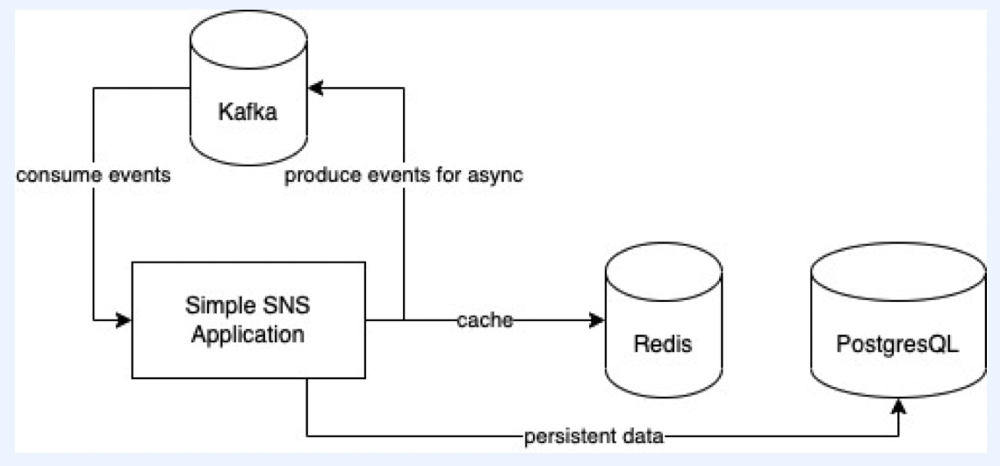
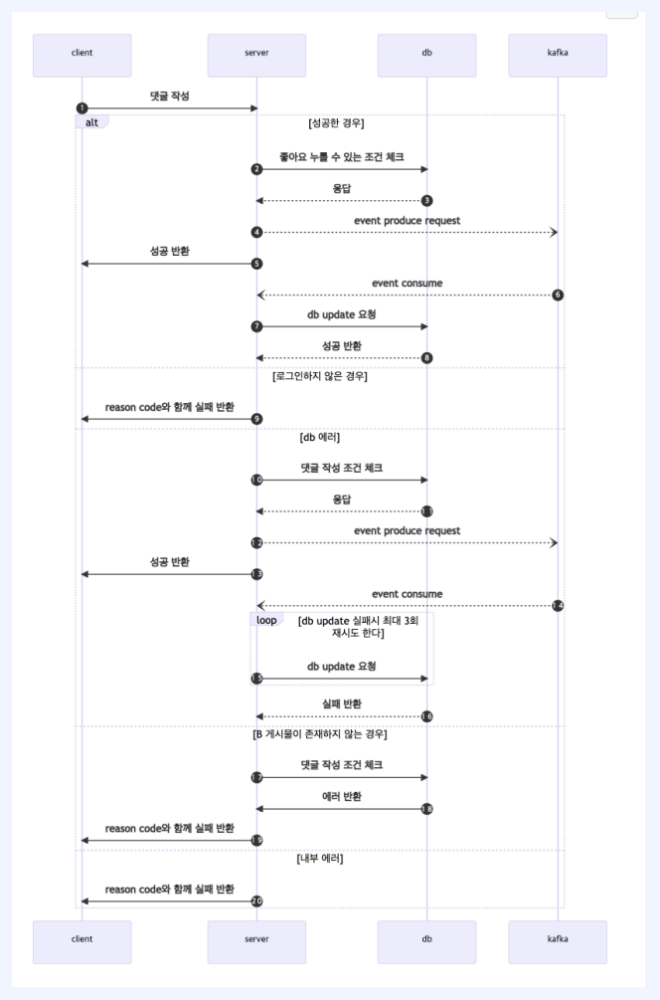
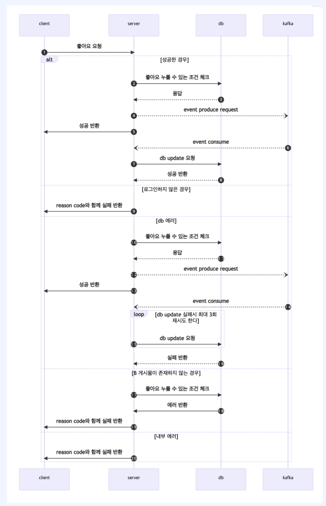

# 문제점

## 코드의 비 최적화

* user 조회 중복

  * JwtTokenFilter + service에서 로그인 여부 확인

  * API 요청마다 로그인 여부확인함

## 기능간의 강한 결합성

* Alarm까지 생성해야 응답하는 API
  * 댓글 작성 API
  * 좋아요 API

## 수많은 DB IO

* JPA 써서 Query 최적화가 안됨

  * 체크 필요사항

    * idx 

    * join 체크

# 해결

## 코드 중복 처리

* 코드의 비 최적화 해결

  

## Kafka

비동기처리로 해결

* 기능간의 강한 결합성
  * 댓글작성 API 응답 받으면 Alarm event 발생
  * 좋아요 API 응답 받으면 Alarm event 발생

## Redis

cache 기능 사용해서 해결

* 수많은 DB IO