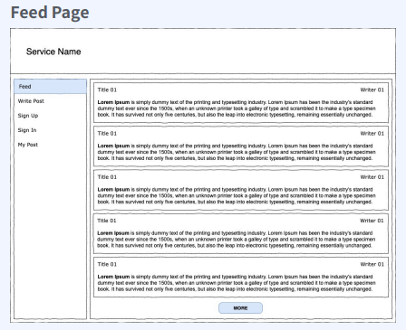
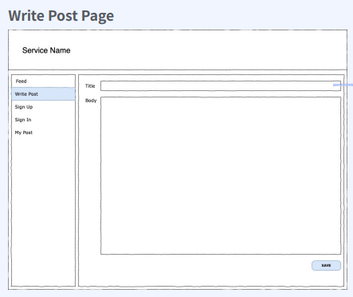
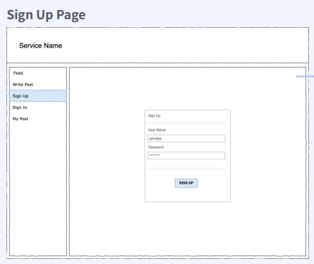
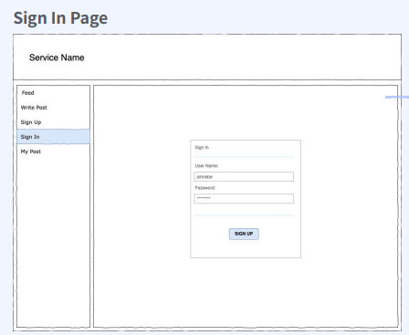
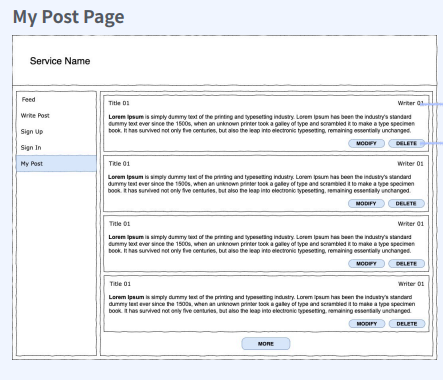
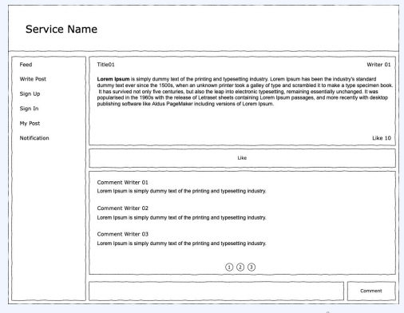
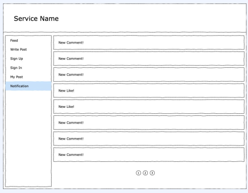

# 페이지별 요구분석

1. 포스트 리스트 페이지

   

   * 모든 포스트 가져오기

   * 제목, 작성자, 본문 보연주기

   * paging, 정렬 처리

2. 포스트 작성 페이지

   

   * 제목, 본문으로 포스트 작성

3. 회원가입 페이지

   

   * username, pwd로 회원가입

4. 로그인 페이지

   

   * username, pwd로 로그인

5. 내가 작성한 포스트 페이지

   
   
   * 내가 작성한 포스트 list
   
     * 로그인한 user 글 보여주기
   
     * paging, 정렬 처리
   
     * 제목,작성자,본문 보여주기
   
   * 포스트 삭제
   
   * 포스트 수정

---

6. 댓글 페이지

   

   * 좋아요
     * 좋아요 갯수 표시

     * 좋아요 누르기 가능(1번만)
   * 댓글

     * 작성자, 댓글 출력 

     * pagination, 정렬

     * 댓글 작성

7. 알람 페이지

   

   * 알람
     * 알람 목록
       * 댓글
       * 좋아요
     * pagination, 정렬

# API

1. Post List API

   * 제목, 작성자, 본문 출력
   * paging, 정렬

2. Post Create API

   * 제목, 본문

3. User Sign Up API

   * userName, pwd

4. User Sign In API

   * userName, pwd

5. My Post API

   * 내가 작성한것
   * 제목, 작성자, 본문 출력

6. Post delete API

   * 내가 작성한 글 삭제

7. Post Modify API

   * 내가 작성한 글 수정

   ---

8. Comment List

   * 댓글 목록
     * 작성자
     * 댓글
   * paging, 정렬

9. CommentWrite

   * 댓글 작성
     * 로그인 한 사람만 작성가능

10. LikeCount

    * 좋아요 갯수 표시

11. Like

    * 좋아요
      * 1번만 가능

12. Alarm

    * 알람 목록
      * 댓글
      * 좋아요
    * paging, 정렬

# Architecture 설계

## 개발환경

Spring Boot

## DB 선택

PostgreSQL를 선택

1. 대용량 DB 필요없음
2. 데이터 분석 필요없음
3. User와 Post의 관계가 필요하다
4. Heroku에서 무료로 PostgreSQL 제공

## Authorization 

JWT 선택

* 이게 더 보안적

* Spring JWT로 구현 가능

## 데이터

User, Post

---

Comment, Like, Alarm