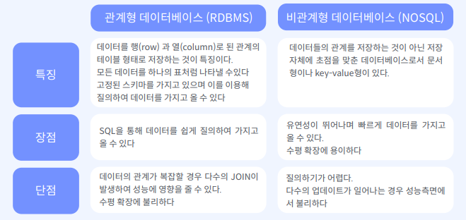

# 페이지 별 기능

1. 포스트 리스트 페이지

   1. 모든 포스트 가져오기
   2. 제목, 작성자, 본문 보연주기
   3. paging, 정렬 처리

2. 포스트 작성 페이지

   1. 제목, 본문으로 포스트 작성

3. 회원가입 페이지

   1. username, pwd로 회원가입

4. 로그인 페이지

   1. username, pwd로 로그인

5. 내가 작성한 포스트 페이지

   1. 내가 작성한 포스트 list
      1. 로그인한 user 글 보여주기
      2. paging, 정렬 처리
      3. 제목,작성자,본문 보여주기
   2. 포스트 삭제
   3. 포스트 수정

   

# API

1. Post List API
2. Post Create API
3. User Sign Up API
4. User Sign In API
5. My Post API
6. Post delete API
7. Post Modify API

# 사전지식

## DB 선택 기준

1. 대용량 DB

   HBASE, cassandra

2. 관계형 DB(RDMS)

   PostgreSQL, MySQL

3. 비관계형 DB(NoSQL)

   redis, mongoDB, CoutchDB

4. 데이터 분석에 용이한 DB

   druid

tip)

* 팀내 운영 경험이 있는 사람이 있거나, 

* reference가 많은 데이터베이스(문제해결이 쉬워짐)

  

## RDBMS vs NoSQL

## Authentication, Authorization

* Authentication :  내가 누구인지 확인

* Authorization : 권한 확인

## Authorization 방법

1. id/ pwd
2. 임의의 문자열

# Architecture 설계

## DB 선택

PostgreSQL를 선택

1. 대용량 DB 필요없음
2. 데이터 분석 필요없음
3. User와 Post의 관계가 필요하다
4. Heroku에서 무료로 PostgreSQL 제공

## Authorization 선택

임의의 문자열

* 이게 더 보안적

* Spring JWT로 구현 가능