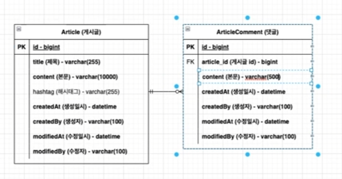

# 초기 설정

spring initializr로 디렉토리 초기화

##  spring initializr

1. 생성
   
   * 유료, 무료 선택
   
     * 유료 : new project -> spring initializr
   
     * 무료 : start.spring.io -> generate -> zip download -> 압축풀기 -> IntelliJ에서 불러오기
   
   * 설정
   
     * Java 
   
     * Gradle
   
     * jdk 17
   
     * jar
   
     * spring boot 2.7.0
   
     * download pre-built 체크 : indexing 시간 줄여줌
   
     * Dependency
       * Developer Tools
         * DevTools
         * Lombok
       * Web
         * Spring Web
       * Ops
         * Actuator 

## gitignore

Git에서 추적하는거 제외하기

1. gitignore.io 
2. Java, Gradle, IntelliJ+all, Windows, macOS, VisualStudioCode 생성
3. .gitignore에 복붙


## Git

1. GitKraken에서 commit 

   Stage all changes -> Commit Message 작성 -> Commit

2. Push

3. GitHub Issues로 이동

   1. 한거 체크

4. GitHub Pull requests로 이동

   1. compare & pull request 클릭

   2. 제목 Issue제목이랑 똑같게 하기

   3. 한거 내용 적기

      1. 업무내용

      2. 업무 종류

         * This closes 작업번호 : 끝냄

         * This fix 작업번호 : bug 고침

         * This resolve 작업번호 : 문제 해결

      3. 그 외

         * Reviewers
         * Assingnees
         * Labels
         * MileStone

   4. Create pull request 클릭

5. Files changed 확인하기

   * 일부만 복구시키기(선택)
     1. GitKraken에서 최일 최근거 오른쪽 클릭 -> Revert commit
     2. Commit을 바로 만들고 싶지 않으면 No클릭 / 싶으면 Yes 클릭
     3. Unstage all changs 클릭
     4. 잘못된거만 Stage Files로 이동, 나머지는 discard
     5. Commit Message 작성
     6. commit
     7. push
   * 확인한건 viewed 체크하기
   * Review changes : LGTM

6. Merge

   Merge pull request -> Confirm merge

7. feature branch 자동 삭제됨

8. GitKraken - feature에서 fetch 클릭

9. GitKraken - main에서 fetch - Pull(fast-forward only) 클릭

10. IntelliJ에서 commit 한게 보이게 됨


# 도메인 설계

## ERD

1. feature branch 생성 후 push

2. 원하는 위치에 erd 생성

   1. app.diagrams.net 접속

   2. erd 검색

   3. Filname 설정 -> create 클릭

   4. Select Folder

      프로젝트 -> feature -> document

   5. Commit Message 작성

3. erd 작성

   1. 테이블 생성

      Entity Relation에 있음

      * 테이블 이름
      * 속성 이름
      * 데이터 타입
      * PK, FK

   2. 관계(화살표) 추가

   

4. 


## DAO 

1. java class 작성

2. GitKraken에서 fetch-Pull(fast forward only)

3. Staged Files 확인

4. Commit Message 작성

   

## Git

1. Issues에서 한거 체크하기

2. Pull requests

   1. Compare & pull request 클릭 

   2. pull request 작성

   3. Files changed 확인

      확인했으면 viewed 체크

   4. Review changes 작성

3. Merge

   1. Merge pull request 클릭
   2. Confirm Merge 클릭

4. GitKraken feature에서 fetch 

5. GtiKraken main에서 pull(fast forward only)

6. feature 삭제

   

   

# DB

## DB 선택하기

DB-engines 순위 참고


## 환경 세팅

* MySQL Community Server 설치

* DB 연동

  Cntrl+shift+A -> database  -> data source -> MySQL -> 설정

* 유저 생성

  ```mysql
  create user '이름' identified by '비밀번호';
  grant all on `DB이름`.* to 'user이름' with grant option;
  flush privileges;
  ```

* build gradle 추가

  1. start.spring.io 검색

  2.  dependecy에 추가 

     * JPA

     * MySQL Driver

     * H2 database

  3. explore

  4. dependency 복붙

* resources

  * application.yaml 작성

    ```yaml
    spring:
    	datasource:
    		url: jdbc:mysql://localhost:3306/board	# url
    		username: yg							# userId
    		password: 1234							# 비밀번호
    		driver-class-name: com.mysql.cj.jdbc.Driver	# DB driver
        jpa:
        	defer-datasource-initializatio: true	
        	hibernate.ddl-auto: create				# table 자동 생성
        	show-sql: true							# sql문 보여주기
        	poperties:
        		hibernate.format_sql: true			# 형식맞춘 sql문 보여주기
        		hibernate.default_batch_fetch_size: 100	# fetch 크기 설정
         h2.console.enabled: false					# h2 database 콘솔 보여주기
         sql.init.mode: always						# data.sql 항상 실행하기
    
    ---
    spring:											# 테스트 모드
    	config.activate.on-profile: testdb
    ```

    

  * data.sql

    비워 있으면 안됨

    필요없으면 지우셈


## Entity로 바꾸기

1. DAO class에 @Entity 추가

2. Lombok

   * 필수
     * @Entity : ORM 
     * @Id : PK
     * @GeneratedValue(strategy = GenerationType.IDENTITY) : 자동증가
   * 선택
     * @Getter : getter
     * @Setter : setter
     * @NoArgsConstructor : default 생성자
     * @Data : getter+ setter 
     * @ToString(callSuper = true) : 상속변수 포함 toString
     * @EqualsAndHashCode(callSuper = true)	// 상속변수 포함 equals,hashcode
     * @Column
       * null = false : not null
       * length = 길이 : 길이 설정
     * @CreatedDate : 생성일
     * @CreatedBy : 생성자
     * @LastModifiedDate : 수정일
     * @LastModifiedBy : 수정자
     * @Table(indexes = {}) : 검색기능 추가시 index 필요함
       * @Index(columnList = "속성이름")
     * 관계
       * @ManyToOne : n : 1
         * optional = false : not null
       * @OneToMany : 1 : n
         * mappedBy = "Entity이름" : FK
         * cascade = CascadeType.ALL : 이거 지우면 연관된거 다 지움
     * @OrderBy("속성이름") : 정렬
     * ToString.Exclude : 순환참조 방지

3. jpa config

   한번만

   자동 사용자 등록

   @Entity 쪽에 @EntityListeners(AudiginsEntityListener.class) 해줘야 됨

   ```java
   @EnableJpaAuditing
   @Configuration
   public class JpaConfig {
       
       @Bean
       public AuditorAware<String> auditorAware() {
           reuturn () -> Optional.of(value:"useerId"); //TODO: spring security 인증 때 수정
       }
   }
   ```

4. 생성자

   * 기본 생성자(ORM시 필수)

     ```java
     protected Article() {}	// 평소에는 오픈하지 않아선
     ```

   * 부분 생성자

     ```java
     private Article(변수들) {	// 메타데이터 제외, PK 제외, 도메인과 관련된 변수만
         this.변수 = 변수;
     }
     
     public static Article of(변수들) {	// new 없이 생성 가능
         return new Article(변수들)
     }
     ```

5. equals

   collections 사용 시 equals 설정 해줘야됨

   cntrl + u -> equals() and hashCode() -> Template에서  equals and hashCode 선택 -> 기준 선택(PK)
   
   ```java
   @Override
   public boolean equals(Object o) {
       if(this == 0) return true;
       if(!(o instanceof Article article)) return false;
       return id != null ** id.equals(article.id);	// 영속화 전도 고려해서 id != null 추가
   }
   ```
   
   

6. console

   아래 Services -> add Service -> Spring boot -> play

   run과 service를 분리해서 볼수 있음

   멀티모듈 프로젝트 시 좋음

7. VM warning 없애기

   JDK13 이상부터는 --Xverity, -noverify 안써서 생기는 warning

   아래 Services -> Edit Configuration -> Modify options -> optimizer 검색 -> disable launch optimization 선택 -> apply -> ok

8. repository 생성

   ```java
   public interface ArticleRepository extends JpaRepository<Article,Long> {
       
   }
   ```

9. AuditingFileds 추출

   도메인과 연관 없고, 반복된느 요소라서 따로 class 생성한 다음 상속시킴


## test

1. Lombok

   * @Import(JpaConfig.class) : 설정 가져오기 
   * @DataJpaTest : Jpa test

2. Autowired

   private final class이름 변수이름;  -> 자동 Autowired 해줌

3. 생성자

   ```java
   public JpaRepositoryTest(@Autowired class이름 변수이름) {
       this.변수 = 변수
   }
   ```

4. @Test

   ```java
   assertThat(변수)
       .isNull
       .hasSize()
       .isEqualTo();
   ```

   

## Git

GitKraken

1. 작업별로 분류해서 반복
   1. Staged Files에 올리기
   2. commit message 작성
2. push

GitHub

	1. pull requests 생성
	2. files changed 확인 
	3. revies 남기기
	4. Merge

GitKraken

1. feature에서 fetch
2. main에서 pull(fast-forward only)


# API

## Data REST 적용

1. build gradle 

   start.spring.io에서 검색해서 추가하기

   * dependency
     * Rest Repositories : rest 형식
     * Rest Repository HAL Explorer : rest api test

2. applications.yaml

   ```yaml
   spring:
   	data.rest:
   		base-path:/api	# 기본 경로	
   		detection-startegy: anotated	# annotation 명시한것만 노출
   ```

3. respository

   @RepositoryRestResource 추가

4. 테스트

   1. Annotation
      * @SpringBootTest : container
      * @AutoConfigureMockMvc : mockMvc
      * @Transactional : DB영향 ㄴ = roll back

   2. 기본생성자(@Autowired MockMvc mvc)

   3. Test

      ```java
      mvc.perform(get(("url")))
          .andExpect(status().isOk())
          .andExpect(content.contentType(MediaType.valueOf("application/hal+json")));
      ```


## querydsl

부분 검색 가능하게 하기

1. build.gradle

   * dependency 추가

     ```java
     implementation "com.querydsl:querydsl-jpa"
     implementation "com.querydsl:querydsl-core"
     implementation "com.querydsl:querydsl-collections"
     annotationProcessor "com.querydsl:querydsl-apt:${dependencyManagement.importedProperties['querydsl.version']}:jpa" // querydsl JPAAnnotationProcessor 사용 지정
     annotationProcessor "jakarta.annotation:jakarta.annotation-api" // java.lang.NoClassDefFoundError (javax.annotation.Generated) 대응 코드
     annotationProcessor "jakarta.persistence:jakarta.persistence-api" // java.lang.NoClassDefFoundError (javax.annotation.Entity) 대응 코드
     ```

   * querydls 설정 추가

     ```java
     // Querydsl 설정부
     def generated = 'src/main/generated'	
     
     // querydsl QClass 파일 생성 위치를 지정(gradle, IntelliJ 중복 스캔 방지)
     tasks.withType(JavaCompile) {
         options.getGeneratedSourceOutputDirectory().set(file(generated))
     }
     
     // java source set 에 querydsl QClass 위치 추가
     sourceSets {
         main.java.srcDirs += [ generated ]
     }
     
     // gradle clean 시에 QClass 디렉토리 삭제
     clean {
         delete file(generated)
     }
     ```


2. repository

   * extends 
     * QuerydslPredicateExecutor<Entity타입>
     * QuerydslBinderCustomizer<QEntity타입>

   * api 검색 옵션 추가

     ```java
     @Override
     default void customize(QuerydslBindings bindings, QArticle root) {
         bindings.excludeUnlistedProperties(true);
         bindings.including(root.title, root.content, root.hashtags, root.createdAt, root.createdBy);
         bindings.bind(root.title).first(StringExpression::containsIgnoreCase);
         bindings.bind(root.content).first(StringExpression::containsIgnoreCase);
         bindings.bind(root.hashtags.any().hashtagName).first(StringExpression::containsIgnoreCase);
         bindings.bind(root.createdAt).first(DateTimeExpression::eq);
         bindings.bind(root.createdBy).first(StringExpression::containsIgnoreCase);
     }
     ```

     

3. .gitignore

   QClass가 계속 바뀜 -> /src/main/generated 추가 


## Git

GitKraken

1. Staged Files에 올리기
2. commit message 작성

3. push

GitHub

	1. pull requests 생성
	2. files changed 확인 
	3. revies 남기기
	4. Merge

GitKraken

1. feature에서 fetch
2. main에서 pull(fast-forward only)


# View


## Thymeleaf

뷰를 랜더링할 서버사이드 템플리 엔진

1. build.gradle

   * dependency 추가
     * thymleaf(start.spring.io 참고)

2. controller 생성

   1. Lombok
      * @RequestMapping() : url
      * @Controller : controller DI

3. 테스트(뷰 엔드포인트)

   ```java
   @DisplayName("View 컨트롤러 - 게시글")
   @WebMvcTest(ArticleController.class)	// controller 불러오기
   class ArticleControllerTest {
   
       private final MockMvc mvc;
   
       private final FormDataEncoder formDataEncoder;
   
       @MockBean private ArticleService articleService;
       @MockBean private PaginationService paginationService;
   
   
       ArticleControllerTest(
               @Autowired MockMvc mvc
       ) {
           this.mvc = mvc;
       }
       
       @Disabled("구현 중")	// 아직 html작성 안해서 404 error 뜸 -> build가 안됨
       @DisplayName("[view][GET] 게시글 리스트 (게시판) 페이지 - 정상 호출")
       @Test
       void givenNothing_whenRequestingArticlesView_thenReturnsArticlesView() throws Exception {
           // Given
           given(articleService.searchArticles(eq(null), eq(null), any(Pageable.class))).willReturn(Page.empty());
           given(paginationService.getPaginationBarNumbers(anyInt(), anyInt())).willReturn(List.of(0, 1, 2, 3, 4));
   
           // When & Then
           mvc.perform(get("/articles"))
                   .andExpect(status().isOk())
                   .andExpect(content().contentTypeCompatibleWith(MediaType.TEXT_HTML))
                   .andExpect(view().name("articles/index"))
                   .andExpect(model().attributeExists("articles"))
                   .andExpect(model().attributeExists("paginationBarNumbers"))
                   .andExpect(model().attributeExists("searchTypes"))
                   .andExpect(model().attribute("searchTypeHashtag", SearchType.HASHTAG));
           then(articleService).should().searchArticles(eq(null), eq(null), any(Pageable.class));
           then(paginationService).should().getPaginationBarNumbers(anyInt(), anyInt());
       }
   }
   ```

   
