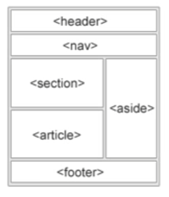

# 초기 설정

spring initializr로 디렉토리 초기화

##  spring initializr

1. 생성
   
   * 유료, 무료 선택
   
     * 유료 : new project -> spring initializr
   
     * 무료 : start.spring.io -> generate -> zip download -> 압축풀기 -> IntelliJ에서 불러오기
   
   * 설정
   
     * Java 
   
     * Gradle
   
     * jdk 17
   
       * IntellilJ에서 JDK 설정
   
         **File > Project Structure > Platform Settings > SDKs**>add JDK
   
         **File > Project Structure > Project Settings > Project > Project SDK에서 JDK 선택**
   
     * jar
     
     * spring boot 2.7.0
     
     * download pre-built 체크 : indexing 시간 줄여줌
     
     * Dependency
       * Developer Tools
         * DevTools
         * Lombok
       * Web
         * Spring Web
       * Ops
         * Actuator 

## gitignore

Git에서 추적하는거 제외하기

1. gitignore.io 
2. Java, Gradle, IntelliJ+all, Windows, macOS, VisualStudioCode 생성
3. .gitignore에 복붙


# 도메인 설계

## ERD

1. feature branch 생성 후 push

2. erd 작성

   1. app.diagrams.net 접속

   2. erd 검색

   3. Filname 설정 -> create 클릭

   1. 테이블 생성

      Entity Relation에 있음

      * 테이블 이름
      * 속성 이름
      * 데이터 타입
      * PK, FK

   2. 관계(화살표) 추가

   

3. export
   1. 제목설정
   2. 위치 설정
      1. 디렉토리 있어야 됨
         1. 디레토리 생성 : mkdir document
         2. 빈 파일 생성 : touch use-case.svg
   2. commit message 작성


## Class

1. java class 작성


# DB

## DB 선택하기

DB-engines 순위 참고


## 환경 세팅

1. MySQL Community Server 설치

2. DB 연동

   1. plugins에서 DB navigator없으면 marketplace에서 다운로드

   2. 재시작

   3. DB Browser 실행

      View -> Tool Windows -> DB Browser 

   4. DB 추가

      +누르기 -> MySQL -> DB 설정

3. 유저 생성

   ```mysql
   create user '아이디'@'localhost' identified by '비밀번호';
   grant all on `board`.* to 'yg'@'localhost' with grant option;	-- 모든권한 주기
   flush privileges;	-- commit
   
   select `user` from `mysql`.`user`;	-- user 보기
   show grants for 'yg'@'localhost';	-- 권한 보기
   ```

4. build.gradle에 dependency 추가(start.spring.io 참고)

   * JPA : ORM
   * MySQL Driver 
   * H2 database : DB test

5. application.yaml 작성

   resources에 위치

   ```yaml
   debug: false  # 모든 debug 끄기
   management.endpoints.web.exposure.include: "*"  # Actuator 중에 드러나지 않은 엔드포인트 볼수 있게 하기
   
   logging:
     level:
       com.example.demo: debug
       org.springframework.web.servlet: debug
       org.hibernate.type.descriptor.sql.BasicBinder: trace  # jpa 쿼리문 변수볼수 있게함
   
   spring:
   	datasource:
   		url: jdbc:mysql://localhost:3306/board	# url
   		username: yg							# userId
   		password: 1234							# 비밀번호
   		driver-class-name: com.mysql.cj.jdbc.Driver	# DB driver
       jpa:
       	database: mysql   # mysql 사용
       	database-platform: org.hibernate.dialect.MySQL5InnoDBDialect	# dialect 설정
       	defer-datasource-initializatio: true	
       	hibernate.ddl-auto: create				# table 자동 생성
       	show-sql: true							# sql문 보여주기
       	poperties:
       		hibernate.format_sql: true			# 형식맞춘 sql문 보여주기
       		hibernate.default_batch_fetch_size: 100	# fetch 크기 설정
        h2.console.enabled: false					# h2 database 콘솔 보여주기
        sql.init.mode: always						# data.sql 항상 실행하기
   
   ---
   spring:											# 테스트 모드
   	config.activate.on-profile: testdb			# testdb 실행시 설정
   ```

6. data.sql

   빈거면 지우기, 없으면 상관없음


## Entity로 바꾸기

1. jpa config

   * 자동 사용자 등록

   * @Entity 쪽에 @EntityListeners(AudiginsEntityListener.class) 해줘야 됨

   ```java
   @EnableJpaAuditing
   @Configuration
   public class JpaConfig {
       
       @Bean
       public AuditorAware<String> auditorAware() {	
           reuturn () -> Optional.of("유저야이디"); //TODO: spring security 인증 때 수정
       }
   }
   ```

   

2. 도메인 class

   1. Lombok

      * 필수
        * @EntityListeners(AuditingEntityListener.class)
        * @Entity : ORM 
        * @Id : PK
        * @GeneratedValue(strategy = GenerationType.IDENTITY) : 자동증가

      * 선택
        * @Getter : getter
        
        * @Setter : setter
        
        * @NoArgsConstructor : default 생성자
        
        * @Data : getter+ setter 
        
        * @ToString
        
          * callSuper = true : 상속변수 포함 toString
          * Exclude : 양방향 관계시 순환 참조 방지
        
        * @EqualsAndHashCode
        
          * callSuper = true : 상속변수 포함 equals,hashcode
        
        * @Column
          * null = false : not null
          * length = 길이 : 길이 설정
        
        * @CreatedDate : 생성일
        
        * @CreatedBy : 생성자
        
        * @LastModifiedDate : 수정일
        
        * @LastModifiedBy : 수정자
        
        * @Table(indexes = {}) : 검색기능 추가시 index 필요함
          * @Index(columnList = "테이블 속성이름")
        
        * 관계
          * @ManyToOne : n : 1
            * optional = false : not null
          * @OneToMany : 1 : n
            * mappedBy = "Entity이름" : FK
            * cascade = CascadeType.ALL : 이거 지우면 연관된거 다 지움
        
        * @OrderBy("속성이름") : 정렬
        
          

   2. 생성자

      1. 기본 생성자(ORM시 필수)

        ```java
        protected Article() {}	// 평소에는 오픈하지 않아선
        ```

      2. 부분 생성자

         ```java
         private Article(변수들) {	// 메타데이터 제외, PK 제외, 도메인과 관련된 변수만
             this.변수 = 변수;
         }
         
         public static Article of(변수들) {	// new 없이 생성 가능
             return new Article(변수들)
         }
         ```

         

   3. equals, hashcode

      collections 사용 시 equals 설정 해줘야됨

      alt + insert -> equals() and hashCode() -> Template에서  equals and hashCode 선택 -> 기준 선택(PK)

      ```java
      @Override
      public boolean equals(Object o) {
          if(this == 0) return true;
          if(!(o instanceof Article article)) return false;
          return id != null ** id.equals(article.id);	// 영속화 전도 고려해서 id != null 추가
      }
      ```

      

   4. AuditingFileds 추출(선택)

      1. 도메인과 연관 없고, 반복되는 요소 따로 class 생성
      2. 도메인 class에 상속시킴

3. repository

   ```java
   public interface ArticleRepository extends JpaRepository<class이름,PK 자료형> {}
   ```

   

4. 기타

   1. Services

      아래 Services -> add Service -> Spring boot -> play

      run과 service를 분리해서 볼수 있음

      멀티모듈 프로젝트 시 좋음

   1. VM warning 없애기

      JDK13 이상부터는 --Xverity, -noverify 안써서 생기는 warning

      아래 Services -> Edit Configuration -> Modify options -> optimizer 검색 -> disable launch optimization 선택 -> apply -> ok

5. test(공부목적)

   1. Lombok

      ```java
      @DisplayName("JPA 연결 테스트")	// 테스트 이름
      @Import(JpaConfig.class)		// jpa 설정 가져오기
      @DataJpaTest   					// jpatest Autowired 자동으로 해줌
      ```

   2. 생성자

      ```java
      public JpaRepositoryTest(   // 생성자 주입 - 변수는 Autowired 해줘야 됨
          	@Autowired ArticleRepository articleRepository,
          	@Autowired ArticleCommentRepository articleCommentRepository) {
          this.articleRepository = articleRepository;
          this.articleCommentRepository = articleCommentRepository;
      }
      ```

      

   3. 테스트 데이터 생성

      https://www.mockaroo.com/

      1. Schemas 작성

      2. resources -> data.sql에 복붙

         

   4. 비교

      ```java
      import static org.assertj.core.api.Assertions.assertThat;	// 자동 입력 안되서 수동으로
      
      assertThat(변수)	// 비교
          .isNotNull()	// null 여부
          .hasSize()		// 크기 확인
          .isEqualTo();	// 결과 확인
      ```

      

   5. h2 console 사용해보기

      1. application.yaml

         ```yaml
         spring:
           datasource:
             url: jdbc:h2:mem:testdb  # url
             username: sa    # userId
             driver-class-name: org.h2.Driver # DB driver
           jpa:
             defer-datasource-initialization: true
             hibernate.ddl-auto: create              # table 자동 생성
             show-sql: true                          # sql 보여누지
             properties:
               hibernate.format_sql: true          # 형식에 맞는 sql보여기
               hibernate.default_batch_fetch_size: 100 # fetch 크기
           h2.console.enabled: true                  # h2 database 콘솔 설정
           sql.init.mode: always                      # data.sql 항상 실행
         ```

      2. 브라우저로 사용

         localhost:8080/h2-console

# API

## Data REST 적용

1. 환경설정

   1. build gradle 

      start.spring.io 참고

      1. dependency

         * Rest Repositories : rest 형식

         * Rest Repository HAL Explorer : rest api test

   2. applications.yaml

      ```yaml
      spring:
      	data.rest:
      		base-path:/api	# 기본 경로	
      		detection-startegy: anotated	# annotation 명시한것만 노출
      ```

2. respository

   @RepositoryRestResource 추가

3. 테스트(공부목적)

   1. Annotation
      * @SpringBootTest : container에 있는거 다 가져오기 = DI 가능
      * @AutoConfigureMockMvc : mockMvc 
      * @Transactional : DB영향 ㄴ = roll back, spring걸로 해야 됨

   2. 기본생성자(@Autowired MockMvc mvc)

   3. Test

      ```java
      // import : cntrl + space -> alt + enter
      mvc.perform(get(("url")))
          .andExpect(status().isOk())	// 상태 확인
          .andExpect(content.contentType(MediaType.valueOf("application/hal+json")))	// response가 json형식인지 확인
      ```


## querydsl

부분 검색 가능하게 하기

1. build.gradle

   * dependency 추가

     ```java
     implementation "com.querydsl:querydsl-jpa"
     implementation "com.querydsl:querydsl-core"
     implementation "com.querydsl:querydsl-collections"
     annotationProcessor "com.querydsl:querydsl-apt:${dependencyManagement.importedProperties['querydsl.version']}:jpa" // querydsl JPAAnnotationProcessor 사용 지정
     annotationProcessor "jakarta.annotation:jakarta.annotation-api" // java.lang.NoClassDefFoundError (javax.annotation.Generated) 대응 코드
     annotationProcessor "jakarta.persistence:jakarta.persistence-api" // java.lang.NoClassDefFoundError (javax.annotation.Entity) 대응 코드
     ```

   * querydls 설정 추가

     ```java
     // Querydsl 설정부
     def generated = 'src/main/generated'	
     
     // querydsl QClass 파일 생성 위치를 지정(gradle, IntelliJ 중복 스캔 방지)
     tasks.withType(JavaCompile) {
         options.getGeneratedSourceOutputDirectory().set(file(generated))
     }
     
     // java source set 에 querydsl QClass 위치 추가
     sourceSets {
         main.java.srcDirs += [ generated ]
     }
     
     // gradle clean 시에 QClass 디렉토리 삭제
     clean {
         delete file(generated)
     }
     ```
   
   * 오른쪽 gradle에서 build -> build 눌러주기
   
     해당 위치에 queryDSL build파일이 생성됨


2. repository

   * extends 
     * QuerydslPredicateExecutor<Entity타입>	: 검색기능 추가
     * QuerydslBinderCustomizer<Q+Entity타입> : custom 검색

   * api 검색 옵션 추가

     ```java
     @Override
     default void customize(QuerydslBindings bindings, QArticle root) {
         bindings.excludeUnlistedProperties(true);	// 바인딩 안한거 제외하기
         bindings.including(root.title, root.content, root.hashtags, root.createdAt, root.createdBy);
         bindings.bind(root.속성이름).first(StringExpression::containsIgnoreCase);	// like '${v}%'
         // bindings.bind(root.title).first(StringExpression::containsIgnoreCase); // like '${v}'
         bindings.bind(root.createdAt).first(DateTimeExpression::eq);	// 날짜는 DateTimeExpression
     }
     ```
     
     

3. .gitignore

   QClass가 계속 바뀜 -> /src/main/generated 추가 
   
   ```python
   # Querydsl
   /src/main/generated
   ```


# View


## Controller

1. build.gradle

   * dependency 추가
     * thymleaf(start.spring.io 참고) : 작업하기 쉽게 뷰를 분리

2. controller 생성

   1. Lombok
      * @RequestMapping() : url 매핑
      * @Controller : controller DI

   2. 함수에 맞게 mapping


3. 테스트(뷰 엔드포인트)

   ```java
   @DisplayName("View 컨트롤러 - 게시글")
   @WebMvcTest(ArticleController.class)	// controller 불러오기
   class ArticleControllerTest {
       private final MockMvc mvc;
   
       ArticleControllerTest(@Autowired MockMvc mvc) {this.mvc = mvc;}
   
       @DisplayName("[view][GET] 게시글 리스트 (게시판) 페이지 - 정상 호출")
       @Test
       void givenNothing_whenRequestingArticlesView_thenReturnsArticlesView() throws Exception {
           // Given
   
           // When & Then
           mvc.perform(get("/articles"))
                   .andExpect(status().isOk())	// 상태 확인
               	//.andExpect(content().contentType(MediaType.TEXT_HTML)) // 옵션 추가안한 html
                   .andExpect(content().contentTypeCompatibleWith(MediaType.TEXT_HTML)) // 옵션 추가한 html 
                   .andExpect(view().name("articles/index"))	// 뷰이름 확인
                   .andExpect(model().attributeExists("articles"))	// 모델의 종류 확인
       }
   }
   ```


4. 설정

   1. config(선택)

      templates의 html파일을 못가져오면 아래와 같이 config class 생성

      ```java
      @Configuration
      public class MvcConfiguration implements WebMvcConfigurer {
      
          @Override
          public void addResourceHandlers(ResourceHandlerRegistry registry) {
              registry.addResourceHandler("/**")
                      .addResourceLocations("classpath:/templates/", "classpath:/static/")    // 경로 추가
                      .setCacheControl(CacheControl.maxAge(10, TimeUnit.MINUTES));
          }
      }
      ```

   2. LiveReload(chrom 확장 ver) 

      html변경된거 바로 반영됨

   


## html

* 생성 위치

  resources -> templates

* semantic tag
  * header
  * body
  * main



* tag

  * label 

  * select : 선택

    * option : 1개

  * option : 선택

  * input : 입력

  * button : 버튼

  * table : 테이블

    * thead : column명

    * tbody : 본문

    * tr : 행

    * td : 열

    * th : 굵은 글씨

      

## Thymeleaf

뷰를 랜더링할 서버사이드 템플리 엔진


* 내용 반복되는 부분 따로 빼놔서 재사용하기

  templates가 계층형으로 안보일 시 -> 왼쪽위 설정 -> Tree Appearance -> Comapct Middle Packages 해제

  templates에 생성

  1. header.html
  
     resources -> templates에 생성
  
     ```html
     <body>
         <header>
         	내용
         </header>
     </body>
     ```

  2. footer.html
  
     resources -> templates에 생성
  
     ```html
     <body>
         <footer>
         	내용
         </footer>
     </body>
     ```
  
  3. 재사용하는 html
  
     ```html
     <html xmlns:th="http://www.thymeleaf.org">	<!-- 추가 -->
     
     <header th:replace="header :: header"></header>	<!--header파일의 header 태그-->
     <footer th:replace="footer :: footer"></footer> <!--footer파일의 footer 태그-->
     
     </html>
     ```


* decoupled-logic

  같은 문법만 쓰도록 분리하기

  * decoupled-logic 설정 

    * config class 

      decoupled-logic 제어할 수 있도록 설정

      ```java
      import lombok.Getter;
      import lombok.RequiredArgsConstructor;
      import org.springframework.boot.context.properties.ConfigurationProperties;
      import org.springframework.boot.context.properties.ConstructorBinding;
      import org.springframework.context.annotation.Bean;
      import org.springframework.context.annotation.Configuration;
      import org.thymeleaf.spring5.templateresolver.SpringResourceTemplateResolver;
      
      @Configuration
      public class ThymeleafConfig {
      
          @Bean
          public SpringResourceTemplateResolver thymeleafTemplateResolver(
                  SpringResourceTemplateResolver defaultTemplateResolver,
                  Thymeleaf3Properties thymeleaf3Properties
          ) {
              defaultTemplateResolver.setUseDecoupledLogic(thymeleaf3Properties.isDecoupledLogic());
      
              return defaultTemplateResolver;
          }
      
      
          @RequiredArgsConstructor
          @Getter
          @ConstructorBinding
          @ConfigurationProperties("spring.thymeleaf3")
          public static class Thymeleaf3Properties {
              /**
               * Use Thymeleaf 3 Decoupled Logic
               */
              private final boolean decoupledLogic;
          }
      
      }
      ```
  
    * application.yaml
  
      decoupled-logic 제어(on off)
  
      ```yaml
      spring:
        thymeleaf3:
          decoupled-logic: true
      ```
  
    * build.gradle dependency 추가(선택)
  
      사용자가 정의한 apllication property를 좀더 편리하게(자동완성) 연동하여 사용하기 위해 설정
  
      1. Spring Configuration Processor 디펜던시 추가(start.spring.io 참고)
  
         ```
         annotationProcessor 'org.springframework.boot:spring-boot-configuration-processor'
         ```
  
    * application
  
      @ConfigureationPropertiesScan 추가 : decoupled-logic 반영
  
  * decoupled-logic 사용
  
    1. xml 파일 만들기(html이름.th.xml)
  
       ```xml
       <?xml version="1.0"?>
       <thlogic xmlns:th="www.thymeleaf.org"> <!--ignore external-->
       	<attr sel="#header" th:replace="header :: header" />	<!--id가 header인 곳에 header파일의 header tag 적용-->
           <attr sel="#footer" th:replace="footer :: footer" />  <!--id가 footer인 곳에 footer파일의 footer tag 적용-->
       </thlogic>
       ```
  
    2. 사용할  html에 id 설정
  
       ```html
       <header id="header"></header>
       ```
  
       ```html
       <footer id="footer"></footer>
       ```
  
       


rebase 설명

## spring security

1. build.gradle에 dependency 추가

   ```java
   implementation("org.springframework.boot:spring-boot-starter-security")
   implementation("org.thymeleaf.extras:thymeleaf-extras-springsecurity6")
   ```

   * start.spring.io 참고,
   * Spring Security와 Thymeleaf 같이 검색해야 됨

2. securityConfig 추가

   1. Lombok 
      * @Configuration 
      
   2. 인증 부여
      * 2.7 ver 전 버전들은 WebSecurityConfigureAdapter 상속받아서 함
      
      * 2.7 ver 이후 버전들은 SecurityFilter Chain Bean 생성
      
        ```java
        @Configuration
        public class SecurityConfig {
            @Bean
            public SecurityFilterChain filterChain(HttpSecurity http) throws Exception {
                return http
                        .authorizeHttpRequests(authz -> authz.anyRequest().permitAll()) // request 다 허용
                        .formLogin().and()  // 로그인 생성
                        .build();
            }
        }
        ```
      
        

3. test

   1. config import

      

## 디자인(css,js)

bootstrap library 사용

bootdey 추천

1. bootstrap 초기 설정

   1. css

      head에 link 추가(Docs - introduciton 참고) - 반복되면 decoupled-logic 사용

   2. js

      body에 script 추가(Docs - introduction 참고) - 반복되면 decoupled-logic 사용

   3. main에 class="conatiner"

2. 디자인

   1. html 복붙(bootdey 참고)

   2. css 적용(bootdey 참고)

      1. resources -> static에 css 폴더 생성 -> css 파일 생성 -> 복붙

      3. html에 링크

         head에 위치

         ```html
         <link href="/css/이름.css" rel="stylesheet"> 
         ```

   3. table

      1. 간격 조정

         th에 class="col-간격"

   4. 페이지 바 (bootstrap 참고)

      1. Pagination 복붙

      2. 가운데 정렬도 가능(Assignment 참고)

   5. bootsrap Examples 활용(페이지 소스보기)

      1. headers
      2. footers
      3. checkout

# Git

1. GitKraken

   1. commit
      1. 변경할 파일 Stage File에 올리기
      2. commit message 작성
      3. commit
   2. push

   

2. GitHub

   1. Issues

      1. 한거 체크표시
      2. 내용 등록

   2. Pull requests

      1. compare & pull request 클릭
      2. 제목 적기
      3. 내용 적기
         1. 업무내용 적기
         2. 업무 종류 적기

            * This closes 작업번호 : 끝냄
            * This fix 작업번호 : bug 고침
            * This resolve 작업번호 : 문제 해결
         3. 그 외
            * Reviewers
            * Assingnees
            * Labels
            * MileStone

      4. Create pull request 클릭

   3. Files changed 

      1. 확인한건 viewed 체크하기
      2. Review changes로 리뷰 남기기
         * 성공한 경우 : 따봉 표시 or LGTM
         * 틀린 경우 복구
           1. GitKraken에서 최일 최근거 오른쪽 클릭 -> Revert commit
           2. Commit을 바로 만들고 싶지 않으면 No클릭 / 싶으면 Yes 클릭
           3. Unstage all changs 클릭
           4. 잘못된거만 Stage Files로 이동, 나머지는 discard
           5. Commit Message 작성
           6. commit
           7. push

      

   4. Merge
      * Merge pull request -> Confirm merge
      * feature branch 자동 삭제됨

   

3. GitKraken  

   1. feature
      1. fetch 클릭
      2. 삭제
   2. main에서 Pull(fast-forward only) 클릭

   

4. IntelliJ

   commit 한게 보이게 됨


# 기능 테스트

SpringBoot 사용안하고 mocking 사용해서 함

test -> service 구현 -> controller 구현

게시판

* 모두 출력

* 검색한거 출력

* 페이지에 맞게 출력

* 게시글 CRUD

  

게시글

로그인


1. service 생성

   1. service 폴더 생성
   2. service 파일 생성
      1. Lombok
         * @Service
         * @RequiredArgsConstructor
      2. repository 선언

2. 테스트 생성(cntrl +  shift + T)

   1. Lombok
      * @DisplayName("테스트 이름") : 테스트 이름
      * @ExtendsWith(MocktoExtension.class) : mockito 사용
      * @InjectMocks : Mock 주입
      * @Mock : Mock
      * @Import : class(configure,encoder) 가져오기
      * @WebMvcTest : controller 가져오기

   2. 테스트 작성
      1. 테스트 코드
         1. repository mock insert할 service 선언
         2. repository Mock으로 선언
         3. @Test 아래에 기능테스트 코드 작성
            1. assertThat으로 결과,예측값 비교
