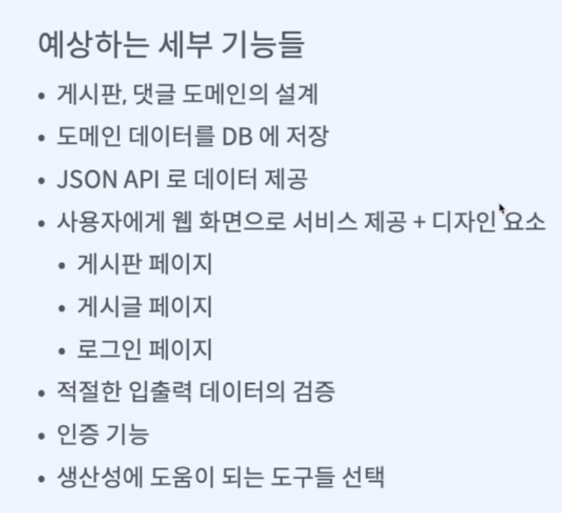
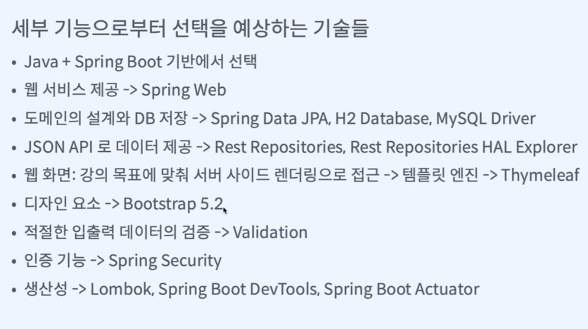
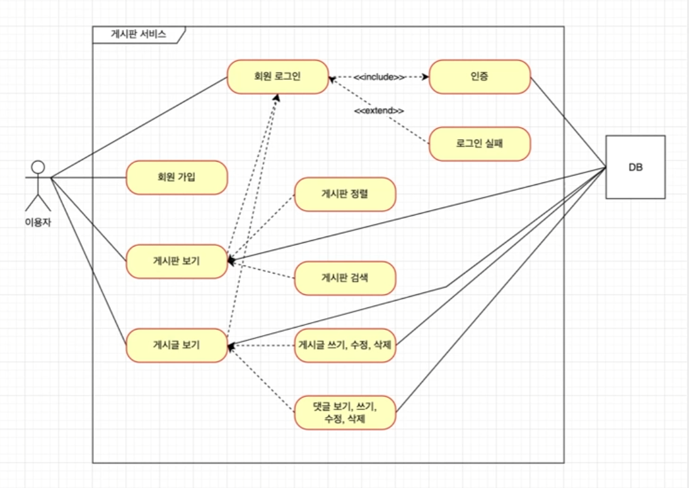

# 배울거

* 문서작업
  * ERD 설계, 유즈케이스 : diagrams.net(draw.io)
  * API 디자인 : 구글 시트
  * 커밋 메시지, 협업환경 : git + gitHub
* IDE : IntelliJ 
* 언어 : java
* 프레임워크 : spring boot
* 빌드도구 : gradle
* git GUI : GitKraken
* 경험 
  * 개발전략
  * 도메인 설계
  * 실무 디자인 패턴
  * 비즈니스 로직 구현
* 테스트 : 오류 없이 요구사항 모두 구현 
  * JUnit5
  * 테스트 라이브러리(Mockito, AssertJ)
  * Spring boot slice test 테크닉
  * github 테스트/빌드 자동화
* 배포 
  * 클라우드 서버(Heroku)
  * 깃헙 : Heroku 배포 자동화
* 플러그인

# 기능

# 선택한 기술

[spring initializr](https://start.spring.io/) - 처음 프로젝트 설정(dependencies)

# gitHub 프로젝트와 이슈

1. 프로젝트 생성
2. GitKraken에 연동
3. Issues : 업무
   1. Label : 업무 종류
      1. enhance : 개발
      2. document : 기획, 보고서
   2. milestone : 일정표
4. pull request : 합치기
5. Actions : 빌드 배포 자동화
6. Projects : 애자일 소프트웨어 개발법
7. settings : 자동화, 설정, 인증
8. workflows : 자동화
9. discussion : 토의하는 곳, setting에서 추가해야 됨
10. sprint : 주 단위로 업무 구분하기, 새로 추가해야 됨

# git branch 전략

## git flow

대규모

* master
* develop
* feature
* release
* hotfix

## github flow

소규모

* master
* feature

## 사용하는 이유, 요령

* 사용하는 이유

  개발 협업 원활하게 하기 위해

* 고려 요소

  * 이 브랜치는 제품으로 내보낼수 있는가?

  * 이 브랜치는 빌드 실패를 허용하는가?

  * 이 브랜치는 테스트 실패를 허용하는가?

  * 이 브랜치는 임시로 운영하는가?

## GitKraken

* git flow 단축키 : comman +콤마

* github flow 사용하는 법 
  1. dummy branch 생성
  2. branch 변경
     * master -> dummy
     * Develop -> main

# 유즈케이스

1. app.diagrams.net 사용

   * 연동하기 - 디렉토리가 있어야됨

   * UML 작성

     * include
     * extend
     * 연관

     

   * Export

     Export -> SVG -> 이름작성 -> Github 클릭

2. GitKraken
   * push

3. GitHub

   * pull request

   * merge

   * feature branch 삭제 
     * 직접 삭제
     * setting에서 자동으로 삭제 설정(Automatically delete head branches)

# API 설계

구글 스프레드 시트 사용

* endpoints

  * 종류
    * 뷰
    * data api

  * url

  * method
    * GET : 조회
    * POST : 추가
    * PUT, PATCH : 수정
    * DELETE : 삭제

  * 기능

  * 설명

* api spec
  * url
  * method
  * 입력 데이터
