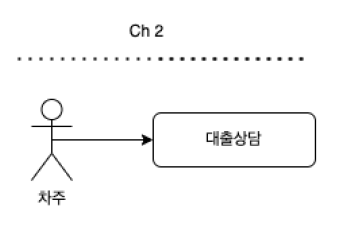
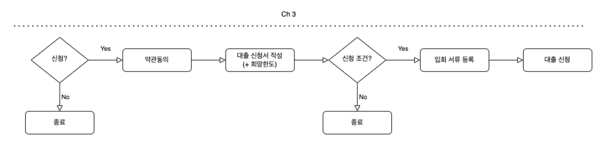
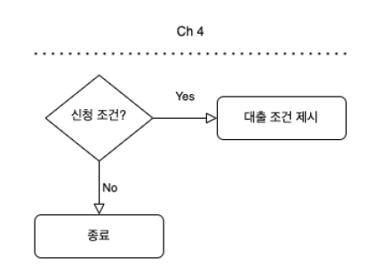
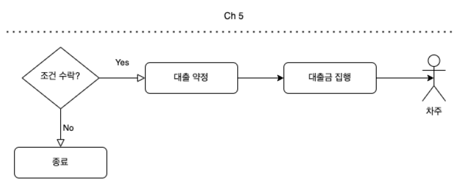
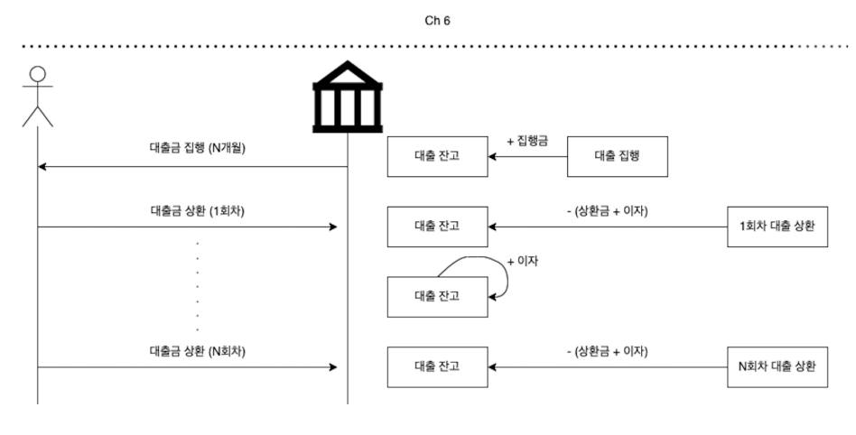

# FinTech

1. FinTech = Fin + Tech
   1. Fin : 돈 필요한 곳에 이자를 붙여 빌려줌
   2. Tech : 필요한 시스템 설계
2. FinTech 산업 사례
   1. 송금
   2. 결제
   3. 자산관리
   4. 투자

# 필요한 역량

1. 주어진 비즈니스에 대한 빠른 이해(도메인 이해)

2. 필요한 시스템 설계(기술)

3. 문제해결을 위한 합리적인 의사결정

4. 알고있는가?

   1. 무엇을 만듦?

   2. 왜 만듦?

   3. ouput이 어떤 impact를 내는가?

      

# 대출 프로세스

# 전체과정

1. 입문
   1. 핀테크 및 대출 도메인 소개
2. 기본
   1. 대출 상담/신청 기능 구현
   2. 대출 심사/집행 기능 구현
   3. 대출 상환 기능 구현
3. 고급
   1. 컨테이너 환경 서버 운영

# 배우는 거

1. 단계별 도메인 소개 및 요구사항 정의

2. 데이터 테이블 정의

3. 기능별 구현 및 테스트 고드 작성

4. 컨테이너 환경에 서비스 배포 및 운영
   1. 로컬 환경에서 kubernetes 환경을 set up - by Docker Desktop
   2. Docker Image 생성 - by JIB
   3. Kubernetes에 배포 - by Skaffold

# 기술스택

1. OpenJDK 11.0
2. Spring Boot 2.7.1
3. H2
4. MySQL 8.0
5. Docker 20.10.9
6. Kubernetes 1.21.3

# Ref

https://github.com/sapzape/fastcampus-loan