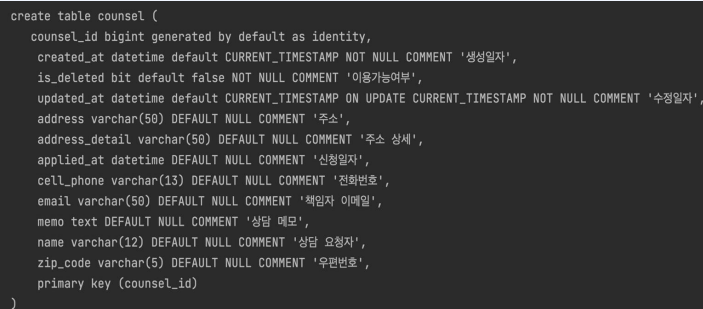

# 상담이란?

문제를 해결하거나 궁금증을 풀기 위하여 서로 의논함

# 1. 도메인 정의

## 테이블 정의

* ID는 Long(BIGINT) 
* Soft Delete 
* 상담을 위해 필요한 기본 필드

## entity 정의

1. Counsel entity
   1. 변수
   2. BaseEntity 상속
2. BaseEntity
   1. meta data

# 2. 상담 등록 기능

1. Dto
   1. Request
   2. Response
2. Service
   1. repository DI
   2. create(request)
      1. modelMapper로 Request dto -> Entity
      2. 신청일자 set
      3. repository.save()
      4. modelMapper로 Entity -> Response dto
      5. return Response dto
3. Repository
   1. JPA Repository 상속

4. Service test

   1. mocking
      1. repository

   2. spy : util
      1. modelMapper
   3. Service에 DI
   4. test 코드 작성
      1. given
         1. request dto
         2. entity
      2. when
         1. repository.save() mocking
      3. then
         1. 비교

5. Controller 

   1. AbstractController를 상속 -> Respose 규격화
   2. postMapping
   3. service DI
   4. request body 받아오기
   5. service 실행
   6. Response 규격화

6. postman으로 확인

   1. application 실행

   2. 결과 확인

      

# 3. 상담 조회 기능

1. Service
   1. get(id)
      1. repository.findById()
      2. error 처리
      3. modelMapper로 Entity -> Response dto
      4. return Response dto

2. Service test
   1. 성공 get
      1. given
         1. id
         2. 예상 entity
      2. when
         1. findById 예상 entity로 mocking
      3. then
         1. 예상값과 결과값 비교
   2. error 발생
      1. given
         1. id
      2. when
         1. findById eror 처리 mocking
      3. then
         1. 예상값과 결과값 비교

3. Controller
   1. getMapping
   2. path variable 받아오기
   3. get Service 실행
   4. Response 규격화

4. Postman으로 확인
   1. 성공
   2. 실패

# 4. 상담 수정 기능

1. Service
   1. update(id,request)
      1. repository.findById()
         1. 성공시 entitty 반환
         2. 에러시 에러처리
      2. entity.set변수()
      3. respository.save()
      4. modelMapper로 Entity -> Response dto
2. Service test
   1. given
      1. id
      2. request
      3. 결과 entity
   2. when
      1. repository.findById()에 entity mocking
      2. respository.save()에 entity mocking
   3. then
      1. 값 비교
3. Controller
   1. putMapping
   2. id, request 가져오기
   3. service 실행
   4. response 규격화
4. postMan으로 확인

# 5. 상담 삭제 기능

1. Service
   1. delete(id)
      1. repository.findById()
         1. 성공시 entitty 반환
         2. 에러시 에러처리
      2. entity.setIsDeleted(true)
      3. respository.save()
      4. modelMapper로 Entity -> Response dto
2. Service test
   1. given
      1. id
      2. 예상 entity
   2. when
      1. repository.findById()에 entity mocking
      2. respository.save()에 entity mocking
   3. then
      1. 값 확인
         1. entity.gettIsDeleted = true
3. Controller
   1. deleteMapping
   2. id 가져오기
   3. service 실행
   4. response 규격화
4. postMan으로 확인
   1. 있는거 삭제 -> 삭제처리
   2. 없는거 삭제 -> 에러처리