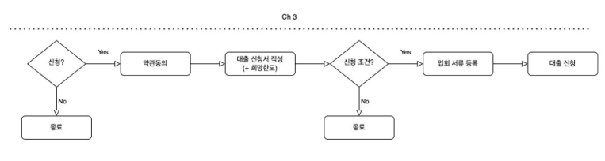
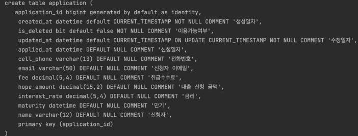

# 신청

## 1. 도메인 정의

### 테이블 정의

* ID는 Long(BIGINT) 
* Soft Delete 
* 신청을 위해 필요한 기본 필드

### Entity

1. id
2. 신청을 위해 필요한 기본 필드
3. meta data

## 2. 대출 신청 등록

1. Dto

   1. Request
   2. Respose

2. Service

   1. repository DI
   2. modelMapper DI
   3. create(request dto)
      1. modelMapper로 request dto -> entity
      2. entitiy에 생성일 set()
      3. respository.save(entitty)
      4. modelMapper로 entity -> Respose dto
      5. return Response dto

3. Repository

   1. JPA repository 상속

4. Service test

   1. mocking
      1. repository
   2. spy
      1. modelMapper
   3. DI
      1. Service
   4. test
      1. given
         1. request dto 
         2. 예상 결과 entity
      2. when
         1. repository.save(entity) mocking
         2. service 실행
      3. then
         1. 비교

5. Controller

   1. Respose 규격화를 위해 AbstractController 상속
   2. Service DI
   3. postMapping
   4. @ResponseBody
   5. service 실행
   6. Response 규격화

6. postMan에서 확인

## 3. 대출 신청 조회

1. Service
   1. get(id)
      1. repository.findById()
         1. 성공시 entity 반환
         2. 실패시 error 처리
      2. modelMapper로 entity -> Respose dto 변환

2. Service test
   1. given
      1. id
      2. 예상 결과 entity
   2. when
      1. repository.findById()에 entity mocking
      2. service 실행
   3. then
      1. 비교
3. Controller
   1. getMapping
   2. @PathVariable
   3. get service 실행
   4. Response 규격화
4. PostMan으로 확인

## 4. 대출 신청 수정

1. Service
   1. update(id, request)
      1. repository.findById()
         1. 성공시 entity 반환
         2. 실패시 error 처리
      2. 값 set
      3. repository.save()
      4. modelMapper로 entity -> Respose dto 변환
2. Service test
   1. given
      1. id
      2. request dto
      3. 예상 결과 entity
   2. when
      1. repository.findById()에 entity mocking
      2. repository.save()에 entity mocking
      3. update service 실행
   3. then
      1. 비교
3. Controller
   1. putMapping
   2. @PathVariable, @RequestBody
   3. update service 실행
   4. Response 규격화
4. PostMan으로 확인

## 5. 대출 신청 삭제

1. Service
   1. delete(id)
      1. repository.findById()
         1. 성공시 entity 반환
         2. 실패시 error 처리
      2. entity.setIsDeleted(true)
      3. repository.save()
      4. modelMapper로 entity -> Respose dto 변환
2. Service test
   1. given
      1. id
      2. 예상 결과 entity
   2. when
      1. repository.findById()에 entity mocking
      2. repository.save()에 entity mocking
      3. delete service 실행
   3. then
      1. 비교
3. Controller
   1. deleteMapping
   2. @PathVariable
   3. delete service 실행
   4. Response 규격화
4. PostMan으로 확인

# 약관

## 1. 도메인 정의

### 테이블 정의

### Entity 정의

1. 필드

   1. id,name,url

2. metadata

   1. BaseEntity로 상속
      1. 생성일, 수정일, 삭제일

3. Soft Delete

   @Where(cluase = "is_deleted=false")

## 2. 약관 등록 기능

1. dto
   1. Request
   2. Response
2. Service
   1. Repository DI
   2. ModelMapper DI
   3. create(request)
      1. modelMapper로 Request dto -> entity
      2. repository.save(entity)
      3. modelMapper로 entity -> Response dto
3. Repository
   1. JPA repository 상속

4. Service test

   1. Repository DI
   2. Spy ModelMapper
   3. service에 DI
   4. crate()
      1. given 
         1. request
         2. 예상 결과 entity
      2. when
         1. repository.save()에 entity mocking
         2. create 실행
      3. then
         1. 비교

5. Controller

   1. Response 규격화를 위해서 AbstractController 상속
   2. Serive DI
   3. create()
      1. postMapping
      2. @RequestBody
      3. Respose 규격화

   4. PostMan으로 확인

## 3. 약관 조회 기능

1. Service
   1. getAll()
      1. repository.findAll()
      2. modelMapper로 entity list -> resonse dto list 변환

2. Service test
   1. getAll()
      1. given
         1. 예상 결과 entity list
      2. when
         1. repository.findAll()에 entity list mocking
         2. getAll servie 실행
      3. then
         1. 비교

3. Controller
   1. getAll()
      1. getMapping
      2. Response 규격화
4. PostMan으로 확인

# 약관 매핑

## 1. 도메인 정의

### Entity 정의

1. metadata
   1. BaseEntity 상속
      1. 생성일
      2. 수정일
      3. 삭제일
2. 필요 필드
   1. 매핑 id
   2. 대출 신청 id
   3. 약관 id

## 2. 대출 신청과 약관 매핑

1. Dto

   1. 약관 id list

2. Repository

   1. JPA repository 상속

3. Service

   1. termsRepository DI
   2. acceptTermsRepository DI
   3. accepTerms(신청id, request(동의한 약관 list))
      1. applicationRepository.findById() : 대출 신청정보 존재여부 확인
         1. 있으면 entity 반환
         2. 없으면 error 처리
      2. termsRepository.findAll() : 약관 존재여부 확인
         1. 있으면 entity 반호나
         2. 없으면 error 처리
      3. 개시한 약관의 수 / 동의한 약관의 수 비교
         1. 다르면 error 처리
      4. 동의한 약관 종류 확인
      5. acceptTerms entity 생성
         1. terms id, application id 입력 
         2. build
      6. acceptTermsRepository.save()
      7. 성공하면 return true

4. Service test

   1. repository mocking
   2. accepTerms() 성공
      1. given
         1. 신청 id
         2. request dto(동의한 약관 list)
         3. application entity
         4. termsList (개시한 약관)
      2. when
         1. applicationRepository.findById()에 application entity mocking
         2. termsRepository.findAll()에 termsList(terms id로 오름차순 정렬) mocking
         3. acceptTermsRepository.save()에 acceptTerms entity mocking
         4. accepTerms service 실행
      3. then
         1. true 나오는지 확인

   3. accepTerms() 일부만 동의, 다른 약관 동의
      1. given
         1. 신청 id
         2. request dto(동의한 약관 list, 약관 갯수 적게)
         3. application entity
         4. termsList (개시한 약관)
      2. when
         1. applicationRepository.findById()에 application entity mocking
         2. termsRepository.findAll()에 termsList(terms id로 오름차순 정렬) mocking
         3. accepTerms service 실행
      3. then
         1. 에러 나오는지 확인

5. Controller

   1. postMapping
   2. @PathVariable, @RequestBody
   3. accepTerms service 실행
   4. Response 규격화

6. PostMan으로 확인

   1. application 실행

   2. 약관 저장

   3. 대출 신청 저장

   4. 동의한 약관들 설정

   5. 결과 확인

      

# 서류

## 1. 파일 업로드

1. Dto

   1. 파일 이름
   2. Url

2. Service

   1. save(MultipartFile)
      1. 업로드한 파일 저장
         1. 파일 읽어오기
         2. 업로드 경로 설정
         3. 기존 이름 사용
         4. 같은 이름 있으면 덮어쓰기
         5. 에러처리

3. Controller

   1. postMapping
   2. file 가져오기
   3. save service 실행
   4. Response 규격화

4. postMan으로 확인

   1. resonse 확인
   2. cmd로 경로에 있는지 확인

   

## 2. 서류 조회

1. Service
   1. load(fileName) 
      1. 파일의 경로 찾기
      2. 리소스 가져오기
      3. 리소스 확인
         1. 있으면 리소스 반환
         2. 없으면 에러처리
      4. 에러처리
   2. loadAll()
      1. 업로드 경로에 있는거 가져오기
      2. 에러처리
2. Controller
   1. download()
      1. getMapping
      2. @RequestParam filName
      3. load service
      4. Response 규격화
         1. header - 파일이름
         2. body - 파일 리소스
   2. getFileInofs()
      1. getMapping
      2. loadAll() service
      3. entity list -> dto list
      4. Response 규격화

3. postMan 으로 확인
   1. response
      1. 파일이름
      2. url

## 3. 서류 삭제

1. Service
   1. deleteAll()
      1. 업로드 경로에 있는 파일 모두 삭제
2. Controller
   1. deleteMapping
   2. delteAll service 실행
   3. Response 규격화
3. postMan으로 실행
   1. 해당경로 파일 모두 삭제됨

# 서류 매핑

1. Service 

   1. 대출 신청 확인

      1. applicationRespository.findById(applicationId).isPresent()
         1. 있으면 true
         2. 없으면 error 처리

   2. 모든 서류 서비스 수정

      1. 인수에 applicationId 추가

      2. 대출 신청 확인

      3. 경로 변경

         url + "/" + applicationId

   3. save()
      1. 디렉토리가 없으면 생성

2. Controller
   1. 모든 서류 controller 수정
      1. PathVariable 추가
         1. mapping
         2. service 실행

3. postman으로 확인
   1. application 확인
   2. 대출신청
   3. 업로드
   4. 다운로드
   5. 파일정보 조회
   6. 삭제
