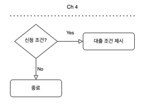
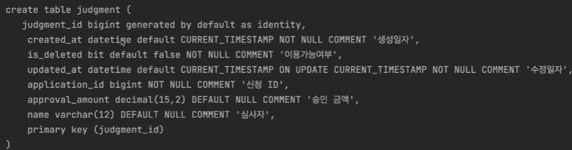

# 대출 심사

## 도메인 정의

### 테이블 정의

* Long id
* Soft Delete

### Entity

## 등록

1. Dto

   1. Request
      1. 신청id, 이름, 신청 승인금액
   2. Response
      1. 심사id, 신청id, 이름, 승인금액
      2. metadata(생성,수정,삭제시간)

2. Repository

   1. JPA repositoy 상속

3. Service 

   1. Repository DI
      1. 심사
      2. 신청
   2. ModelMapper DI
   3. isPresentApplication(applicationId)
   4. create(request) 구현
      1. 신청정보 검증
         1. 없으면 에러처리
      2. modelMapper로 reqeust dto -> 심사 entity
      3. 심사Reapositoy.save(심사 entity)
      4. modelMapper로 심사 entity -> Response dto로 변환

4. Service test

   1. mocking

      1. Repository DI
         1. 심사
         2. 신청

   2. Spy

      1. ModelMapper 

   3. Service에 mock 삽입

   4. test 

      1. given

         1. request

         2. 신청 entity

            

      2. when

         1. findById() -> 아무 신청entity mocking
         2. 심사Reapositoy.save() -> 심사entity mocking
         3. create() 실행

      3. then

         1. 비교

5. Controller
   1. 규격화를 위해 AbstractController 상속
   2. 심사 service DI
   3. create()
      1. postMapping
      2. @RequestBody
      3. create service 실행
      4. Response 규격화
6. PostMan으로 확인
   1. 심사등록
      1. 있는 신청 심사 확인
      2. 없는 신청 심사 확인

 

## 조회

### 심사 id로 조회하기

1. Service

   1. get(심사id)
      1. 심사repository.findById(심사id)
         1. 있으면 entity 반환
         2. 없으면 error 처리
      2. modelMapper로 entity -> Response dto

2. Service test

   1. given
      1. 심사 id
   2. when
      1. 심사repository.findById(id) -> 심사entity mocking
      2. get() service 실행
   3. then
      1. 비교

3. Controller

   1. getMapping
   2. @PathVariable
   3. get service 실행
   4. Response 규격화

4. PostMan으로 확인

   1. 신청 등록

   2. 심사 등록

   3. 심사id로  조회

      1. 있는 경우 entity
      2. 없는 경우 error

      

### 신청 id로 조회하기

1. Repository
   1. 심사repository.findByApplicationId(신청id)
2. Service
   1. getJudgementOfApplication(신청id)
      1. 신청 검증
         1. isPresentApplication(applicationId)
            1. 없으면 error 처리
      2. 심사repository.findByApplicationId(신청id)
         1. 있으면 entity 반환
         2. 없으면 에러처리
      3. modelMapper로 entity -> Response dto
3. Service test
   1. given
      1. 심청 id
      2. entity
         1. 신청
         2. 심사
   2. when
      1. 신청repository.findById() -> 아무신청entity mocking
      2. 심사repository.findByApplicationId(신청id) -> 심사entity mocking
      3. getJudgementOfApplication() service 실행
   3. then
      1. 비교
4. Controller
   1. getMapping
   2. @PathVariable
   3. service 실행
   4. Response 규격화

5. PostMan으로 확인
   1. 신청 등록
   2. 심사 등록
   3. 신청 id로 조회
      1. 있으면 심사 entity list 
      2. 없으면 error

## 수정

1. Service
   1. update(심사id, request)
      1. 심사repository.findById(id)
         1. 있으면 entity 반환
         2. 없으면 error
      2. request 값으로 entity 값 설정
      3. 심사repository.findById(entity)
      4. modleMapper로 entity -> Response dto
2. Service test
   1. given
      1. id
      2. request
      3.  update 된 entity
   2. when
      1. 심사repository.findById(entity)에 아무 심사entity mocking
      2. 심사repository.save(entity)에 update 된 entity mocking
      3. update service 실행
   3. then
      1. 비교
3. Controller
   1. update()
      1. PutMapping
      2. @PathVariabe, @RequestBody
      3. update serevice 실행
      4. Response 규격화
4. PostMan으로 확인
   1. 신청 등록
   2. 심사 등록
   3. update
      1. 심사 없는거면 error
      2. 있는겨면 response

## 삭제

1. Service
   1. delete(심사id)
      1. 심사repository.findById(id)
         1. 있으면 entity 반환
         2. 없으면 error
      2. entity.setIsDeleted(true)
      3. 심사 repository.save(entity)
2. Service test
   1. given
      1. id
      2. 심사entity
   2. when
      1. 심사repository.findById(entity)에 심사entity mocking
      2. 심사repository.save(entity)에 심사entity mocking
      3. delete service 실행
   3. then
      1. entity.getIsDeleted 값 확인
3. Controller
   1. delte()
      1. DeleteMapping
      2. @PathVariabe
      3. delete serevice 실행
      4. Response 규격화
4. PostMan으로 확인
   1. 신청 등록
   2. 심사 등록
   3. delete
      1. 실패하면 error
      2. 성공하면 null

# 대출 심사 금액 부여

1. Dto
   1. GrantAmount
      1. 신청id, 금액
      2. metadata
2. Service
   1. grant(심사id) 
      1. 심사 존재여부 확인
         1. 있으면 심사entity 반환
         2. 없으면 error 처리
      2. 신청 존재여부 확인
         1. 있으면 신청entity 반환
         2. 없으면 error 처리
      3. 신청entity.setApprovalAmount(승인된 금액)
      4. 신청Repository.save(신천entity)
      5. ModelMapper로 entity -> GrantAmount dto로 변환
3. Service test
   1. given
      1. 심사 id
      2. 심사 entity
      3. 신청 entity
   2. when
      1. 심사repository.findById() 에 심사 entity mocking
      2. 신청repository.findById()에 신청 entity mocking
      3. 신청repository.save()에 신청 entity mocking
   3. then
      1. 비교
         1. 신청 id
         2. 승인된 금액

4. Controller
   1. PatchMapping
   2. @PathVariable
   3. grant service 실행
   4. Grant 규격화
5. PostMan으로 확인
   1. 신청 등록
   2. 심사 등록
   3. 한도 부여
      1. approvalAmount가 바뀜