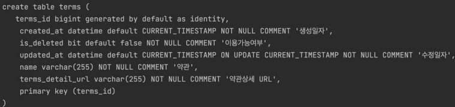

# 약관

# 1. 도메인 정의

## 테이블 정의

## Entity 정의

1. 필드

   1. id,name,url

2. metadata

   1. BaseEntity로 상속
      1. 생성일, 수정일, 삭제일

3. Soft Delete

   @Where(cluase = "is_deleted=false")

# 2. 약관 등록 기능

1. dto
   1. Request
   2. Response
2. Service
   1. Repository DI
   2. ModelMapper DI
   3. create(request)
      1. modelMapper로 Request dto -> entity
      2. repository.save(entity)
      3. modelMapper로 entity -> Response dto
3. Repository
   1. JPA repository 상속

4. Service test

   1. Repository DI
   2. Spy ModelMapper
   3. service에 DI
   4. crate()
      1. given 
         1. request
         2. 예상 결과 entity
      2. when
         1. repository.save()에 entity mocking
         2. create 실행
      3. then
         1. 비교

5. Controller

   1. Response 규격화를 위해서 AbstractController 상속
   2. Serive DI
   3. create()
      1. postMapping
      2. @RequestBody
      3. Respose 규격화

   4. PostMan으로 확인

# 3. 약관 조회 기능

1. Service
   1. getAll()
      1. repository.findAll()
      2. modelMapper로 entity list -> resonse dto list 변환

2. Service test
   1. getAll()
      1. given
         1. 예상 결과 entity list
      2. when
         1. repository.findAll()에 entity list mocking
         2. getAll servie 실행
      3. then
         1. 비교

3. Controller
   1. getAll()
      1. getMapping
      2. Response 규격화
4. PostMan으로 확인

