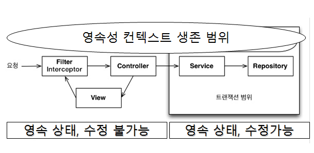

# 뷰 서비스


## 테스트 구현

1. DI

   1. @ExtendWith(MockitoExtension.class)
   2. service 는 @InjectMocks
   3. 나머지는 @Mock

2. test 코드

   1. @test

   2. 함수 작성

      given_when_then(){} 

   3. 비교

      assertThat()

```java
@DisplayName("비즈니스 로직 - 게시글")
@ExtendWith(MockitoExtension.class) // spring boot slice test 안하고 해보기 - 가볍게 만들기
class ArticleServiceTest {

    @InjectMocks private ArticleService sut;

    @Mock
    private ArticleRepository articleRepository;

    @DisplayName("게시글을 검색하면, 게시글 리스트를 반환한다.")   // 게시글, 페이지네이션, 정렬
    @Test
    void givenSearchParameter_whenSearchArticles_thenReturnArticleList() {
        // Given

        // When
        Page<ArticleDto> articles = sut.searchArticles(); // 제목, 본문, ID, 닉네임, 해시태그

        // Then
        assertThat(articles).isNotNull();
    }
```

1. 게시판
   1. 정렬
   2. 검색
   3. 모든 게시글 보기
   4. 선택한 게시글만 보기
   5. 루트 페이지로 이동
2. 게시글
   1. 게시글 CRUD
   2. 댓글 CRUD

3. 로그인

   spring security


4. 한거

   도메인, dto, 서비스, 서비스테스트, 도메인과 dto 연동코드, response(필요정보만)


## 기타 설정

1. JPA buddy  ignore 설정 추가

   .jpb 폴더 생성되서

2. erd 속성 이름 주의점

   예약어랑 같으면 안됨

3. OSIV off 

   * application.yml에서 off

   ```yaml
   spring:
   	jpa:
   		open-in-view: false
   ```

   *  domain, dto 분리 -> 서비스가 나간뒤 트랜잭션 종료, 서비스에서 마무리가 된 데이터가 controller로 오게끔

     

   * 각 layer의 독립성 보장

     service - 도메인, dto 존재 앎

     controller는 request나 respone 존재만 앎


---

#19

feature 길어지면 branch만들어서 main 말고 만든 branch에 merge


getReferenceBy 와 findBy 차이


## 서비스 구현

1. 게시판 비스니스 로직 구현
    	1. 검색, CRUD
            	1. respsitory 함수 추가
                	2. service에서 
                  	1. repository 함수 사용
                     	2.  dto->entity 변환  


2. 게시판 controller 구현

   1. request 변수 받기

   1. response 
      1. service함수 사용 + response 도메인으로 받기
      2. map에 담기

   3. 테스트

      @MockBean service

      service는 생성자 주입으로 안됨 -> filed injection @MockBean 사용


3. 게시판 view 구현

   1. 정보가 들어갈 곳에 class 이름 설정 

   2. th.xml에 이름설정한 class에 들어갈 내용 적기


4. 도메인과 dto 분리하는 이유	

​	하나의 거대한 범용 class를 여러 layer가 공통적으로 사용하면 문제 발생

1. 특정상황에서만 값이 존재하는 필드

2. 초기화되는 시점과 사용되는 시점이 필드군마다 제각각이라 유지보수 어려움

3. 여러 layer의 Annotation이 한데 섞여 한눈에 이해하기 어려움


5. pageable 

   자동으로 크기가 10인 페이지 객체 만들어줌

---

#24 pagination

1. prev, next
2. 현재페이지 가운데 배치


# Pagination

게시판, 게시글

1. pagination service test
   1. 현재페이지, 전체페이지 / 예상페이지 비교
   2. 페이지 바 길이 5인지 확인
2. pagianation service
   1. 현재페이지, 전체페이지 -> 현제페이지 가운데인 길이 5인 페이지바
   2. 페이지 바 길이 출력

3. controller test

   1. 현재페이지, 전체페이지 주어지면

      요청이 주어질 때

      페이지바 속성이 있는지 확인

4. controller

   map의 페이지바 속성에 service값 넣기

5. html

   값넣을 곳에 class 이름 넣기

6. th.xml

   값 넣을 곳에 넣을 값 설정


# 정렬

도메인 코드에 의해 정렬됨

th.xml로 정렬


# 검색

html 로 검색타입, 검색어 받아오기 설정

1. controller로
   1. @RequestParam으로 검색기준, 검색어 가져오기
   2. service 결과를 map에 담기

2. searchtype.description을 위해 도메인에 있는 searchType 수정

3. repository

   1. querydsl 사용

4. 검색 service 구현

5. html

   1. form태그, 
      1. 클래스 - 값 넣기를 위해
      2. 변수이름 - @RequestParam을 위해

6. th.xml

   값 넣기

   

# MethodSource

한번에 여러개 넣고 테스트하기


https://ebabby.tistory.com/28


# 해시태그 검색 구현 #32


# 댓글 구현


spring 2.7 releases -> Auto - configure 바뀜 : 저장 위치가 spring.factories로 바뀜 -> IntelliJ 1.3이상 권장


