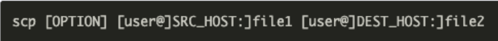

# 배포 파일 원격 서버로 전송 방법

* SCP(Secure Copy) 명령어를 사용하면 된다.

* FTP도 가능
  * remote -> local 쉽지가 않음

## SCP

* SCP(Secure Copy) 개념

  서로다른 2 location에서 안전하게 전송가능하게 하는 유틸리티성 command-line 명령어

* 사용처

  1. local -> remote

     ex) SSL 인증서 - HTTPS

  2. remote -> local

     ex) Heap Dump 파일 - 운영서버쪽 log 분석시 사용

  3. remote -> remote

     ex) Server Config 파일

* 특징
  * SSH를 사용하므로 SSH Key 혹은 Password가 필요하다. 
  * 콜론(“:”)을 사용하여 server location과 directory location을 구분한다. 
  * SCP 명령어를 사용하기 위해선 Source File에 대한 Read 권한과 Target Server에 Write 권한이 있어야한다. 
  * 만약 동일한 File Name + File Path가 Target Server에 존재한다면 경고없이 Overwrite를 한다.

* 사용방법

  

  * 일반적인 상황 

    scp file.txt remote_username@1.1.1.1:/remote/directory 

  * 파일명을 다르게 저장 

    scp file.txt remote_username@1.1.1.1:/remote/directory/NEW_FILE_NAME.txt 

  * 특정 포트로 전송 

    scp -P 1234 file.txt remote_username@1.1.1.1:/remote/directory

  * Directory 복사 & 전송 

    scp -r /local/directory remote_username@1.1.1.1:/remote/directory 

## 실습

local -> remote

* 일반적인 상황 

  1. 파일 만들기

     vim test.text

     cot test.text

  2. 원격 서버로 전송

     scp test.text ubuntu@54.180.44.212:/home/ubuntu

  3. 패스워드 입력

  4. 보내짐

  5. 원격 서버에서 확인

     ls

     cat test.text

* 파일명을 다르게 저장 

  1. 원격 서버로 전송

     scp test.text ubuntu@54.180.44.212:/home/ubuntu/test2.text

  2. 패스워드 입력

  3. 보내짐

  4. 원격 서버에서 확인

     ls

     cat test2.text

* Directory 복사 & 전송 

  1. Directory 생성

     mkdir scp_folder

  2. 이동

     cd scp scp_folder

  3. 파일생성

     vim scp_folder

     cat scp_folder

  4. 상위 계층으로 이동

     cd ..

  5. 원격 서버로 전송

     scp -r ./scp_folder ubuntu@54.180.44.212:/home/ubuntu/scp_folder

  6. 원격 서버에서 확인

     ls

     cat scp_folder

  

# 서버를 운영하기 전 체크사항

1. 특정 포트가 사용중인가? ->`lsof -i:8080`
2. Target Server에 요청이 정상적으로 가는가? -> `telnet IP PORT` 

## CLI

1. man : CLI 명령어 대힌 상세한 정보 제공

   ex) `man 명령어`

   * 나가기는 `q`

2. lsof : 현재서버의 특정 포트에 정보 조회 가능

   1. Port Search : `lsof -i:8080`
   2. Range Search : `lsof -i:8000-8080`

   ref) 포트 죽이기 : `kill -9 PORT`

3. nslookup : DNS 값으로 IP 조회

   ex) `nslookup naver.com`

4. telnet : Target Server에 요청이 정상적으로 가는지 확인

   ex) `telnet IP PORT` 

   * 성공시
     * connected가 뜸 

   * 실패시 
     * 응답이 안나오는 경우 Cntrl + c 로 강제종료
     * 나의 outdoor 방화벽 확인
     * target server의 특정 port가 열려있는지 전화해보기

5. netstat : 네트워크 상태 확인

   * option

     * a : 모든 Ports와 Connections
     * n : 숫자 주소 보여줌
     * l : 살아있는 Ports만 확인
     * t : TCP Ports로 실행중인 것만 확인

     ex) `netstat -anlt`

   * 특정 포트의 상태 찾기 : `netstat OPTION | grep PORT`
   * state
     * LISTEN : 클라이언트의 요청을 기다림 
     * ESTABLISHED : 클라이언트와 통신중

