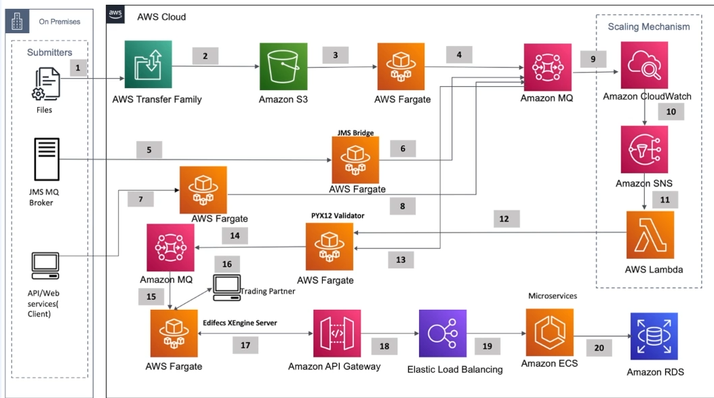

# 지원동기

1. 불평불만만 하는 지원자를 굳이 뽑을 필요는 없다
2. 회사는 꿈을 이뤄주는 곳이 아니다
3. 나의 능력을 회사의 발전에 이바지 할수 있다를 보여라
4. 노력한 부분 어필
5. 신입
   1. 학습태도
   2. 기술 스택에 대한 이해도
6. 1.5~3년차
   1. 학습태도
   2. 기술 스택에 대한 이해도
   3. 사이드 프로젝트
7. 4~n년차
   1. 학습태도
   2. 기술 스택에 대한 이해도
   3. 사이드 프로젝트
   4. 경험

8. ~에 기여하고 싶다 + 노력

# 읽기 좋은 자소서

1. 공통된 포맷

   1. 기간

      * 길다면 왜 길었는지
      * 무엇을 개발했는지
      * 어필할 부분

   2. 주최

      * 회사

      * 사이드 프로젝트

      * 전략

        1. skip

           * 현재 회사 기술스택 != 지원하고자 하는 회사 기술스택

           * 모두 사이드 프로젝트 위주 + 경력 이직 희망

        2. 비록 회사 기술스택은 아니지만 따로 시간을 내어 꾸준히 개발하고 기술 스택에 대한 이해도가 있다

   3. 기술 스택

      * 과유불급
        * 맞는 포지션에 맞는 기술 스택만 나열
        * 잘 준비해서 잘 대답할 수 있는 범위
        * 핵심적인 키워드만

   4. 프로젝트 설명

      * 간략한 설명

   5. 어필하고 싶은 부분

      * 원하는 질문을 받을 수 있게 먼저 제시하자

2. 두괄식

# 포트폴리오

1. 시각자료 첨부 자소서

2. 피해야 할거

   1. 구구절절
   2. code 복붙
      1. 하고 싶으면
         * Description
         * How to Test
         * Commits

3. 작성 스타일

   1. 정적 -  PDF
   2. 동적 - 제출 후 수정 가능(Notion, GitHub)

4. 작성법

   1. 정확히 알고 중요한 기술스택만 나열

5. 작성가이드 포맷

   1. Project Summary

      * 최소한만
      * 이론,경험 말할 수 있는거만

      

   2. Sequence Diagram

      * Sequence Number + 간결

      

   3. Code Snapshot(선택)

      * 주석과 더불어
      * 비즈니스를 모르더라도
      * 이해할 수 있을 정도로
      * 읽기 편한 코드를 첨부

      

   4. System Arcithecture

      